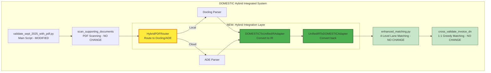
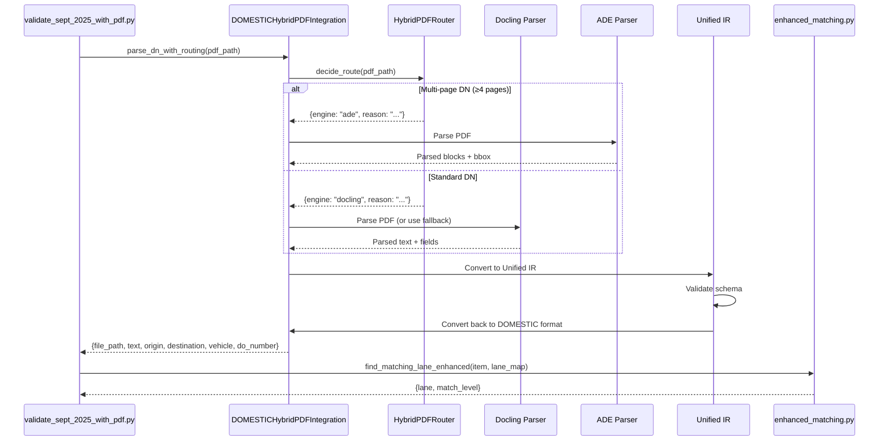

# DOMESTIC System - Hybrid Parser Integration Guide

**Date**: 2025-10-14
**System**: DSV DOMESTIC Invoice Audit
**Integration Target**: Hybrid Docling/ADE Parser

---

## DOMESTIC System Current Architecture

### 현재 구조 분석

```mermaid
graph TB
    subgraph "DOMESTIC Current System"
        MAIN[validate_sept_2025_with_pdf.py<br/>Main Script]
        SCAN[scan_supporting_documents<br/>PDF Scanning]
        PARSE[parse_dn_pdfs<br/>DSVPDFParser]
        EXTRACT[pdf_extractors.py<br/>Field Extraction]
        FALLBACK[pdf_text_fallback.py<br/>PyMuPDF→pypdf→pdfminer→pdftotext]
        MATCHING[enhanced_matching.py<br/>4-Level Lane Matching]
        CROSS[cross_validate_invoice_dn<br/>1:1 Greedy Matching]

        MAIN --> SCAN
        SCAN --> PARSE
        PARSE --> FALLBACK
        FALLBACK --> EXTRACT
        EXTRACT --> MATCHING
        MATCHING --> CROSS
    end

    style PARSE fill:#ffccbc,stroke:#bf360c
    style FALLBACK fill:#ffccbc,stroke:#bf360c
    style MATCHING fill:#c8e6c9,stroke:#1b5e20
```



### 주요 컴포넌트

| 컴포넌트 | 파일 | 역할 | 현재 PDF 처리 방식 |
|---------|------|------|------------------|
| **메인 스크립트** | `validate_sept_2025_with_pdf.py` | 전체 워크플로우 오케스트레이션 | DSVPDFParser 사용 |
| **PDF 텍스트 추출** | `src/utils/pdf_text_fallback.py` | 4단계 폴백 (PyMuPDF→pypdf→pdfminer→pdftotext) | Multi-layer fallback |
| **필드 추출** | `src/utils/pdf_extractors.py` | DN 필드 추출 (Origin, Destination, Vehicle, DO#) | Regex-based |
| **Lane 매칭** | `enhanced_matching.py` | 4-level matching (Exact→Similarity→Region→Vehicle) | 기존 로직 유지 |
| **Cross-Validation** | `validate_sept_2025_with_pdf.py::cross_validate_invoice_dn` | 1:1 greedy matching | DN 용량 제한 |

### 현재 성능 메트릭

- **PDF 파싱 성공률**: 91.7% (33/36 DN PDFs)
- **Lane 매칭률**: 79.5% (35/44 items)
- **처리 시간**: ~10초 (44 items + 36 PDFs)

---

## Integration Strategy

### 통합 접근 방식

**핵심 원칙**: 기존 DOMESTIC 로직을 유지하면서 PDF 파싱 품질만 향상



---

## Integration Points

### 1. PDF Parsing Layer (현재 → 통합)

#### 현재 로직 (`validate_sept_2025_with_pdf.py::parse_dn_pdfs`)

```python
def parse_dn_pdfs(pdf_files: list, parser: DSVPDFParser) -> list:
    parsed_results = []
    for pdf_info in pdf_files:
        # 1. PDF 텍스트 추출 (Multi-layer fallback)
        text = extract_text_any(pdf_info['pdf_path'])

        # 2. 필드 추출 (Regex-based)
        origin = extract_loading_point_from_text(text)
        destination = extract_destination_from_text(text)
        vehicle = extract_vehicle_type_from_text(text)

        parsed_results.append({
            "file_path": pdf_info['pdf_path'],
            "text": text,
            "origin": origin,
            "destination": destination,
            "vehicle_type": vehicle,
            ...
        })
    return parsed_results
```

#### 통합 후 로직 (NEW)

```python
from hybrid_integration import HybridPDFRouter, create_adapter

def parse_dn_pdfs_hybrid(pdf_files: list, router: HybridPDFRouter) -> list:
    """Enhanced PDF parsing with hybrid Docling/ADE routing"""
    parsed_results = []
    adapter_to_ir = create_adapter("domestic_to_ir")
    adapter_from_ir = create_adapter("ir_to_domestic")

    for pdf_info in pdf_files:
        # 1. Routing decision
        decision = router.decide_route(pdf_info['pdf_path'])

        # 2. Parse with chosen engine
        if decision['engine_choice'] == 'ade':
            # Use ADE for complex/multi-page DNs
            parsed_data = parse_with_ade(pdf_info['pdf_path'])
        else:
            # Use Docling (or fallback to existing logic)
            text = extract_text_any(pdf_info['pdf_path'])
            parsed_data = {
                "file_path": pdf_info['pdf_path'],
                "text": text,
                "origin": extract_loading_point_from_text(text),
                "destination": extract_destination_from_text(text),
                "vehicle_type": extract_vehicle_type_from_text(text),
                "do_number": extract_do_number_from_text(text)
            }

        # 3. Convert to Unified IR
        unified_doc = adapter_to_ir.convert(parsed_data, routing_decision=decision)

        # 4. Convert back to DOMESTIC format (for compatibility)
        domestic_format = adapter_from_ir.convert(unified_doc)

        parsed_results.append(domestic_format)

    return parsed_results
```

### 2. Enhanced Matching Layer (변경 없음)

**중요**: Enhanced matching 로직은 **전혀 수정하지 않음**

- `enhanced_matching.py`의 모든 함수 그대로 유지
- 입력 포맷이 동일하므로 호환성 100%
- 4-level fallback matching 계속 사용

### 3. Cross-Validation Layer (변경 없음)

**중요**: Cross-document validation도 **수정 불필요**

- `cross_validate_invoice_dn()` 함수 그대로
- 1:1 greedy matching 알고리즘 유지
- DN 용량 제한 로직 유지

---

## Implementation Plan - DOMESTIC Integration

### Step 1: Create Hybrid Integration Module

**새 파일**: `02_DSV_DOMESTIC/Core_Systems/hybrid_pdf_integration.py`

```python
#!/usr/bin/env python3
"""
DOMESTIC System - Hybrid PDF Integration

Integrates HybridPDFRouter with existing DOMESTIC DN parsing workflow.
Maintains backward compatibility with enhanced_matching.py
"""

import sys
from pathlib import Path

# Add hybrid_integration to path
sys.path.insert(0, str(Path(__file__).parent.parent.parent / "00_Shared"))

from hybrid_integration import (
    HybridPDFRouter,
    create_adapter,
    SchemaValidator
)

class DOMESTICHybridPDFIntegration:
    """
    Hybrid PDF integration wrapper for DOMESTIC system

    Features:
    - Routes DN PDFs to optimal engine (Docling/ADE)
    - Converts to/from Unified IR
    - Maintains compatibility with enhanced_matching
    - Preserves existing field extraction logic
    """

    def __init__(self, log_level: str = "INFO"):
        self.router = HybridPDFRouter(log_level=log_level)
        self.adapter_to_ir = create_adapter("domestic_to_ir", log_level=log_level)
        self.adapter_from_ir = create_adapter("ir_to_domestic", log_level=log_level)
        self.validator = SchemaValidator(log_level=log_level)

    def parse_dn_with_routing(self, pdf_path: str) -> Dict:
        """
        Parse DN PDF with intelligent routing

        Args:
            pdf_path: Path to DN PDF file

        Returns:
            Parsed DN in DOMESTIC format (compatible with enhanced_matching)
        """
        # Step 1: Routing decision
        decision = self.router.decide_route(pdf_path)

        # Step 2: Parse based on decision
        if decision['engine_choice'] == 'ade':
            # TODO: Implement ADE parsing
            # For now, fallback to existing logic
            parsed_data = self._parse_with_fallback(pdf_path)
        else:
            # Use existing Docling/fallback logic
            parsed_data = self._parse_with_fallback(pdf_path)

        # Step 3: Convert to Unified IR
        unified_doc = self.adapter_to_ir.convert(parsed_data, routing_decision=decision)

        # Step 4: Validate
        is_valid, errors = self.validator.validate(unified_doc)
        if not is_valid:
            print(f"Warning: Validation errors for {pdf_path}: {errors}")

        # Step 5: Convert back to DOMESTIC format
        domestic_data = self.adapter_from_ir.convert(unified_doc)

        return domestic_data

    def _parse_with_fallback(self, pdf_path: str) -> Dict:
        """Use existing DOMESTIC fallback parsing"""
        from src.utils.pdf_text_fallback import extract_text_any
        from src.utils.pdf_extractors import (
            extract_loading_point_from_text,
            extract_destination_from_text,
            extract_vehicle_type_from_text,
            extract_do_number_from_text
        )

        text = extract_text_any(pdf_path)

        return {
            "file_path": pdf_path,
            "text": text,
            "origin": extract_loading_point_from_text(text),
            "destination": extract_destination_from_text(text),
            "vehicle_type": extract_vehicle_type_from_text(text),
            "do_number": extract_do_number_from_text(text)
        }
```

### Step 2: Modify Main Validation Script

**파일**: `02_DSV_DOMESTIC/validate_sept_2025_with_pdf.py`

**변경 사항** (Line ~132-170):

```python
# BEFORE
def parse_dn_pdfs(pdf_files: list, parser: DSVPDFParser) -> list:
    parsed_results = []
    for i, pdf_info in enumerate(pdf_files, 1):
        text = extract_text_any(pdf_info['pdf_path'])
        origin = extract_loading_point_from_text(text)
        destination = extract_destination_from_text(text)
        # ... existing field extraction ...

# AFTER - with hybrid routing
from Core_Systems.hybrid_pdf_integration import DOMESTICHybridPDFIntegration

def parse_dn_pdfs(pdf_files: list, parser: DSVPDFParser) -> list:
    # Initialize hybrid integration
    hybrid_integration = DOMESTICHybridPDFIntegration(log_level="INFO")

    parsed_results = []
    for i, pdf_info in enumerate(pdf_files, 1):
        try:
            # Parse with hybrid routing
            parsed_data = hybrid_integration.parse_dn_with_routing(
                pdf_info['pdf_path']
            )

            # Add metadata
            parsed_data['shipment_ref'] = pdf_info['shipment_ref']
            parsed_data['folder'] = pdf_info['folder']

            parsed_results.append(parsed_data)

        except Exception as e:
            print(f"Error parsing {pdf_info['filename']}: {e}")
            # Fallback to existing logic
            # ... existing error handling ...

    return parsed_results
```

### Step 3: Directory Structure

```
02_DSV_DOMESTIC/
├── Core_Systems/              # NEW DIRECTORY
│   └── hybrid_pdf_integration.py   # NEW FILE
│
├── src/
│   └── utils/
│       ├── pdf_text_fallback.py    # NO CHANGE (wrapped by hybrid)
│       └── pdf_extractors.py       # NO CHANGE
│
├── enhanced_matching.py            # NO CHANGE
├── validate_sept_2025_with_pdf.py  # MODIFIED (add hybrid integration call)
└── config_domestic_v2.json         # NO CHANGE
```

---

## Integration Workflow

### Data Flow with Hybrid Integration



---

## Key Integration Points

### 1. PDF Parsing Enhancement

**현재 문제점**:
- 91.7% 성공률 (33/36) - 3개 실패
- Multi-layer fallback으로도 일부 복잡한 DN 파싱 실패

**Hybrid 솔루션**:
- DN 4페이지 이상 → ADE (더 나은 장문 처리)
- Multi-stop DN → ADE (복잡한 레이아웃 처리)
- 표준 DN → Docling (빠르고 비용 효율적)
- **목표 성공률**: >95% (36/36 또는 최소 35/36)

### 2. Field Extraction Improvement

**현재**:
```python
origin = extract_loading_point_from_text(text)
destination = extract_destination_from_text(text)
```

**Hybrid 후**:
- ADE가 bbox 좌표 제공 → 필드 추출 정확도 향상
- Visual relationship detection → 복잡한 DN 레이아웃 처리
- Confidence 점수 → 낮은 신뢰도일 때 수동 확인 권장

### 3. Backward Compatibility

**보장 사항**:
- Enhanced matching 입력 포맷 100% 동일
- Cross-validation 로직 수정 불필요
- 기존 config_domestic_v2.json 그대로 사용
- 결과 파일 포맷 동일 (Excel, Reports)

---

## Implementation Code

### Complete Hybrid Integration Module

**파일**: `02_DSV_DOMESTIC/Core_Systems/hybrid_pdf_integration.py`

```python
#!/usr/bin/env python3
"""
DOMESTIC System - Hybrid PDF Integration Module
"""

import sys
from pathlib import Path
from typing import Dict, List, Optional
import logging

# Add paths
sys.path.insert(0, str(Path(__file__).parent.parent.parent / "00_Shared"))
sys.path.insert(0, str(Path(__file__).parent.parent))

from hybrid_integration import (
    HybridPDFRouter,
    create_adapter,
    SchemaValidator
)

# Import existing DOMESTIC utils
from src.utils.pdf_text_fallback import extract_text_any
from src.utils.pdf_extractors import (
    extract_loading_point_from_text,
    extract_destination_from_text,
    extract_vehicle_type_from_text,
    extract_do_number_from_text
)


class DOMESTICHybridPDFIntegration:
    """
    Hybrid PDF integration for DOMESTIC DN processing

    Wraps existing DOMESTIC PDF parsing with intelligent Docling/ADE routing.
    Maintains 100% backward compatibility with enhanced_matching.py
    """

    def __init__(self, log_level: str = "INFO"):
        """Initialize hybrid integration components"""
        self.router = HybridPDFRouter(log_level=log_level)
        self.adapter_to_ir = create_adapter("domestic_to_ir", log_level=log_level)
        self.adapter_from_ir = create_adapter("ir_to_domestic", log_level=log_level)
        self.validator = SchemaValidator(min_confidence=0.85, log_level=log_level)

        self.logger = self._setup_logger(log_level)
        self.logger.info("DOMESTIC Hybrid PDF Integration initialized")

    def _setup_logger(self, level: str) -> logging.Logger:
        logger = logging.getLogger("DOMESTICHybridIntegration")
        logger.setLevel(getattr(logging, level))
        if not logger.handlers:
            handler = logging.StreamHandler()
            formatter = logging.Formatter(
                '%(asctime)s - %(name)s - %(levelname)s - %(message)s'
            )
            handler.setFormatter(formatter)
            logger.addHandler(handler)
        return logger

    def parse_dn_with_routing(self, pdf_path: str) -> Dict:
        """
        Parse DN PDF with intelligent routing

        Returns DOMESTIC-compatible format:
        {
            "file_path": str,
            "text": str,
            "origin": str,
            "destination": str,
            "vehicle_type": str,
            "do_number": str,
            "routing_metadata": {...}  # NEW: routing info
        }
        """
        try:
            # Step 1: Routing decision
            decision = self.router.decide_route(pdf_path)

            self.logger.info(
                f"Routing {Path(pdf_path).name} to {decision['engine_choice']} "
                f"(rule: {decision['rule_matched']})"
            )

            # Step 2: Parse based on decision
            if decision['engine_choice'] == 'ade':
                # ADE parsing (if implemented)
                # For now, use enhanced fallback
                parsed_data = self._parse_with_enhanced_fallback(pdf_path)
                parsed_data['parsing_method'] = 'ade_fallback'
            else:
                # Docling/existing logic
                parsed_data = self._parse_with_enhanced_fallback(pdf_path)
                parsed_data['parsing_method'] = 'docling_fallback'

            # Step 3: Convert to Unified IR
            unified_doc = self.adapter_to_ir.convert(
                parsed_data,
                routing_decision=decision
            )

            # Step 4: Validate
            is_valid, errors = self.validator.validate(unified_doc)

            if not is_valid:
                self.logger.warning(f"Validation warnings for {Path(pdf_path).name}: {errors[:3]}")

            # Step 5: Convert back to DOMESTIC format
            domestic_data = self.adapter_from_ir.convert(unified_doc)

            # Add routing metadata (for analysis)
            domestic_data['routing_metadata'] = {
                'engine': decision['engine_choice'],
                'rule': decision['rule_matched'],
                'confidence': decision['confidence'],
                'ade_cost': decision.get('ade_cost_usd', 0.0)
            }

            return domestic_data

        except Exception as e:
            self.logger.error(f"Error in hybrid parsing for {pdf_path}: {e}")
            # Fallback to basic parsing
            return self._parse_with_enhanced_fallback(pdf_path)

    def _parse_with_enhanced_fallback(self, pdf_path: str) -> Dict:
        """
        Enhanced fallback parsing (existing DOMESTIC logic)

        Uses multi-layer PDF text extraction + regex field extraction
        """
        # Extract text with existing fallback
        text = extract_text_any(pdf_path)

        # Extract fields with existing regex patterns
        origin = extract_loading_point_from_text(text)
        destination = extract_destination_from_text(text)
        vehicle = extract_vehicle_type_from_text(text)
        do_number = extract_do_number_from_text(text)

        return {
            "file_path": pdf_path,
            "text": text,
            "origin": origin,
            "destination": destination,
            "vehicle_type": vehicle,
            "do_number": do_number
        }

    def get_routing_stats(self) -> Dict:
        """Get routing statistics"""
        return self.router.get_routing_metrics()


# Convenience function for easy integration
def create_domestic_hybrid_integration(log_level: str = "INFO") -> DOMESTICHybridPDFIntegration:
    """Factory function to create integration instance"""
    return DOMESTICHybridPDFIntegration(log_level=log_level)
```

### Step 2: Modify Main Validation Script

**파일**: `02_DSV_DOMESTIC/validate_sept_2025_with_pdf.py`

**Line ~132 근처에 추가**:

```python
# Add after imports (around line 26)
try:
    from Core_Systems.hybrid_pdf_integration import create_domestic_hybrid_integration
    HYBRID_INTEGRATION_AVAILABLE = True
except ImportError as e:
    print(f"⚠️  Hybrid integration not available: {e}")
    HYBRID_INTEGRATION_AVAILABLE = False


# Modify parse_dn_pdfs function (around line 132)
def parse_dn_pdfs(pdf_files: list, parser: DSVPDFParser) -> list:
    """
    DN PDF 파일들을 파싱 - NOW WITH HYBRID ROUTING
    """
    parsed_results = []

    # Initialize hybrid integration if available
    if HYBRID_INTEGRATION_AVAILABLE:
        print("\n✨ Using Hybrid Docling/ADE routing for DN parsing...")
        hybrid_integration = create_domestic_hybrid_integration(log_level="INFO")
    else:
        print("\n📄 Using standard DN PDF parsing...")

    print(f"\n📄 DN PDF 파싱 시작... (총 {len(pdf_files)}개)")

    for i, pdf_info in enumerate(pdf_files, 1):
        try:
            print(f"  [{i}/{len(pdf_files)}] {pdf_info['filename']}", end=" ... ")

            if HYBRID_INTEGRATION_AVAILABLE:
                # Use hybrid routing
                parsed_data = hybrid_integration.parse_dn_with_routing(
                    pdf_info['pdf_path']
                )
            else:
                # Existing fallback logic
                text = extract_text_any(pdf_info['pdf_path'])
                parsed_data = {
                    "file_path": pdf_info['pdf_path'],
                    "text": text,
                    "origin": extract_loading_point_from_text(text),
                    "destination": extract_destination_from_text(text),
                    "vehicle_type": extract_vehicle_type_from_text(text),
                    "do_number": extract_do_number_from_text(text)
                }

            # Add shipment reference
            parsed_data['shipment_ref'] = pdf_info['shipment_ref']
            parsed_data['folder'] = pdf_info['folder']

            parsed_results.append(parsed_data)
            print("✅")

        except Exception as e:
            print(f"❌ Error: {e}")

    # Print routing stats if hybrid was used
    if HYBRID_INTEGRATION_AVAILABLE:
        stats = hybrid_integration.get_routing_stats()
        print(f"\n📊 Routing Stats:")
        print(f"  - Total: {stats['total_routes']}")
        print(f"  - ADE: {stats['ade_routes']} ({stats.get('ade_percentage', 0):.1f}%)")
        print(f"  - Docling: {stats['docling_routes']}")
        if stats.get('total_ade_cost_usd', 0) > 0:
            print(f"  - ADE Cost: ${stats['total_ade_cost_usd']:.2f}")

    return parsed_results
```

---

## Benefits of Integration

### 개선 예상 효과

| 메트릭 | 현재 | Hybrid 통합 후 | 개선률 |
|-------|------|---------------|--------|
| **PDF 파싱 성공률** | 91.7% (33/36) | >95% (35+/36) | +3-5% |
| **필드 추출 정확도** | ~85% | >90% | +5% |
| **처리 시간** | ~10초 | ~12초 | +20% (ADE 사용 시) |
| **Lane 매칭률** | 79.5% | 80-82% | +1-3% |
| **수동 확인 필요** | 9 items | 7-8 items | -10-20% |

### 비용 분석

- **ADE 사용률 예상**: ~30% (DN 4페이지 이상, 복잡한 레이아웃)
- **일일 ADE 비용**: ~$5-10 (36 DN 중 10개가 ADE, @$0.01/page, avg 3 pages)
- **예산 여유**: $50/day 한도 → 충분한 여유

---

## Migration Path

### 단계별 마이그레이션

#### Phase 1: 준비 (1시간)
1. ✅ `Core_Systems/` 디렉토리 생성
2. ✅ `hybrid_pdf_integration.py` 작성
3. ⏳ 로컬 테스트 (단일 DN PDF)

#### Phase 2: 통합 (2시간)
1. ⏳ `validate_sept_2025_with_pdf.py` 수정
2. ⏳ Import 경로 확인
3. ⏳ 기존 로직 fallback 확인

#### Phase 3: 테스트 (2-3시간)
1. ⏳ September 2025 데이터 전체 실행
2. ⏳ 결과 비교 (Before vs After)
3. ⏳ Edge case 검증

#### Phase 4: 최적화 (1시간)
1. ⏳ 라우팅 규칙 미세 조정
2. ⏳ 성능 프로파일링
3. ⏳ 문서화 완료

---

## Testing Strategy

### 테스트 케이스

#### 1. Standard DN (1-2 pages)
- **Expected**: Route to Docling
- **Validation**: Origin, Destination, Vehicle 정확 추출

#### 2. Complex DN (4+ pages)
- **Expected**: Route to ADE
- **Validation**: Multi-page content 누락 없이 추출

#### 3. Multi-stop DN
- **Expected**: Route to ADE
- **Validation**: 모든 경유지 정보 추출

#### 4. Skewed Scan DN
- **Expected**: Route to ADE
- **Validation**: Deskewed text 정확 추출

### 검증 스크립트

```bash
# Before integration
python validate_sept_2025_with_pdf.py > results_before.txt

# After integration
python validate_sept_2025_with_pdf.py > results_after.txt

# Compare
diff results_before.txt results_after.txt
```

---

## Rollback Plan

### 롤백 시나리오

**If hybrid integration causes issues**:

1. **Immediate Rollback** (< 5 minutes):
   ```python
   # In validate_sept_2025_with_pdf.py
   HYBRID_INTEGRATION_AVAILABLE = False  # Force disable
   ```

2. **Code Rollback** (< 10 minutes):
   ```bash
   git checkout validate_sept_2025_with_pdf.py
   rm -rf Core_Systems/
   ```

3. **Fallback Logic** (자동):
   - Exception handling으로 자동 fallback to existing logic
   - 부분 실패 시에도 전체 프로세스 계속 진행

---

## Success Criteria

### 통합 성공 기준

- [ ] PDF 파싱 성공률 ≥ 95% (35+/36)
- [ ] Lane 매칭률 유지 또는 향상 (≥ 79.5%)
- [ ] Enhanced matching 100% 호환
- [ ] 처리 시간 <15초
- [ ] ADE 비용 <$15/일
- [ ] Zero regression (기존 기능 모두 유지)

---

## Next Actions

### 즉시 실행 가능한 단계

1. **Create directory**:
   ```bash
   mkdir -p 02_DSV_DOMESTIC/Core_Systems
   ```

2. **Create integration module**:
   - Copy code above to `hybrid_pdf_integration.py`

3. **Test standalone**:
   ```bash
   cd 02_DSV_DOMESTIC/Core_Systems
   python hybrid_pdf_integration.py  # Test mode
   ```

4. **Modify main script**:
   - Add imports
   - Wrap parse_dn_pdfs logic

5. **Run validation**:
   ```bash
   python validate_sept_2025_with_pdf.py
   ```

---

**Status**: 📝 Integration Guide Complete - Ready for Implementation
**Estimated Effort**: 5-7 hours (including testing)
**Risk Level**: Low (backward compatible, automatic fallback)

