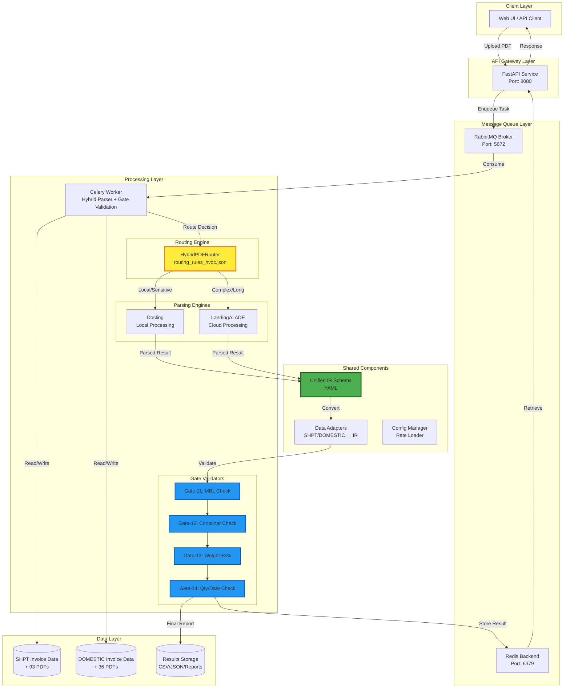
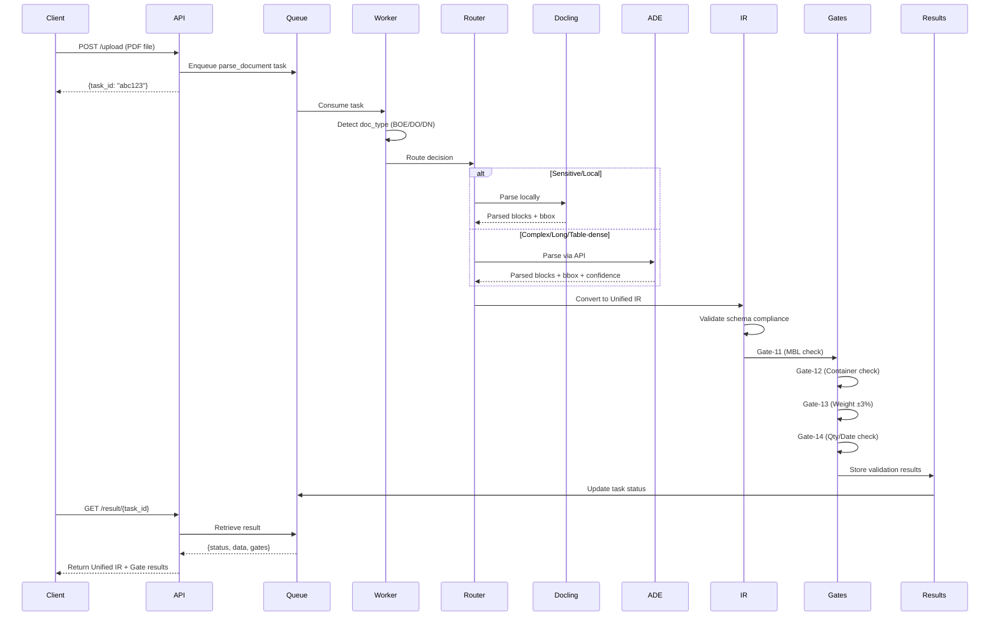
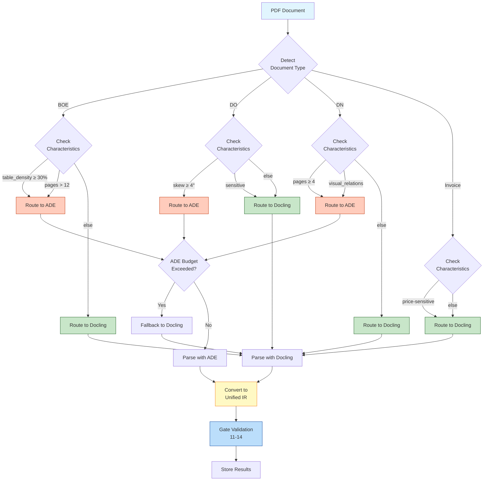
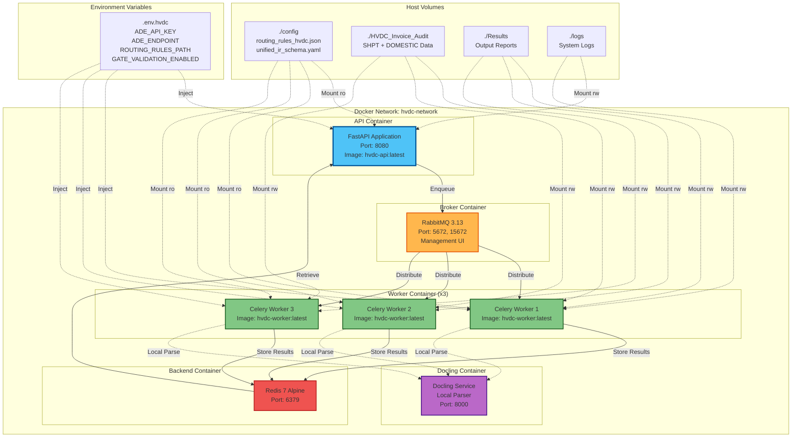
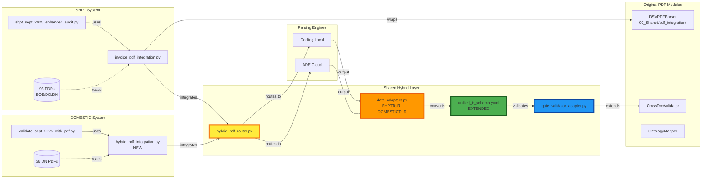

# HVDC Hybrid Parser Integration Design Document

**Version**: 1.0.0
**Date**: 2025-10-14
**Status**: Design Complete
**Project**: HVDC Invoice Audit - Hybrid Docling/ADE Integration

---

## Executive Summary

This document outlines the integration design for combining the Hybrid Document Parser (Docling + LandingAI ADE) with existing SHPT and DOMESTIC Invoice Audit systems. The integration aims to:

1. **Improve PDF parsing quality** through intelligent routing between local (Docling) and cloud (ADE) engines
2. **Standardize data representation** using Unified IR schema across all systems
3. **Maintain Gate validation** (Gate-11~14) within the hybrid workflow
4. **Enable cross-document validation** across invoice and supporting documents
5. **Deploy via Docker Compose** for consistent local development environment

---

## System Architecture Diagrams

### 1. Overall System Architecture



### 2. Data Flow Pipeline



### 3. Routing Decision Tree



### 4. Docker Compose Deployment Architecture



### 5. Component Integration Matrix



---

## Architecture Comparison Matrix

| Aspect | Hybrid Parser (Original) | SHPT System | DOMESTIC System | **Integrated Solution** |
|--------|-------------------------|-------------|-----------------|------------------------|
| **PDF Parsing** | Docling + ADE routing | DSVPDFParser (PyMuPDF) | Multi-layer fallback (PyMuPDF→pypdf→pdfminer→pdftotext) | **Hybrid Router with both engines** |
| **Document Types** | Generic documents | BOE, DO, DN, Carrier Invoice | DN only | **All types with specialized routing** |
| **Data Schema** | Unified IR (blocks+bbox) | Custom SHPT schema | Custom DOMESTIC schema | **Extended Unified IR** |
| **Routing Logic** | routing_rules.json (generic) | N/A | N/A | **routing_rules_hvdc.json (HVDC-specific)** |
| **Gate Validation** | None | Gate-11~14 | Cross-document validation | **Gate-11~14 in hybrid workflow** |
| **Deployment** | Docker Compose + K8s | Python script | Python script | **Docker Compose (local dev)** |
| **Async Processing** | Celery + RabbitMQ | Synchronous | Synchronous | **Celery + RabbitMQ** |
| **Budget Control** | Daily ADE budget | N/A | N/A | **Daily ADE budget with Docling fallback** |
| **Cache** | None | File hash-based | None | **File hash-based cache** |
| **Success Rate** | Unknown | 100% (93/93 PDFs) | 91.7% (33/36 PDFs) | **Target: >95%** |

---

## Unified IR Schema Mapping

### Current SHPT Data Model
```python
{
    "header": {
        "file_path": str,
        "doc_type": "BOE" | "DO" | "DN" | "CarrierInvoice",
        "shipment_id": str
    },
    "data": {
        "mbl_no": str,
        "containers": List[str],
        "gross_weight": float,
        "hs_code": str,
        "customs_office": str,
        # ... BOE/DO/DN specific fields
    }
}
```

### Current DOMESTIC Data Model
```python
{
    "file_path": str,
    "text": str,  # Full PDF text
    "origin": str,
    "destination": str,
    "vehicle_type": str,
    "destination_code": str,
    "do_number": str
}
```

### Extended Unified IR Schema
```yaml
document:
  doc_id: string
  engine: "docling" | "ade"
  routing_decision:
    rule_matched: string
    reason: string
    engine_choice: string
    confidence: float
  pages: integer
  meta:
    filename: string
    mime: string
    created_at: timestamp
    checksum_sha256: string
    doc_type: "BOE" | "DO" | "DN" | "CarrierInvoice" | "Other"
    shipment_id: string (HVDC-specific)
  blocks:
    - id: string
      type: "text" | "table" | "figure" | "header" | "footer" | "field" | "checkbox"
      text: string (optional)
      table: (optional)
        rows: array of arrays
        header: boolean
      bbox:
        page: integer
        x0: float
        y0: float
        x1: float
        y1: float
      meta:
        confidence: float
        source_engine: string
        page_idx: integer
        relations:
          - type: string
            target_id: string
  hvdc_fields:  # HVDC-specific extensions
    boe_fields: (if doc_type == "BOE")
      entry_no: string
      customs_office: string
      hs_code_classifications: array
      mbl_no: string
      containers: array
      gross_weight: float
      gross_weight_unit: string
    do_fields: (if doc_type == "DO")
      do_number: string
      do_validity_date: timestamp
      demurrage_risk_level: "LOW" | "MEDIUM" | "HIGH" | "CRITICAL"
      estimated_demurrage_usd: float
    dn_fields: (if doc_type == "DN")
      origin: string
      destination: string
      vehicle_type: string
      destination_code: string
      do_reference: string
    gate_validation:  # Gate validation results
      gate_11_mbl_check:
        status: "PASS" | "FAIL" | "SKIP"
        details: string
      gate_12_container_check:
        status: "PASS" | "FAIL" | "SKIP"
        details: string
      gate_13_weight_check:
        status: "PASS" | "FAIL" | "SKIP"
        tolerance_pct: float
        details: string
      gate_14_qty_date_check:
        status: "PASS" | "FAIL" | "SKIP"
        details: string
```

---

## Routing Rules Customization

### HVDC-Specific Routing Rules (`routing_rules_hvdc.json`)

```json
{
  "version": "1.0-hvdc",
  "default_engine": "docling",
  "daily_ade_budget_usd": 50.0,
  "sensitivity_force_local": [
    "contract",
    "passport",
    "price-sensitive",
    "portal-fee",
    "demurrage-calculation"
  ],
  "rules": [
    {
      "name": "boe_table_dense",
      "doc_types": ["BOE"],
      "when": {
        "table_density_gte": 0.30
      },
      "action": {
        "engine": "ade",
        "reason": "BOE with dense tables - ADE excels at table extraction"
      }
    },
    {
      "name": "boe_long_document",
      "doc_types": ["BOE"],
      "when": {
        "pages_gt": 12
      },
      "action": {
        "engine": "ade",
        "reason": "Long BOE document - ADE handles better"
      }
    },
    {
      "name": "do_skewed_scan",
      "doc_types": ["DO"],
      "when": {
        "skew_deg_gte": 4.0
      },
      "action": {
        "engine": "ade",
        "reason": "Skewed DO scan - ADE has better correction"
      }
    },
    {
      "name": "dn_multi_page",
      "doc_types": ["DN"],
      "when": {
        "pages_gte": 4
      },
      "action": {
        "engine": "ade",
        "reason": "Multi-page DN - better handling with ADE"
      }
    },
    {
      "name": "visual_relations_detection",
      "doc_types": ["BOE", "DO", "DN", "CarrierInvoice"],
      "when": {
        "visual_relations": ["checkbox", "caption", "chart", "signature"]
      },
      "action": {
        "engine": "ade",
        "reason": "Document with visual relationships - ADE specializes"
      }
    },
    {
      "name": "ade_budget_guard",
      "doc_types": ["BOE", "DO", "DN", "CarrierInvoice"],
      "when": {
        "ade_budget_exceeded": true
      },
      "action": {
        "engine": "docling",
        "reason": "ADE budget exceeded - fallback to Docling"
      },
      "priority": "HIGH"
    },
    {
      "name": "sensitive_force_local",
      "doc_types": ["BOE", "DO", "DN", "CarrierInvoice"],
      "when": {
        "sensitivity_in": ["contract", "passport", "price-sensitive", "portal-fee"]
      },
      "action": {
        "engine": "docling",
        "reason": "Sensitive document - local processing only"
      },
      "priority": "CRITICAL"
    },
    {
      "name": "engine_fallback",
      "doc_types": ["BOE", "DO", "DN", "CarrierInvoice"],
      "when": {
        "engine_failed": true
      },
      "action": {
        "engine": "swap",
        "reason": "Primary engine failed - swap to alternative"
      },
      "priority": "HIGH"
    }
  ],
  "metrics_emit": [
    "latency_ms",
    "engine",
    "doc_type",
    "pages",
    "table_density",
    "ade_cost_usd",
    "cache_hit",
    "retries",
    "gate_validation_results"
  ]
}
```

---

## Gate Validation Integration Points

### Current SHPT Gate Validation Logic

**Gate-11: MBL Consistency Check**
- Compare MBL number across Invoice, BOE, and DO
- Status: PASS if all match, FAIL if mismatch detected

**Gate-12: Container Number Validation**
- Verify container numbers match across Invoice and BOE
- Handle multiple containers per shipment
- Status: PASS if consistent, FAIL if discrepancy

**Gate-13: Weight Tolerance Check (±3%)**
- Compare gross weight between Invoice and BOE
- Allow 3% tolerance for measurement variance
- Status: PASS if within tolerance, FAIL if exceeds

**Gate-14: Quantity & Date Validation**
- Verify quantity consistency across documents
- Check date logic (BL Date ≤ Invoice Date ≤ DO Validity)
- Status: PASS if logical, FAIL if inconsistent

### Integration into Hybrid Workflow

```python
# Pseudocode for integrated validation pipeline

async def process_document_with_validation(pdf_file, shipment_id):
    # Step 1: Route and parse
    routing_decision = hybrid_router.decide_route(pdf_file)
    if routing_decision.engine == "ade":
        parsed_result = await ade_parser.parse(pdf_file)
    else:
        parsed_result = docling_parser.parse(pdf_file)

    # Step 2: Convert to Unified IR
    unified_ir = data_adapter.to_unified_ir(
        parsed_result,
        routing_decision,
        shipment_id
    )

    # Step 3: Validate schema
    schema_validator.validate(unified_ir)

    # Step 4: Gate validation (if applicable)
    if unified_ir.doc_type in ["BOE", "DO", "DN"]:
        gate_results = gate_validator.validate_all_gates(
            unified_ir,
            related_documents=fetch_related_documents(shipment_id)
        )
        unified_ir.hvdc_fields.gate_validation = gate_results

    # Step 5: Store and return
    await redis_backend.store(unified_ir)
    return unified_ir
```

---

## Key Design Decisions

### 1. Why Hybrid Routing?
- **Docling**: Fast, local, no cost, good for standard documents
- **ADE**: Cloud-based, better for complex layouts, costs money
- **Decision**: Route based on document characteristics to optimize cost/quality

### 2. Why Unified IR Schema?
- **Problem**: SHPT and DOMESTIC use different data models
- **Solution**: Single standardized schema that both can convert to/from
- **Benefit**: Enables code reuse, cross-system validation, easier maintenance

### 3. Why Docker Compose (not K8s)?
- **Requirement**: Local development environment specified in plan
- **Trade-off**: K8s provides better scaling, but Docker Compose is simpler for local dev
- **Future**: Can migrate to K8s using existing k8s/ manifests

### 4. Why Preserve Existing PDF Modules?
- **Legacy**: SHPT DSVPDFParser already proven in production (100% success rate)
- **Strategy**: Wrap existing parser, don't replace
- **Benefit**: Maintains backward compatibility, reduces risk

---

## Risk Analysis & Mitigation

| Risk | Impact | Probability | Mitigation |
|------|--------|-------------|------------|
| ADE API downtime | High | Low | Automatic fallback to Docling |
| Budget overrun | Medium | Medium | Daily budget cap with local fallback |
| Schema conversion errors | High | Medium | Comprehensive validation + unit tests |
| Performance degradation | Medium | Low | Caching + async processing |
| Gate validation false positives | High | Low | Extensive testing with real data (102+44 items) |
| Docker networking issues | Low | Low | Standard compose patterns + documentation |

---

## Success Metrics

### Performance Targets
- **Parsing Success Rate**: >95% (vs. current 100% SHPT, 91.7% DOMESTIC)
- **Processing Latency**: <10 seconds per document (vs. current ~7 seconds for SHPT)
- **Gate Validation Accuracy**: >98% (maintain current SHPT standards)
- **ADE Cost**: <$50 USD/day (as configured)

### Quality Targets
- **Schema Validation**: 100% compliance with Unified IR
- **Cache Hit Rate**: >40% for repeated documents
- **Zero Downtime**: Graceful fallback on engine failures

---

## Next Steps

1. ✅ **Design Complete** - This document
2. ⏳ **Phase 2**: Implement Unified IR schema extension
3. ⏳ **Phase 3**: Build hybrid router and adapters
4. ⏳ **Phase 4**: Integrate with SHPT and DOMESTIC systems
5. ⏳ **Phase 5**: Docker Compose deployment
6. ⏳ **Phase 6**: Testing with real datasets (93+36 PDFs)
7. ⏳ **Phase 7**: Documentation and performance reporting

---

**Document Status**: ✅ Ready for Implementation
**Approval**: Pending stakeholder review
**Next Review**: After Phase 2 completion

