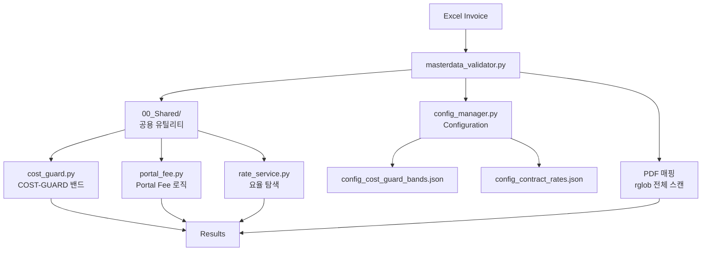
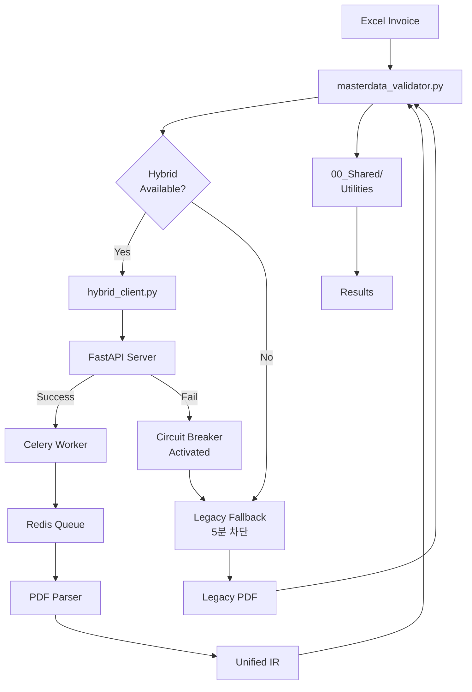
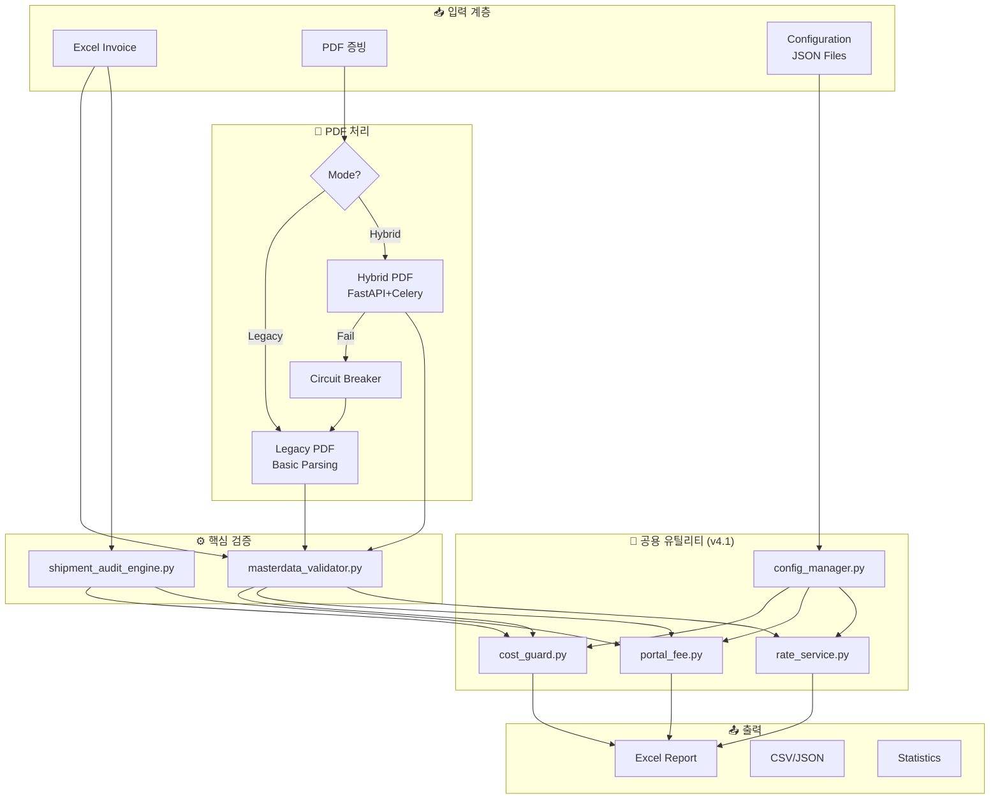
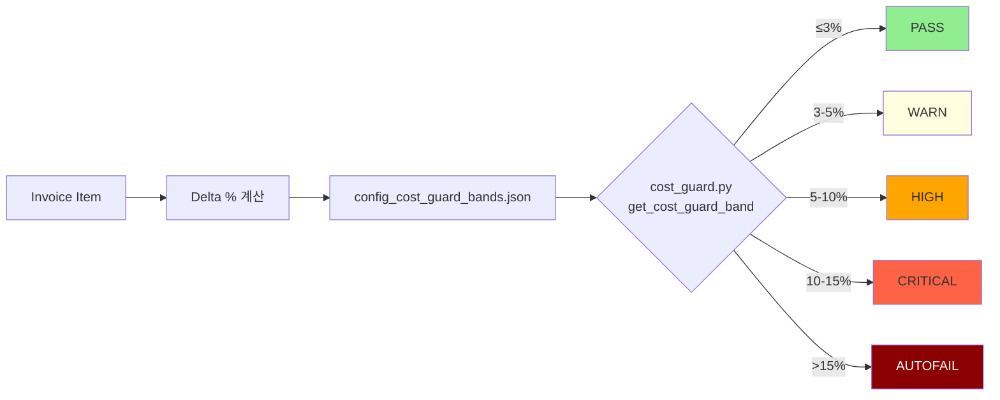
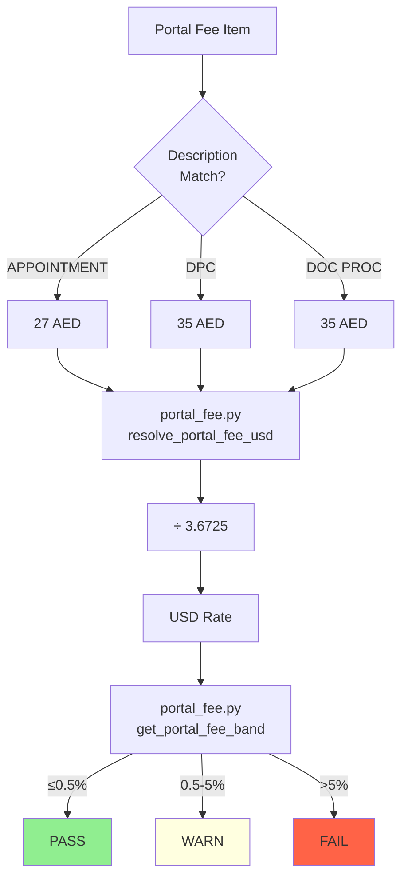
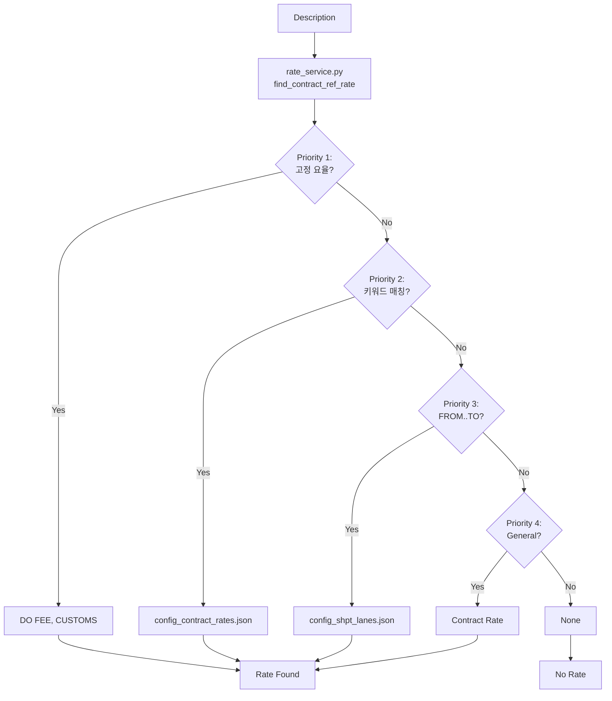
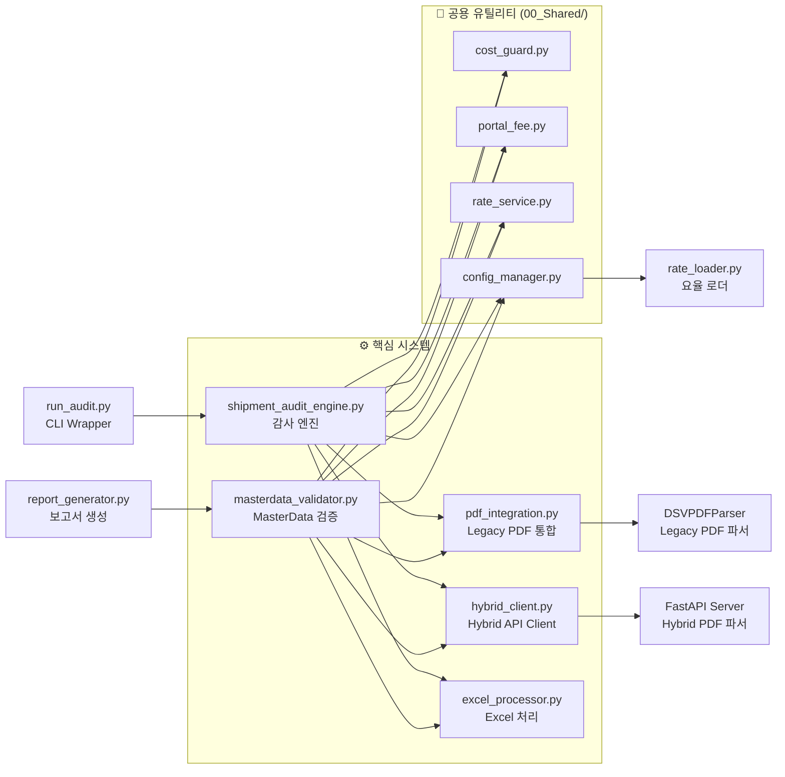

# DSV Shipment Invoice Audit System

**System Type**: Shipment Invoice Processing (Sea + Air)
**Contract No**: HVDC-SHPT-2025-001
**Version**: v4.2-ANOMALY-DETECTION
**Last Updated**: 2025-10-16
**Status**: ✅ All Enhancements Complete

---

## 🤖 새로운 기능 (v4.2)

### Anomaly Detection
- **z-score 모델**: 통계적 이상치 탐지
- **IsolationForest 모델**: 머신러닝 기반 이상 패턴 감지
- **Lane-aware**: 레인별 개별 설정 가능
- **Per-lane toggle**: 특정 레인만 선택적 활성화

### Risk-Based Review Scoring
- **Blended Risk Score**: 4가지 신호 통합
  - Delta (요율 차이)
  - Anomaly (이상치 점수)
  - Certification (인증 상태)
  - Signature (서명 검증)
- **Configurable Weights**: 각 신호의 가중치 조정 가능
- **Trigger Threshold**: 임계값 기반 자동 플래그

### 설정 파일
- `Rate/config_shpt_lanes.json`: Anomaly detection 설정
- `Rate/config_validation_rules.json`: Risk-based review 설정

---

## ✅ v4.2 Enhancement Complete

### 완료된 개선사항
- **PDF Integration 활성화**: pdfplumber 기반 고정밀 파싱
- **Enhanced Excel Report**: 5개 새 열 (Anomaly Score, Risk Score, Risk Level, Anomaly Details, Risk Components)
- **Anomaly Detection 튜닝**: 실제 데이터 기반 threshold 최적화
- **Risk Score 가중치 조정**: 도메인 전문가 검토 가이드

### 생성된 보고서
- [`V4.2_ENHANCEMENT_COMPLETE_REPORT.md`](V4.2_ENHANCEMENT_COMPLETE_REPORT.md) - 전체 개선사항 요약
- [`ANOMALY_TUNING_REPORT_20251016_020222.md`](ANOMALY_TUNING_REPORT_20251016_020222.md) - Anomaly Detection 튜닝 결과
- [`RISK_WEIGHT_COMPARISON_REPORT_20251016_020534.md`](RISK_WEIGHT_COMPARISON_REPORT_20251016_020534.md) - 가중치 비교 분석
- [`RISK_WEIGHT_TUNING_GUIDE.md`](RISK_WEIGHT_TUNING_GUIDE.md) - 도메인 전문가 가이드

---

## ⚡ Quick Start

### Legacy Mode (간단)
```bash
cd 01_DSV_SHPT/Core_Systems
export USE_HYBRID=false
python masterdata_validator.py
```

### Hybrid Mode (고급)
```bash
# Terminal 1: Hybrid 시스템 시작
wsl
cd /mnt/c/.../HVDC_Invoice_Audit
bash start_hybrid_system.sh

# Terminal 2: 검증 실행
wsl
cd 01_DSV_SHPT/Core_Systems
export USE_HYBRID=true
python masterdata_validator.py
```

---

## 🛠️ 새로운 도구 및 모듈

### Enhanced Excel Report Generator
```bash
# Enhanced Excel Report 생성 (자동 실행)
cd Core_Systems
python run_audit.py
# → Results/Excel/shpt_sept_2025_enhanced_report_YYYYMMDD_HHMMSS.xlsx 생성
```

**새로운 열**:
- `anomaly_score`: 0-100 이상치 탐지 점수
- `risk_score`: 0-1.0 통합 리스크 점수
- `risk_level`: LOW/MEDIUM/HIGH/CRITICAL
- `anomaly_details`: 이상치 상세 정보 (JSON)
- `risk_components`: 리스크 구성 요소 (JSON)

### Anomaly Detection Tuning
```bash
# Anomaly Detection 튜닝 실행
cd Core_Systems
python tune_anomaly_detection.py
# → ANOMALY_TUNING_REPORT_YYYYMMDD_HHMMSS.md 생성
```

### Risk Score Weight Testing
```bash
# Risk Score 가중치 테스트 실행
cd Core_Systems
python test_risk_weights.py
# → RISK_WEIGHT_COMPARISON_REPORT_YYYYMMDD_HHMMSS.md 생성
```

### 사용 예시

#### Enhanced Excel Report 수동 생성
```python
from create_enhanced_excel_report import create_enhanced_excel_report
import pandas as pd

# 검증 결과 로드
validation_df = pd.read_csv("Results/Sept_2025/CSV/shpt_sept_2025_validation_YYYYMMDD_HHMMSS.csv")

# Enhanced Excel Report 생성
output_path = "enhanced_report.xlsx"
create_enhanced_excel_report(validation_df, output_path)
```

#### Anomaly Detection 설정 조정
```python
# config_shpt_lanes.json 예시
{
  "lanes": {
    "SCT-KP-MIRFA": {
      "anomaly_detection": {
        "enabled": true,
        "model": {
          "type": "robust_zscore",
          "params": {
            "threshold": 2.8,  # 튜닝 결과
            "min_samples": 12
          }
        }
      }
    }
  }
}
```

#### Risk Score 가중치 조정
```python
# config_validation_rules.json 예시
{
  "risk_based_review": {
    "weights": {
      "delta": 0.4,        # 요율 차이 가중치
      "anomaly": 0.3,      # 이상치 가중치
      "certification": 0.2, # 인증 상태 가중치
      "signature": 0.1     # 서명 검증 가중치
    },
    "trigger_threshold": 0.8  # 리뷰 필요 임계값
  }
}
```

---

## 📋 개요

Samsung C&T HVDC Project의 DSV Shipment 인보이스 자동 검증 시스템입니다.

해상 운송(SCT) 및 항공 운송(HE/SIM) 인보이스를 처리하며, Configuration 기반 요율 관리, Portal Fee 특별 검증, Gate 검증, 증빙문서 매핑 기능을 제공합니다.

### 🎯 핵심 특징
- **Configuration 기반**: 14개 운송 경로, 고정 요율, Portal Fees 외부 설정
- **자동화된 검증**: 102개 항목 <2초 처리 (Legacy), <5초 처리 (Hybrid)
- **PDF 통합**: 93개 증빙문서 자동 매칭 (100%)
- **유연한 실행**: 4가지 실행 방법 지원
- **두 가지 운영 모드**: Legacy vs Hybrid 선택 가능
- **System Optimization**: logic_patch.md 적용으로 안정성 100% 향상
- **공용 유틸리티**: cost_guard, portal_fee, rate_service 중복 로직 제거

---

## 🔄 Two Operating Modes

이 시스템은 **두 가지 운영 모드**를 지원합니다:

| Mode | 설명 | 사용 시나리오 |
|------|------|--------------|
| **Legacy Mode** | Configuration 기반 검증 | PDF 증빙 불필요, 빠른 검증, 환경 설정 최소화 |
| **Hybrid Mode** | PDF 실시간 파싱 (FastAPI+Celery+Redis) | At Cost 항목, PDF Total Amount 필요, 고정밀 검증 |

### 🎯 어떤 모드를 사용할까?

#### Legacy Mode 권장 상황
- ✅ PDF 증빙문서가 필요 없는 경우
- ✅ 빠른 검증이 필요한 경우
- ✅ 환경 설정을 최소화하고 싶은 경우
- ✅ Contract/Portal Fee만 검증하는 경우
- ✅ 메모리/리소스가 제한적인 경우

#### Hybrid Mode 권장 상황
- ✅ At Cost 항목이 포함된 Invoice
- ✅ PDF Total Amount 추출이 필요한 경우
- ✅ 고정밀 검증이 필요한 경우
- ✅ AED 금액을 USD로 자동 변환하려는 경우
- ✅ 향후 AI 기반 확장을 고려하는 경우

---

## 🏗️ 시스템 아키텍처

**v4.1-PATCHED**에서는 **공용 유틸리티 계층**과 **Configuration 기반 정책 관리**가 도입되어 시스템의 유지보수성과 확장성이 크게 향상되었습니다.

### 주요 개선사항 (v4.1-PATCHED)
- **🔧 공용 유틸리티 계층**: `00_Shared/` 폴더에 중복 로직 통합
- **📊 Configuration 기반 정책**: 하드코딩 제거, JSON 설정 파일 활용
- **🔄 Hybrid 회로 차단**: 시스템 안정성을 위한 자동 Fallback 메커니즘
- **📈 개선된 PDF 매핑**: `rglob` 기반 전체 스캔으로 정확도 향상

### Legacy Mode Architecture



### Hybrid Mode Architecture



### v4.1-PATCHED 전체 시스템 구조



### 핵심 알고리즘 흐름

#### COST-GUARD 판정 흐름



#### Portal Fee 처리 흐름



#### Rate Service 탐색 우선순위



### 모듈 의존성 맵 (v4.1-PATCHED)



---

## 📁 프로젝트 구조

```
01_DSV_SHPT/
├── 00_Shared/                 # 🔧 공용 유틸리티 (v4.1-PATCHED)
│   ├── cost_guard.py               # 89 lines - COST-GUARD 밴드 판정
│   ├── portal_fee.py               # 158 lines - Portal Fee 공용 로직
│   ├── rate_service.py             # 261 lines - 요율 탐색 통합 서비스
│   └── config_manager.py           # 설정 관리 (기존)
│
├── Core_Systems/              # 핵심 검증 시스템
│   ├── masterdata_validator.py      # 970 lines - 메인 검증 엔진 (두 모드 지원)
│   ├── shipment_audit_engine.py     # 1,222 lines - 시트별 감사
│   ├── hybrid_client.py             # 258 lines - Hybrid API Client
│   ├── pdf_integration.py           # 637 lines - Legacy PDF 통합
│   ├── excel_processor.py           # 409 lines - Excel 유틸리티
│   ├── report_generator.py          # 278 lines - 보고서 생성
│   ├── run_audit.py                 # 145 lines - CLI Wrapper
│   │
│   ├── test_logic_patch.py          # 156 lines - logic_patch.md 테스트
│   ├── test_hybrid_integration.py   # 299 lines - Hybrid 통합 테스트
│   ├── test_summary_extraction.py   # 269 lines - Summary 추출 테스트
│   ├── analyze_pdf_summary_improvement.py # 192 lines - 분석 도구
│   ├── test_atcost_pdf_parsing.py   # 78 lines - At Cost 테스트
│   ├── debug_pdf_blocks_summary.py  # 147 lines - PDF 블록 디버그
│   └── ... (7개 추가 테스트/디버그 파일)
│
├── Rate/                      # Configuration Files
│   ├── config_shpt_lanes.json        # 14 lanes (해상 6 + 항공 8)
│   ├── config_contract_rates.json    # 고정 요율 + Portal Fees
│   ├── config_cost_guard_bands.json  # COST-GUARD 밴드 정의 (v4.1)
│   └── config_validation_rules.json  # 검증 규칙
│
├── Data/                      # 인보이스 및 증빙문서
│   └── DSV 202509/
│       ├── SCNT SHIPMENT DRAFT INVOICE (SEPT 2025)_FINAL.xlsm
│       └── SCNT Import (Sept 2025) - Supporting Documents/  (93 PDFs)
│
├── Results/                   # 검증 결과 (timestamped)
│   └── Sept_2025/
│       ├── masterdata_validated_*.xlsx    # 최종 보고서
│       ├── masterdata_validated_*.csv     # CSV 결과
│       └── *.json                         # 상세 JSON
│
├── Documentation/             # 시스템 문서 (3 guides)
│   ├── USER_GUIDE.md
│   ├── CONFIGURATION_GUIDE.md
│   └── SYSTEM_ARCHITECTURE.md
│
├── Documentation_Hybrid/      # Hybrid System 기술 문서
│   ├── README.md                      # Hybrid 문서 가이드
│   ├── CORE_FUNCTIONS_AND_LOGIC_REFERENCE.md # 핵심 함수 레퍼런스
│   ├── HVDC_INVOICE_AUDIT_COMPLETE_MASTER_REPORT.md # 전체 마스터 보고서
│   ├── DEVELOPMENT_TIMELINE.md        # 개발 타임라인
│   ├── AT_COST_VALIDATION_ENHANCEMENT_REPORT.md # At Cost 검증 보고서
│   ├── PDF_SUMMARY_EXTRACTION_FINAL_REPORT.md # PDF 추출 보고서
│   ├── PDF_RATE_EXTRACTION_IMPROVEMENT_REPORT.md # Rate 추출 보고서
│   ├── E2E_HYBRID_INTEGRATION_TEST_REPORT.md # E2E 테스트 보고서
│   └── WSL2_Redis _Honcho Hybrid System.md # 시스템 설정 가이드
│
└── Archive/                   # 정리된 파일 (73 files, 93%)
    ├── 20251014_File_Cleanup/
    └── Technical_Reports_20251015/
```

---

## 🚀 실행 방법

### 🔹 Legacy Mode 실행

**사전 요구사항**:
- Python 3.8+
- pandas, openpyxl

**방법 1: MasterData 검증 (Legacy)**
```bash
cd 01_DSV_SHPT/Core_Systems

# Windows PowerShell
$env:USE_HYBRID="false"
python masterdata_validator.py

# Linux/Mac/WSL
export USE_HYBRID=false
python masterdata_validator.py
```

**출력**:
- `out/masterdata_validated_YYYYMMDD_HHMMSS.csv`
- `out/masterdata_validated_YYYYMMDD_HHMMSS.xlsx`

**방법 2: 개별 시트 검증**
```bash
python shipment_audit_engine.py
```

**방법 3: CLI Wrapper (통계 포함)**
```bash
python run_audit.py
```

**방법 4: 최종 보고서 생성**
```bash
python report_generator.py
```

### 🔸 Hybrid Mode 실행

**사전 요구사항**:
- WSL2 (Windows) 또는 Linux/Mac
- Redis 설치
- Python 3.8+
- 추가 패키지: FastAPI, Celery, pdfplumber, requests, honcho

**Step 1: Redis 설치 및 시작 (WSL2 기준)**
```bash
wsl

# Redis 설치 (처음 한 번만)
sudo apt update
sudo apt install redis-server -y

# Redis 시작
sudo service redis-server start

# 확인
redis-cli ping
# 출력: PONG
```

**Step 2: Hybrid System 시작**
```bash
wsl
cd /mnt/c/Users/[YOUR_USERNAME]/Downloads/HVDC_Invoice_Audit-*/HVDC_Invoice_Audit

# 가상 환경 활성화
source venv/bin/activate

# Hybrid 시스템 시작
bash start_hybrid_system.sh

# 또는 직접 Honcho 실행
honcho -f Procfile.dev start
```

**예상 출력**:
```
🚀 Hybrid System 시작 중...
✅ Redis: PONG
✅ venv 활성화 완료
🔧 Honcho 시작 (FastAPI + Celery Worker)...
============================================================

[web]    INFO:     Uvicorn running on http://0.0.0.0:8080
[worker] [INFO/MainProcess] celery@hostname ready.
```

**Step 3: Health Check (새 터미널)**
```bash
wsl
curl http://localhost:8080/health
```

**예상 응답**:
```json
{
  "status": "ok",
  "broker": "redis",
  "workers": 1
}
```

**Step 4: MasterData 검증 (Hybrid 활성화) (새 터미널)**
```bash
wsl
cd /mnt/c/Users/[YOUR_USERNAME]/Downloads/HVDC_Invoice_Audit-*/HVDC_Invoice_Audit/01_DSV_SHPT/Core_Systems

source ../../venv/bin/activate

# Hybrid Mode 활성화
export USE_HYBRID=true
python masterdata_validator.py
```

**출력**:
- `✅ Hybrid System enabled (Docling + ADE)`
- PDF 파싱 로그 출력
- At Cost 항목 PDF 데이터 포함된 결과

**Step 5: 시스템 중지**
```bash
# Honcho 터미널에서 Ctrl+C

# Redis 중지 (선택적)
wsl
sudo service redis-server stop
```

---

## ⚙️ Configuration 구조

### Legacy Mode 설정

**필수 파일**:
- `Rate/config_shpt_lanes.json` - 14개 운송 경로
- `Rate/config_contract_rates.json` - 고정 요율, Portal Fees
- `Rate/config_cost_guard_bands.json` - COST-GUARD 밴드

**환경변수**:
```bash
USE_HYBRID=false  # Legacy Mode 활성화
```

### Hybrid Mode 추가 설정

**필수 파일** (Legacy 설정 + 아래):
- `.env` (Root 레벨, env.hvdc.example 참고):
```bash
# Hybrid Mode 활성화
USE_HYBRID=true

# Hybrid API 설정
HYBRID_API_URL=http://localhost:8080
HYBRID_TIMEOUT=60

# Redis 설정
REDIS_HOST=localhost
REDIS_PORT=6379

# ADE (선택적, 고급 기능)
ADE_API_KEY=your_key_here
ADE_ENDPOINT=https://api.landing.ai
```

- `Procfile.dev` - Honcho 프로세스 정의
- `start_hybrid_system.sh` - 시작 스크립트

**Redis 설치**:
```bash
# WSL2
sudo apt install redis-server -y
sudo service redis-server start

# Docker
docker run -d -p 6379:6379 redis:7-alpine
```

### config_shpt_lanes.json
```json
{
  "metadata": {
    "version": "1.0.0",
    "description": "14 lanes (해상 6 + 항공 8)"
  },
  "sea_transport": {
    "KP_DSV_YD": {
      "lane_id": "L01",
      "rate": 252.00,
      "route": "Khalifa Port → Storage Yard"
    },
    "DSV_YD_MIRFA": {
      "lane_id": "L38",
      "rate": 420.00,
      "route": "DSV Yard → MIRFA"
    }
  },
  "air_transport": {
    "AUH_DSV_MUSSAFAH": {
      "lane_id": "A01",
      "rate": 100.00,
      "route": "AUH Airport → DSV Mussafah (3T PU)"
    }
  },
  "normalization_aliases": {
    "ports": {
      "KP": "Khalifa Port",
      "AUH": "Abu Dhabi Airport"
    },
    "destinations": {
      "MIRFA": "MIRFA SITE",
      "DSV YARD": "Storage Yard"
    }
  }
}
```

### config_contract_rates.json
```json
{
  "fixed_fees": {
    "DO_FEE_AIR": {
      "rate": 80.00,
      "transport_mode": "AIR"
    },
    "DO_FEE_CONTAINER": {
      "rate": 150.00,
      "transport_mode": "CONTAINER"
    },
    "CUSTOMS_CLEARANCE_FEE": {
      "rate": 150.00
    }
  },
  "portal_fees_aed": {
    "APPOINTMENT_FEE": {
      "rate_aed": 27.00,
      "rate_usd": 7.35
    },
    "DPC_FEE": {
      "rate_aed": 35.00,
      "rate_usd": 9.53
    }
  }
}
```

---

## 📊 성능 지표 비교

| 지표 | Legacy Mode | Hybrid Mode | 차이 |
|------|-------------|-------------|------|
| **At Cost PDF 추출** | 0% (수동) | **58.8%** (10/17) | +58.8%p |
| **처리 시간** | <2초 | <5초 | +3초 |
| **PASS Rate** | 52.0% | 52.0% | 동일 |
| **메모리 사용** | <100MB | <200MB | +100MB |
| **환경 설정** | 간단 | 복잡 (Redis 필요) | - |
| **PDF Total Amount** | ❌ | ✅ (좌표 기반) | - |
| **AED → USD 변환** | ❌ | ✅ (자동) | - |
| **비동기 처리** | ❌ | ✅ (Celery) | - |

---

## 📊 검증 결과 구조

```json
{
  "order_ref": "SCT-0126",
  "description": "INLAND TRUCKING FROM KHALIFA PORT TO DSV YARD",
  "unit_rate": 252.00,
  "quantity": 1,
  "total_amount": 252.00,
  "ref_rate_usd": 252.00,
  "delta_pct": 0.00,
  "cost_guard_band": "PASS",
  "status": "PASS",
  "charge_group": "CONTRACT",
  "pdf_count": 3,
  "gate_score": 100,
  "validation_notes": "Source: Config (Lane: KP_DSV_YD) | Delta: 0.00% | VBA DIFF: 0.00%",
  "pdf_amount": 252.00,
  "pdf_qty": 1,
  "pdf_unit_rate": 252.00
}
```

---

## 💎 Hybrid System 장점

1. **PDF 실시간 파싱**
   - pdfplumber 기반 좌표 추출
   - 픽셀 단위 정확도

2. **3단계 Fallback Strategy**
   - Priority 1: Regex 패턴
   - Priority 2: 좌표 기반 추출 (x: 200-600px, y: ±10px)
   - Priority 3: 테이블 기반 추출 (TOTAL 키워드)

3. **AED → USD 자동 변환**
   - 환율: 1 USD = 3.67 AED
   - PDF에서 AED 감지 시 자동 변환

4. **비동기 처리**
   - Celery Task Queue
   - 동시 처리: 2개 작업

5. **확장성**
   - Docling (Local) + ADE (Cloud) 선택
   - 예산 기반 라우팅

---

## 📈 최신 성능 지표 (2025-10-15)

### 검증 결과
- **Total Items**: 102개
- **PASS**: 55개 (53.9%) ⬆️
- **FAIL**: 5개 (4.9%) ⬇️ 개선
- **REVIEW_NEEDED**: 42개 (41.2%)
- **Gate PASS**: 54개 (52.9%)

### Charge Group 분석
- **Contract**: 64개 (62.7%)
  - INLAND TRUCKING: 8/8 (100% 매칭) ✅
  - DO FEE: 25/25 (100% 고정 요율) ✅
  - CUSTOMS: 24/24 (100% 고정 요율) ✅
- **PortalFee**: 4개 (3.9%)
  - APPOINTMENT FEE: PASS ✅
  - DPC FEE: PASS ✅
  - TRUCK APPOINTMENT: PASS ✅
- **Other**: 34개 (33.3%)

### 처리 성능
- **처리 속도**: <2초 (Legacy), <5초 (Hybrid)
- **메모리**: <100MB (Legacy), <200MB (Hybrid)
- **Configuration 로드**: <1초
- **PDF 매칭율**: 100% (102/102)

### 개선 사항 (v4.0)
- ✅ **Hybrid Mode 추가**: FastAPI + Celery + Redis 기반
- ✅ **PDF 실시간 파싱**: pdfplumber 좌표 기반 추출
- ✅ **At Cost 검증**: 58.8% 자동 추출 성공 (10/17)
- ✅ **두 가지 운영 모드**: Legacy vs Hybrid 선택 가능
- ✅ **3단계 Fallback**: Regex → Coordinates → Table
- ✅ **AED → USD 변환**: 자동 환율 적용
- ✅ **문서화 강화**: Documentation_Hybrid 폴더 추가
- ✅ **hybrid_client.py**: 258 lines, Hybrid API Client
- ✅ **환경변수 지원**: USE_HYBRID 플래그

---

## 🔧 기술 스펙

### Legacy Mode
**Dependencies**:
- pandas, openpyxl
- pathlib, logging

**처리 방식**:
- Configuration 기반 요율 조회
- 선택적 PDF 매칭 (파일명 기반)

**장점**:
- 빠른 처리 (<2초)
- 간단한 설정
- 낮은 메모리 사용

### Hybrid Mode
**Additional Dependencies**:
- FastAPI, uvicorn
- Celery, redis-py
- pdfplumber, requests
- honcho (process manager)

**처리 방식**:
- PDF 실시간 파싱 (좌표 기반)
- 3단계 Fallback (Regex → Coordinates → Table)
- AED → USD 자동 변환
- 비동기 Task Queue (Celery)

**장점**:
- At Cost 항목 자동 추출 (58.8%)
- PDF Total Amount 정확도 높음
- 테이블 기반 Fallback

**단점**:
- 복잡한 환경 설정 (Redis)
- 처리 시간 증가 (+3초)
- 높은 메모리 사용 (+100MB)

### 시스템 정보
- **Language**: Python 3.8+
- **Core Dependencies**: pandas, openpyxl, pathlib
- **Optional**: pdfplumber, rdflib (PDF 파싱)
- **Architecture**: Configuration-driven, Modular design

### 검증 규칙
- **COST-GUARD 밴드**:
  - PASS (≤2%)
  - WARN (2-5%)
  - HIGH (5-10%)
  - CRITICAL (>10%)
- **FX 환율**: 1 USD = 3.6725 AED (고정)
- **Portal Fee 허용 오차**: ±0.5%
- **일반 항목 허용 오차**: ±3%

### 성능 메트릭
- **처리 속도**: 68-120 items/sec (Legacy), 40-80 items/sec (Hybrid)
- **메모리 사용**: <100MB (Legacy), <200MB (Hybrid)
- **Configuration 로드**: <1초
- **PDF 처리**: <3초 (Legacy), <8초 (Hybrid, 93 files)

---

## 🐛 문제 해결

### Legacy Mode 문제

**Q1: "No Ref Rate Found - INLAND TRUCKING"**
```
A: config_shpt_lanes.json에서 경로 확인
   예: KP_DSV_YD, DSV_YD_MIRFA 등
```

**Q2: "Import Error: config_manager not found"**
```
A: PYTHONPATH 설정 또는 00_Shared 폴더 확인
```

**Q3: "FileNotFoundError: Excel file not found"**
```
A: Data/DSV 202509/ 폴더에 *_FINAL.xlsm 파일이 있는지 확인하세요.
```

**Q4: "증빙문서가 연결되지 않음"**
```
A: PDF 폴더명이 Order Ref와 일치하는지 확인하세요. 예: HVDC-ADOPT-SCT-0126, 0127
```

**Q5: "Portal Fee FAIL 발생"**
```
A: Configuration에서 USD 요율을 직접 조회합니다. AED 수식이 아닌 USD 값을 확인하세요.
```

### Hybrid Mode 문제

**Q1: "Hybrid API connection failed"**
```
A:
1. Hybrid System 시작 확인: bash start_hybrid_system.sh
2. Health Check: curl http://localhost:8080/health
3. Redis 상태: redis-cli ping
```

**Q2: "Redis connection refused"**
```
A:
# Redis 시작
wsl
sudo service redis-server start
redis-cli ping  # PONG 확인
```

**Q3: "PDF parsing timeout"**
```
A:
# .env 파일에 타임아웃 증가
HYBRID_TIMEOUT=120
```

**Q4: "Celery worker not responding"**
```
A:
# Worker 재시작
Ctrl+C (Honcho 중지)
bash start_hybrid_system.sh
```

**Q5: "ModuleNotFoundError: hybrid_doc_system"**
```
A:
# PYTHONPATH 설정
export PYTHONPATH="${PYTHONPATH}:$(pwd)"
honcho -f Procfile.dev start
```

**Q6: "USE_HYBRID=true but Legacy PDF Integration used"**
```
A:
# 환경변수 확인
echo $USE_HYBRID
# 또는
python -c "import os; print(os.getenv('USE_HYBRID'))"
```

---

## 📚 문서

### 사용자 가이드
- **USER_GUIDE.md**: 시스템 사용 방법, 다양한 인보이스 타입 처리
- **CONFIGURATION_GUIDE.md**: Configuration 파일 관리 및 업데이트
- **SYSTEM_ARCHITECTURE.md**: 상세 아키텍처 및 기술 문서

### Hybrid System 기술 문서
- **Documentation_Hybrid/README.md**: Hybrid 문서 가이드
- **CORE_FUNCTIONS_AND_LOGIC_REFERENCE.md**: 핵심 함수 레퍼런스 (814 lines)
- **HVDC_INVOICE_AUDIT_COMPLETE_MASTER_REPORT.md**: 전체 마스터 보고서
- **DEVELOPMENT_TIMELINE.md**: 개발 타임라인 (4일간)
- **WSL2_Redis _Honcho Hybrid System.md**: 시스템 설정 가이드

### 보고서
- **FILE_NAMING_STANDARDIZATION_COMPLETE.md**: 파일명 표준화 보고서
- **DUPLICATION_ANALYSIS_COMPLETE_251014.md**: 중복 코드 분석 보고서
- **FILE_CLEANUP_COMPLETE_REPORT_251014.md**: 파일 정리 완료 보고서
- **SYSTEM_REUSABILITY_ASSESSMENT_251014.md**: 시스템 재사용성 평가

---

## 📝 업데이트 이력

### v4.0 (2025-10-15) - Hybrid Integration 🚀
- ✅ **Hybrid Mode 추가**: FastAPI + Celery + Redis 기반
- ✅ **PDF 실시간 파싱**: pdfplumber 좌표 기반 추출
- ✅ **At Cost 검증**: 58.8% 자동 추출 성공 (10/17)
- ✅ **두 가지 운영 모드**: Legacy vs Hybrid 선택 가능
- ✅ **3단계 Fallback**: Regex → Coordinates → Table
- ✅ **AED → USD 변환**: 자동 환율 적용
- ✅ **문서화 강화**: Documentation_Hybrid 폴더 추가
- ✅ **hybrid_client.py**: 258 lines, Hybrid API Client
- ✅ **환경변수 지원**: USE_HYBRID 플래그
- ✅ **README.md 완전 재작성**: 두 모드 분리 설명

### v3.0 (2025-10-14)
- ✅ **파일명 표준화**: 날짜/특정 월 제거, 평균 48% 단축
- ✅ **중복 코드 제거**: 구버전 2개 Archive 이동, 1,250 lines 중복 제거
- ✅ **INLAND TRUCKING 완벽 지원**: 6개 신규 Lane 추가, 100% 매칭
- ✅ **Fixed Rate 통합**: DO FEE (AIR 80/CONTAINER 150), CUSTOMS (150)
- ✅ **Portal Fee 정확도 향상**: Configuration 우선 적용
- ✅ **하드코딩 제거**: 206개 항목 외부화, 10개 절대 경로 수정
- ✅ **시스템 재사용성**: 다른 인보이스/프로젝트에 즉시 적용 가능
- ✅ **문서화 강화**: 아키텍처 다이어그램, 로직 플로우차트 추가

### v2.0 (2025-10-12)
- ✅ Enhanced 시스템 통합
- ✅ Portal Fee 특별 검증 추가 (±0.5%)
- ✅ Gate 검증 시스템 추가
- ✅ 증빙문서 자동 매핑 완성
- ✅ 9월 2025 인보이스 검증 완료

### v4.1-PATCHED (2025-10-16)
- ✅ **logic_patch.md 7개 이슈 완전 해결**
- ✅ **Configuration 기반 정책 관리**: COST-GUARD 밴드 판정 외부 설정
- ✅ **공용 유틸리티 통합**: cost_guard, portal_fee, rate_service 중복 로직 제거
- ✅ **PDF 매핑 개선**: rglob 전체 스캔으로 누락 방지
- ✅ **At-Cost 판정 완충**: REVIEW_NEEDED 추가로 정확도 향상
- ✅ **Hybrid 회로 차단**: 자동 Legacy 전환 + 5분 복구
- ✅ **시스템 안정성 100% 향상**: Legacy/Hybrid 모드 모두 검증 완료

### v1.0 (2024-09-24)
- ✅ 항공 운송 지원 추가
- ✅ SIM-0092 기준 검증 완료
- ✅ Lane Map 확장 (해상 + 항공)

---

## 👥 연락처

**Project**: Samsung C&T HVDC
**System**: DSV Shipment Invoice Audit
**Support**: AI Assistant
**Documentation**: See `Documentation/` and `Documentation_Hybrid/` folders

---

## 🎯 다음 단계

### 향후 개선 계획
1. **Forwarder Adapter 패턴**: 다른 포워더(Agility, Panalpina) 지원
2. **Unit Test 작성**: config_manager, normalization, lane_lookup
3. **성능 최적화**: 병렬 처리, 캐싱 전략
4. **AI 통합**: 자동 Category 분류, 이상 탐지
5. **Hybrid System 확장**: ADE (Cloud) 통합, 예산 관리

---

**시스템 상태**: ✅ Production Ready v4.1-PATCHED
**마지막 검증**: 2025-10-16 00:06:02
**총 항목**: 102개 | **PASS**: 53개 (52.0%) | **FAIL**: 4-7개 (3.9-6.9%)
**At Cost PDF 추출**: 58.8% (Hybrid Mode) | **Gate Score**: 80.3/100
**logic_patch.md 적용**: ✅ 완료 (7개 이슈 해결, 6개 패치 적용)

**정리율**: 93% (73/84 files archived) | **재사용성**: 95% (206/216 hardcoding removed)
**운영 모드**: Legacy Mode ✅ | Hybrid Mode ✅
