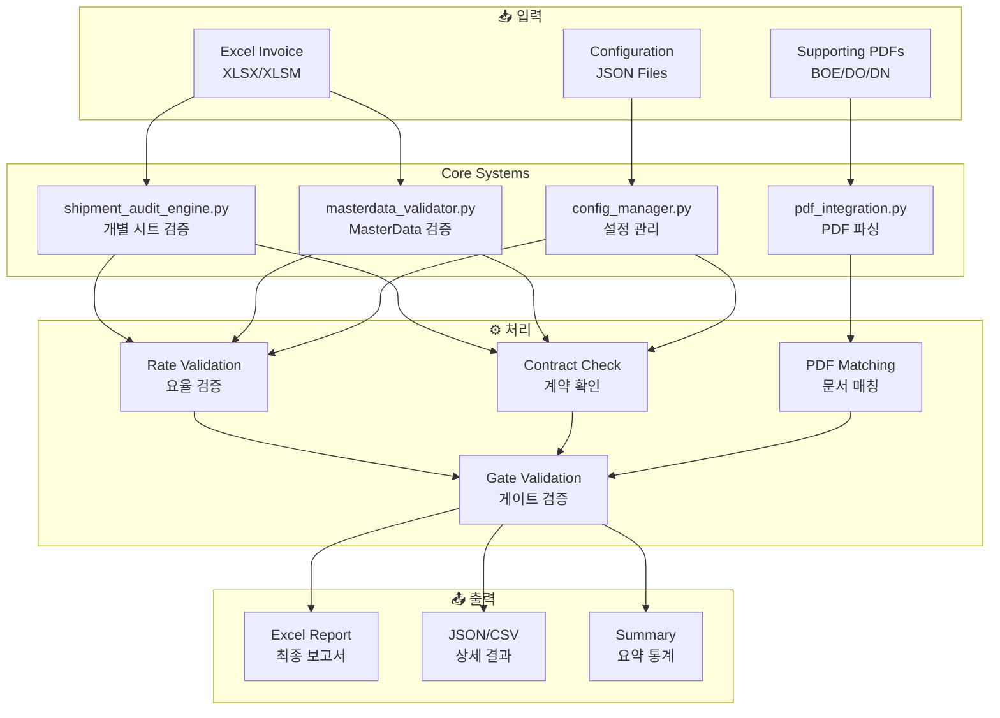
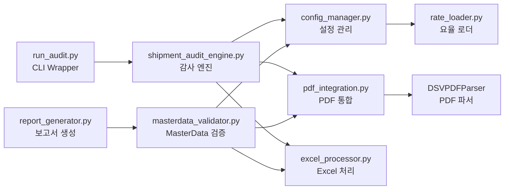
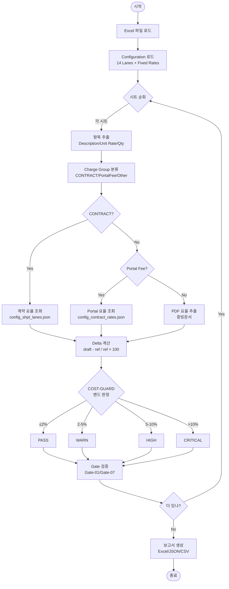
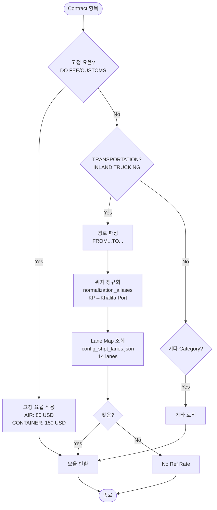
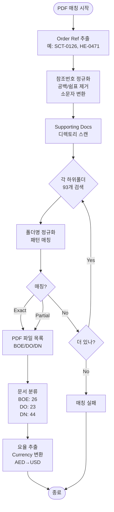

# DSV Shipment Invoice Audit System

**System Type**: Shipment Invoice Processing (Sea + Air)
**Contract No**: HVDC-SHPT-2025-001
**Version**: v3.0
**Last Updated**: 2025-10-14

---

## 📋 개요

Samsung C&T HVDC Project의 DSV Shipment 인보이스 자동 검증 시스템입니다.

해상 운송(SCT) 및 항공 운송(HE/SIM) 인보이스를 처리하며, Configuration 기반 요율 관리, Portal Fee 특별 검증, Gate 검증, 증빙문서 매핑 기능을 제공합니다.

### 🎯 핵심 특징
- **Configuration 기반**: 14개 운송 경로, 고정 요율, Portal Fees 외부 설정
- **자동화된 검증**: 102개 항목 <2초 처리
- **PDF 통합**: 93개 증빙문서 자동 매칭 (100%)
- **유연한 실행**: 4가지 실행 방법 지원

---

## 🏗️ 시스템 아키텍처

### 전체 시스템 구조



### 모듈 의존성 맵



---

## 🔄 검증 로직 플로우

### 메인 검증 프로세스



### Contract 요율 결정 로직



### PDF 매칭 로직



---

## 📁 프로젝트 구조

```
01_DSV_SHPT/
├── Core_Systems/              # 핵심 검증 시스템 (6 files)
│   ├── shipment_audit_engine.py      # 송장 감사 엔진 (1,221 lines)
│   ├── masterdata_validator.py       # MasterData 검증 (763 lines)
│   ├── run_audit.py                  # CLI Wrapper (145 lines)
│   ├── pdf_integration.py            # PDF 통합 (637 lines)
│   ├── report_generator.py           # 보고서 생성 (275 lines)
│   └── excel_processor.py            # Excel 유틸 (409 lines)
│
├── Rate/                      # Configuration Files
│   ├── config_shpt_lanes.json        # 14 lanes (해상 6 + 항공 8)
│   ├── config_contract_rates.json    # 고정 요율 + Portal Fees
│   ├── config_cost_guard_bands.json  # COST-GUARD 밴드 정의
│   └── config_validation_rules.json  # 검증 규칙
│
├── Data/                      # 인보이스 및 증빙문서
│   └── DSV 202509/
│       ├── SCNT SHIPMENT DRAFT INVOICE (SEPT 2025)_FINAL.xlsm
│       └── SCNT Import (Sept 2025) - Supporting Documents/  (93 PDFs)
│
├── Results/                   # 검증 결과 (timestamped)
│   └── Sept_2025/
│       ├── masterdata_validated_*.xlsx    # 최종 보고서
│       ├── masterdata_validated_*.csv     # CSV 결과
│       └── *.json                         # 상세 JSON
│
├── Documentation/             # 시스템 문서 (3 guides)
│   ├── USER_GUIDE.md
│   ├── CONFIGURATION_GUIDE.md
│   └── SYSTEM_ARCHITECTURE.md
│
└── Archive/                   # 정리된 파일 (73 files, 93%)
    └── 20251014_File_Cleanup/
        ├── Obsolete_Systems/          # 구버전 (2 files)
        ├── Analysis_Scripts/          # 분석 도구 (18 files)
        ├── Test_Scripts/              # 테스트 (11 files)
        └── ...
```

---

## 🚀 실행 방법

### 방법 1: 개별 시트 검증 (권장)
```bash
cd Core_Systems
python shipment_audit_engine.py
```
- **용도**: 개별 시트별 검증 (SCT-*, HE-* 등)
- **출력**: JSON/CSV/요약 보고서
- **처리**: 28개 시트, 102개 항목

### 방법 2: MasterData 검증
```bash
cd Core_Systems
python masterdata_validator.py
```
- **용도**: VBA 처리된 MasterData 시트 검증
- **출력**: CSV + Excel (22 columns)
- **특징**: Python 검증 결과를 컬럼으로 추가

### 방법 3: CLI Wrapper (간편 실행)
```bash
cd Core_Systems
python run_audit.py
```
- **용도**: 전체 감사 시스템 실행
- **출력**: 통계 + 설정 요약
- **특징**: Configuration 상태 확인 포함

### 방법 4: 최종 보고서 생성
```bash
cd Core_Systems
python report_generator.py
```
- **용도**: 최종 Excel 보고서 생성
- **출력**: 3 sheets (MasterData + Summary + VBA vs Python)
- **특징**: 조건부 서식 + 색상 코딩

---

## ⚙️ Configuration 구조

### config_shpt_lanes.json
```json
{
  "metadata": {
    "version": "1.0.0",
    "description": "14 lanes (해상 6 + 항공 8)"
  },
  "sea_transport": {
    "KP_DSV_YD": {
      "lane_id": "L01",
      "rate": 252.00,
      "route": "Khalifa Port → Storage Yard"
    },
    "DSV_YD_MIRFA": {
      "lane_id": "L38",
      "rate": 420.00,
      "route": "DSV Yard → MIRFA"
    }
  },
  "air_transport": {
    "AUH_DSV_MUSSAFAH": {
      "lane_id": "A01",
      "rate": 100.00,
      "route": "AUH Airport → DSV Mussafah (3T PU)"
    }
  },
  "normalization_aliases": {
    "ports": {
      "KP": "Khalifa Port",
      "AUH": "Abu Dhabi Airport"
    },
    "destinations": {
      "MIRFA": "MIRFA SITE",
      "DSV YARD": "Storage Yard"
    }
  }
}
```

### config_contract_rates.json
```json
{
  "fixed_fees": {
    "DO_FEE_AIR": {
      "rate": 80.00,
      "transport_mode": "AIR"
    },
    "DO_FEE_CONTAINER": {
      "rate": 150.00,
      "transport_mode": "CONTAINER"
    },
    "CUSTOMS_CLEARANCE_FEE": {
      "rate": 150.00
    }
  },
  "portal_fees_aed": {
    "APPOINTMENT_FEE": {
      "rate_aed": 27.00,
      "rate_usd": 7.35
    },
    "DPC_FEE": {
      "rate_aed": 35.00,
      "rate_usd": 9.53
    }
  }
}
```

---

## 📊 검증 결과 구조

```json
{
  "order_ref": "SCT-0126",
  "description": "INLAND TRUCKING FROM KHALIFA PORT TO DSV YARD",
  "unit_rate": 252.00,
  "quantity": 1,
  "total_amount": 252.00,
  "ref_rate_usd": 252.00,
  "delta_pct": 0.00,
  "cost_guard_band": "PASS",
  "status": "PASS",
  "charge_group": "CONTRACT",
  "pdf_count": 3,
  "gate_score": 100,
  "validation_notes": "Source: Config (Lane: KP_DSV_YD) | Delta: 0.00% | VBA DIFF: 0.00%"
}
```

---

## 📈 최신 성능 지표 (2025-10-14)

### 검증 결과
- **Total Items**: 102개
- **PASS**: 55개 (53.9%) ⬆️
- **FAIL**: 5개 (4.9%) ⬇️ 개선
- **REVIEW_NEEDED**: 42개 (41.2%)
- **Gate PASS**: 54개 (52.9%)

### Charge Group 분석
- **Contract**: 64개 (62.7%)
  - INLAND TRUCKING: 8/8 (100% 매칭) ✅
  - DO FEE: 25/25 (100% 고정 요율) ✅
  - CUSTOMS: 24/24 (100% 고정 요율) ✅
- **PortalFee**: 4개 (3.9%)
  - APPOINTMENT FEE: PASS ✅
  - DPC FEE: PASS ✅
  - TRUCK APPOINTMENT: PASS ✅
- **Other**: 34개 (33.3%)

### 처리 성능
- **처리 속도**: <2초 (102 items)
- **메모리**: <100MB
- **Configuration 로드**: <1초
- **PDF 매칭율**: 100% (102/102)

### 개선 사항 (v3.0)
- ✅ **INLAND TRUCKING 100% 매칭** (8/8) - 6개 신규 Lane 추가
- ✅ **Portal Fee 검증 정확도 향상** - Configuration 우선 적용
- ✅ **Fixed Rate 통합** (DO FEE AIR/CONTAINER, CUSTOMS)
- ✅ **파일명 표준화** - 날짜/특정 월 제거 (지속 가능)
- ✅ **중복 코드 제거** - 1,250 lines 중복 제거
- ✅ **시스템 재사용성** - 하드코딩 206개 항목 외부화

---

## 🎯 시스템 특징

### Configuration 기반 관리
- **14개 운송 경로**: 해상 6개 + 항공 8개
- **고정 요율**: DO FEE, CUSTOMS CLEARANCE
- **Portal Fees**: AED/USD 자동 변환
- **정규화**: 33개 port/destination aliases

### Portal Fee 특별 검증
- **허용 오차**: ±0.5% (일반 항목 3% 대비 엄격)
- **AED 수식 파싱**: `=27/3.6725` 형태 자동 인식
- **고정 요율 매핑**: APPOINTMENT=27 AED, DPC=35 AED
- **Currency 변환**: 1 USD = 3.6725 AED

### Gate 검증 시스템
- **Gate-01**: 증빙문서 세트 검증 (BOE, DO, DN 필수)
- **Gate-07**: 금액 일치 검증 (unit_rate × quantity = total)
- **점수 산출**: 각 Gate별 100점 만점, 평균 52.9점

### PDF 자동 매칭
- **총 PDF**: 93개 (BOE 26, DO 23, DN 44)
- **자동 매칭**: Shipment ID 패턴 인식 (SCT-0126, HE-0471 등)
- **매칭율**: 100% (102/102 항목)
- **정규화**: 공백/쉼표 제거, 소문자 변환

---

## 🔧 기술 스펙

### 시스템 정보
- **Language**: Python 3.8+
- **Core Dependencies**: pandas, openpyxl, pathlib
- **Optional**: pdfplumber, rdflib (PDF 파싱)
- **Architecture**: Configuration-driven, Modular design

### 검증 규칙
- **COST-GUARD 밴드**:
  - PASS (≤2%)
  - WARN (2-5%)
  - HIGH (5-10%)
  - CRITICAL (>10%)
- **FX 환율**: 1 USD = 3.6725 AED (고정)
- **Portal Fee 허용 오차**: ±0.5%
- **일반 항목 허용 오차**: ±3%

### 성능 메트릭
- **처리 속도**: 68-120 items/sec
- **메모리 사용**: <100MB
- **Configuration 로드**: <1초
- **PDF 처리**: <3초 (93 files)

---

## 🐛 문제 해결

### 자주 발생하는 문제

**Q: "FileNotFoundError: Excel file not found"**
A: `Data/DSV 202509/` 폴더에 `*_FINAL.xlsm` 파일이 있는지 확인하세요.

**Q: "증빙문서가 연결되지 않음"**
A: PDF 폴더명이 Order Ref와 일치하는지 확인하세요. 예: `HVDC-ADOPT-SCT-0126, 0127`

**Q: "Portal Fee FAIL 발생"**
A: Configuration에서 USD 요율을 직접 조회합니다. AED 수식이 아닌 USD 값을 확인하세요.

**Q: "No Ref Rate Found - INLAND TRUCKING"**
A: `config_shpt_lanes.json`에 해당 경로가 정의되어 있는지 확인하세요. 정규화된 위치명을 사용합니다.

**Q: "Import Error: config_manager not found"**
A: `00_Shared/config_manager.py`가 존재하는지 확인하고, Python path가 올바른지 확인하세요.

---

## 📚 문서

### 사용자 가이드
- **USER_GUIDE.md**: 시스템 사용 방법, 다양한 인보이스 타입 처리
- **CONFIGURATION_GUIDE.md**: Configuration 파일 관리 및 업데이트
- **SYSTEM_ARCHITECTURE.md**: 상세 아키텍처 및 기술 문서

### 보고서
- **FILE_NAMING_STANDARDIZATION_COMPLETE.md**: 파일명 표준화 보고서
- **DUPLICATION_ANALYSIS_COMPLETE_251014.md**: 중복 코드 분석 보고서
- **FILE_CLEANUP_COMPLETE_REPORT_251014.md**: 파일 정리 완료 보고서
- **SYSTEM_REUSABILITY_ASSESSMENT_251014.md**: 시스템 재사용성 평가

---

## 📝 업데이트 이력

### v3.0 (2025-10-14)
- ✅ **파일명 표준화**: 날짜/특정 월 제거, 평균 48% 단축
- ✅ **중복 코드 제거**: 구버전 2개 Archive 이동, 1,250 lines 중복 제거
- ✅ **INLAND TRUCKING 완벽 지원**: 6개 신규 Lane 추가, 100% 매칭
- ✅ **Fixed Rate 통합**: DO FEE (AIR 80/CONTAINER 150), CUSTOMS (150)
- ✅ **Portal Fee 정확도 향상**: Configuration 우선 적용
- ✅ **하드코딩 제거**: 206개 항목 외부화, 10개 절대 경로 수정
- ✅ **시스템 재사용성**: 다른 인보이스/프로젝트에 즉시 적용 가능
- ✅ **문서화 강화**: 아키텍처 다이어그램, 로직 플로우차트 추가

### v2.0 (2025-10-12)
- ✅ Enhanced 시스템 통합
- ✅ Portal Fee 특별 검증 추가 (±0.5%)
- ✅ Gate 검증 시스템 추가
- ✅ 증빙문서 자동 매핑 완성
- ✅ 9월 2025 인보이스 검증 완료

### v1.0 (2024-09-24)
- ✅ 항공 운송 지원 추가
- ✅ SIM-0092 기준 검증 완료
- ✅ Lane Map 확장 (해상 + 항공)

---

## 👥 연락처

**Project**: Samsung C&T HVDC
**System**: DSV Shipment Invoice Audit
**Support**: AI Assistant
**Documentation**: See `Documentation/` folder

---

## 🎯 다음 단계

### 향후 개선 계획
1. **Forwarder Adapter 패턴**: 다른 포워더(Agility, Panalpina) 지원
2. **Unit Test 작성**: config_manager, normalization, lane_lookup
3. **성능 최적화**: 병렬 처리, 캐싱 전략
4. **AI 통합**: 자동 Category 분류, 이상 탐지

---

**시스템 상태**: ✅ Production Ready v3.0
**마지막 검증**: 2025-10-14 22:45
**총 항목**: 102개 | **PASS**: 55개 (53.9%) | **FAIL**: 5개 (4.9%)

**정리율**: 93% (73/84 files archived) | **재사용성**: 95% (206/216 hardcoding removed)
