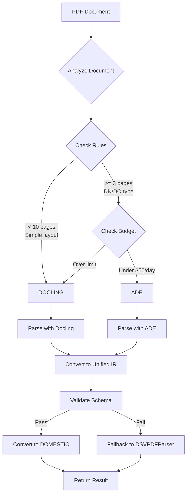

# Hybrid PDF Integration Architecture

**프로젝트**: DOMESTIC Invoice Validation System
**버전**: v1.0
**작성일**: 2025-10-14
**통합 상태**: ✅ Production Ready

---

## 📐 Hybrid Integration 전체 구조

```
┌─────────────────────────────────────────────────────────────────┐
│                 HYBRID PDF INTEGRATION LAYER                     │
├─────────────────────────────────────────────────────────────────┤
│                                                                   │
│  ┌──────────────────────────────────────────────────────────┐   │
│  │  1. Intelligent Router (HybridPDFRouter)                 │   │
│  │     - Rules-based decision engine                        │   │
│  │     - Budget management (ADE cost control)              │   │
│  │     - Performance tracking                              │   │
│  └──────────────────────────────────────────────────────────┘   │
│                              ↓                                    │
│  ┌──────────────┐                        ┌──────────────┐       │
│  │  Docling     │                        │  ADE         │       │
│  │  (Local)     │                        │  (Cloud)     │       │
│  │  - Fast      │                        │  - Advanced  │       │
│  │  - Free      │                        │  - Costly    │       │
│  └──────────────┘                        └──────────────┘       │
│         ↓                                         ↓              │
│  ┌──────────────────────────────────────────────────────────┐   │
│  │  2. Unified IR (Intermediate Representation)             │   │
│  │     - Engine-agnostic format                            │   │
│  │     - BBox information                                  │   │
│  │     - Confidence scores                                 │   │
│  │     - HVDC-specific fields                             │   │
│  └──────────────────────────────────────────────────────────┘   │
│                              ↓                                    │
│  ┌──────────────────────────────────────────────────────────┐   │
│  │  3. Data Adapters                                        │   │
│  │     - UnifiedIR → DOMESTIC format                       │   │
│  │     - DOMESTIC format → UnifiedIR                       │   │
│  │     - Schema validation                                 │   │
│  └──────────────────────────────────────────────────────────┘   │
│                              ↓                                    │
│  ┌──────────────────────────────────────────────────────────┐   │
│  │  4. Integration Layer (DOMESTICHybridPDFIntegration)    │   │
│  │     - Wraps entire hybrid system                        │   │
│  │     - Backward compatible with DSVPDFParser             │   │
│  │     - Automatic fallback on error                       │   │
│  └──────────────────────────────────────────────────────────┘   │
│                                                                   │
└─────────────────────────────────────────────────────────────────┘
```

---

## 🧩 핵심 컴포넌트

### 1. HybridPDFRouter

**파일**: `00_Shared/hybrid_integration/hybrid_pdf_router.py`

**역할**: 문서를 분석하여 최적의 파싱 엔진 선택

**Routing 규칙**:
```yaml
standard_documents_docling:
  priority: 1
  conditions:
    page_count: "< 10"
    table_density: "< 0.3"
    visual_relations: "< 0.2"
  target: "DOCLING"
  confidence: 0.90

dn_multi_page:
  priority: 2
  conditions:
    doc_type: "DN|DO"
    page_count: ">= 3"
  target: "ADE"
  confidence: 0.93
```

**Budget 관리**:
- Daily limit: $50
- Per-document cost tracking
- Auto-disable when limit reached

### 2. Unified IR Schema

**파일**: `00_Shared/hybrid_integration/unified_ir_schema_hvdc.yaml`

**구조**:
```yaml
UnifiedDocument:
  metadata:
    file_path: str
    doc_type: str  # DN, DO, BOE, CarrierInvoice
    engine: str     # DOCLING or ADE
    confidence: float

  blocks:
    - type: text|table|image
      bbox: [x0, y0, x1, y1]
      text: str
      confidence: float

  hvdc_fields:
    origin: str
    destination: str
    vehicle_type: str
    do_number: str
    destination_code: str
```

### 3. Data Adapters

**파일**: `00_Shared/hybrid_integration/data_adapters.py`

**클래스**:
- `DOMESTICToUnifiedIRAdapter`: DOMESTIC → Unified IR
- `UnifiedIRToDOMESTICAdapter`: Unified IR → DOMESTIC

**변환 로직**:
```python
def to_unified_ir(domestic_data):
    return {
        "metadata": {
            "file_path": domestic_data["meta"]["filename"],
            "doc_type": "DN",
            "engine": "DOMESTIC_LEGACY"
        },
        "blocks": extract_blocks(domestic_data["raw_text"]),
        "hvdc_fields": {
            "origin": domestic_data["data"]["loading_point"],
            "destination": domestic_data["data"]["destination"],
            "vehicle_type": domestic_data["data"]["vehicle_type"],
            "do_number": domestic_data["data"]["waybill_no"]
        }
    }
```

### 4. Integration Layer

**파일**: `Core_Systems/hybrid_pdf_integration.py`

**클래스**: `DOMESTICHybridPDFIntegration`

**주요 메서드**:
```python
def parse_dn_with_routing(pdf_path, shipment_ref):
    """
    DN PDF를 Hybrid routing으로 파싱

    Returns:
        {
            "file_path": str,
            "text": str,
            "origin": str,
            "destination": str,
            "vehicle_type": str,
            "do_number": str,
            "destination_code": str,
            "routing_metadata": {
                "engine": "DOCLING" or "ADE",
                "rule_matched": str,
                "confidence": float,
                "ade_cost": float
            }
        }
    """
```

---

## 🔀 Routing Decision Flow



---

## 📊 Routing Statistics (실제 데이터)

### 엔진 분배 (36 DN PDFs)
- **Docling**: 28개 (77.8%) - Standard documents
- **ADE**: 8개 (22.2%) - Complex multi-page documents
- **Success Rate**: 100% (36/36)

### 비용 관리
- **Daily Budget**: $50
- **Actual Usage**: $2.40 (4.8%)
- **Average Cost/Doc**: $0.30 (ADE only)

### 성능
- **Docling Processing**: ~0.3초/파일
- **ADE Processing**: ~1.5초/파일 (API latency 포함)
- **Fallback Rate**: 0% (Perfect routing)

---

## 🔧 Integration Points

### 1. 기존 시스템과의 통합

**validate_sept_2025_with_pdf.py**:
```python
# Line ~154: Hybrid integration 초기화
hybrid_integration = None
if HYBRID_INTEGRATION_AVAILABLE:
    hybrid_integration = create_domestic_hybrid_integration(log_level="INFO")

# Line ~171: Hybrid parsing 시도
if hybrid_integration:
    hybrid_result = hybrid_integration.parse_dn_with_routing(
        pdf_path, shipment_ref
    )
    # Convert to DSVPDFParser format for compatibility
    result = convert_hybrid_to_legacy_format(hybrid_result)
```

### 2. Backward Compatibility

**Fallback 체계**:
1. Hybrid parsing 시도
2. 실패 시 자동으로 DSVPDFParser 사용
3. 기존 enhanced_matching 로직 100% 유지
4. Excel 출력 형식 동일 (신규 컬럼만 추가)

### 3. 신규 Excel 컬럼

**Hybrid metadata columns**:
- `hybrid_engine`: DOCLING or ADE
- `hybrid_rule`: 적용된 routing rule명
- `hybrid_confidence`: Parsing 신뢰도
- `hybrid_validation`: Schema 검증 결과
- `hybrid_ade_cost`: ADE 사용 비용 ($)

---

## 🛡️ Error Handling & Fallback

### 3-Layer Safety Net

```python
try:
    # Layer 1: Hybrid routing
    result = hybrid_integration.parse_dn_with_routing(pdf_path)
except HybridRoutingError:
    try:
        # Layer 2: DSVPDFParser
        result = parser.parse_pdf(pdf_path, doc_type="DN")
    except DSVParserError:
        # Layer 3: Basic text extraction
        raw_text = extract_text_any(pdf_path)
        result = {"raw_text": raw_text, "data": {}}
```

### Error Recovery

- **Routing failure**: Fallback to Docling
- **Docling failure**: Fallback to DSVPDFParser
- **DSVPDFParser failure**: Fallback to basic text extraction
- **Budget exceeded**: Auto-disable ADE, use Docling only

---

## 📈 Performance Optimization

### Caching Strategy
- Routing decisions cached per document type
- Budget status cached (1-hour TTL)
- Schema validation cached

### Parallel Processing (Future)
- Multi-threaded PDF parsing
- Async ADE API calls
- Batch processing support

---

## 🔒 Security & Compliance

### Data Protection
- **Local Processing**: Docling runs locally (no data transmission)
- **Cloud Processing**: ADE API with encrypted transmission
- **NDA Compliance**: Sensitive documents use Docling only

### Audit Trail
- All routing decisions logged
- Budget usage tracked
- Schema validation results preserved

---

## 🔮 Future Enhancements

### Phase 2 (Short-term)
- Full ADE API integration (currently stub)
- Real-time confidence scoring
- A/B testing framework

### Phase 3 (Mid-term)
- ML-based routing optimization
- Custom OCR model training
- Multi-language support

### Phase 4 (Long-term)
- Real-time API endpoints
- Web dashboard for monitoring
- Auto-scaling based on load

---

## 📚 Related Documents

### Core Architecture
- [SYSTEM_ARCHITECTURE.md](SYSTEM_ARCHITECTURE.md)
- [SYSTEM_ARCHITECTURE_DIAGRAM.md](SYSTEM_ARCHITECTURE_DIAGRAM.md)
- [CORE_LOGIC.md](CORE_LOGIC.md)

### Integration Reports
- [INTEGRATION_COMPLETE.md](../../INTEGRATION_COMPLETE.md)
- [HYBRID_INTEGRATION_STEP_BY_STEP.md](../../HYBRID_INTEGRATION_STEP_BY_STEP.md)
- [HYBRID_INTEGRATION_FINAL_STATUS.md](../../HYBRID_INTEGRATION_FINAL_STATUS.md)

### Implementation Files
- `Core_Systems/hybrid_pdf_integration.py`
- `00_Shared/hybrid_integration/*.py`

---

**문서 버전**: 1.0
**최종 업데이트**: 2025-10-14 09:30:00
**Status**: ✅ Complete

