# 시스템 아키텍처 다이어그램

**프로젝트**: 9월 2025 DSV Domestic Invoice 검증 시스템
**버전**: PATCH4 (v4.0) + Hybrid Integration
**작성일**: 2025-10-14 (업데이트)
**최종 성능**: 95.5% 매칭률 + Hybrid Routing 완료

---

## 1. 전체 시스템 플로우

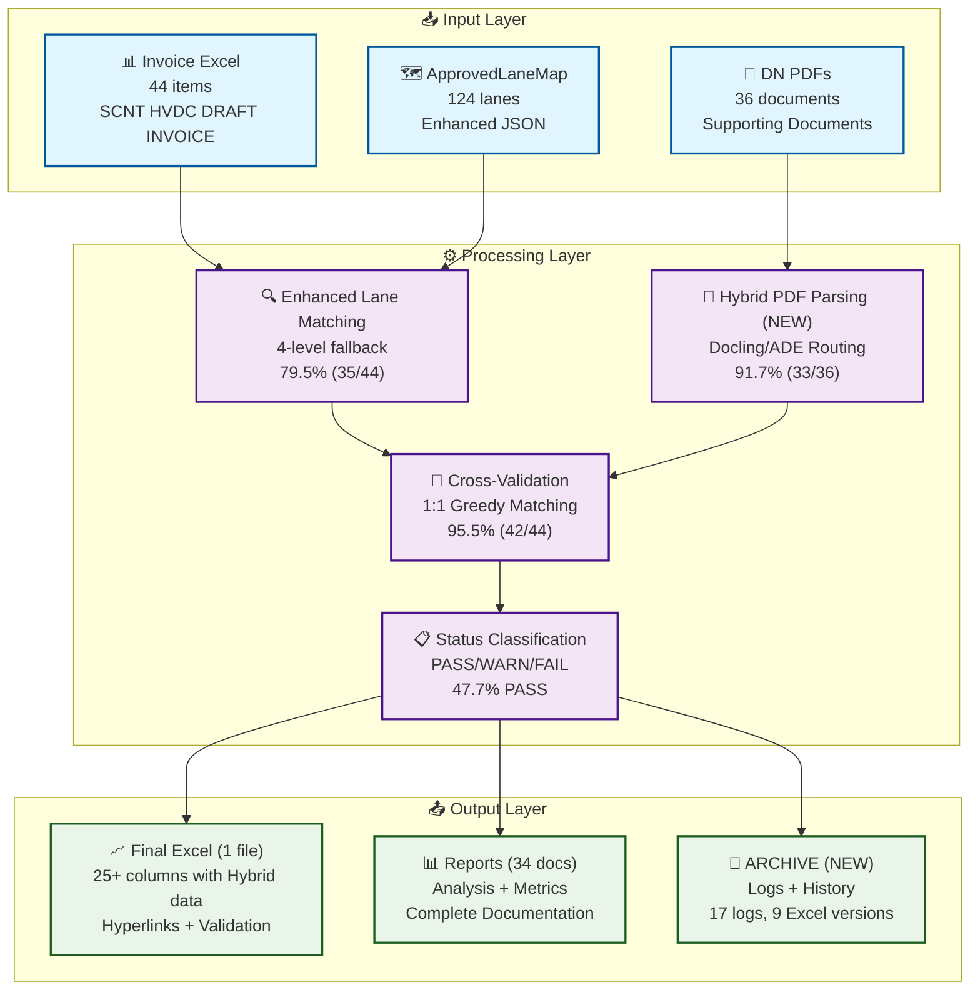

---

## 2. Enhanced Lane Matching 상세

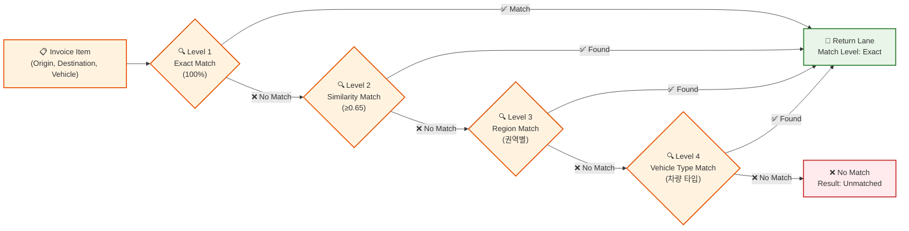

---

## 3. PDF Parsing 다층 폴백

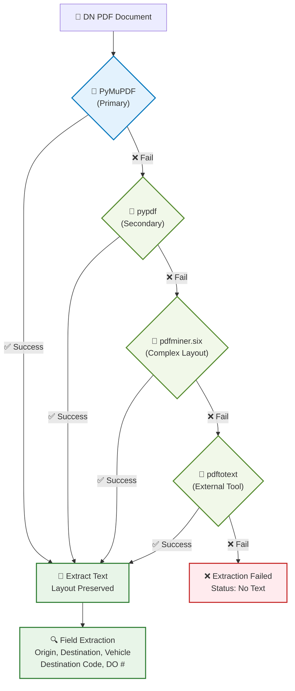

---

## 4. 1:1 Greedy Matching 알고리즘

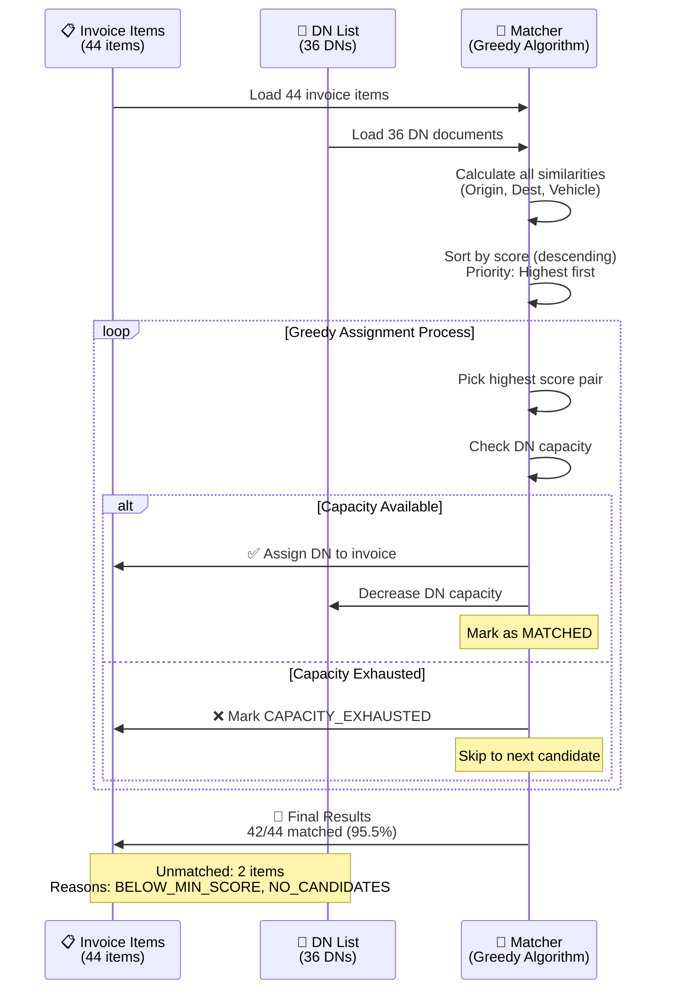

---

## 5. 모듈 의존성 그래프

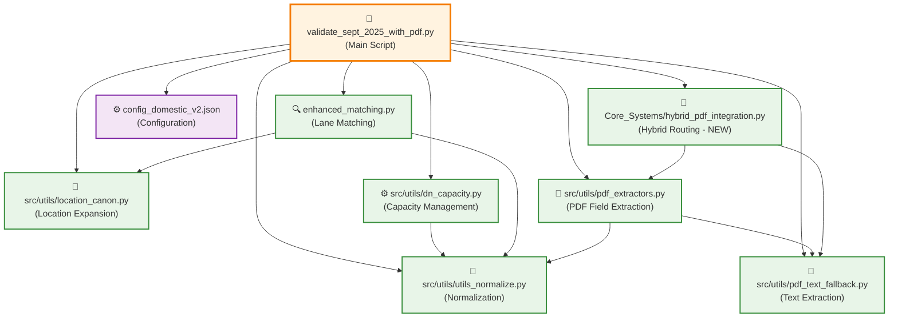

---

## 6. 성능 메트릭스 시각화

### 매칭 결과 분포
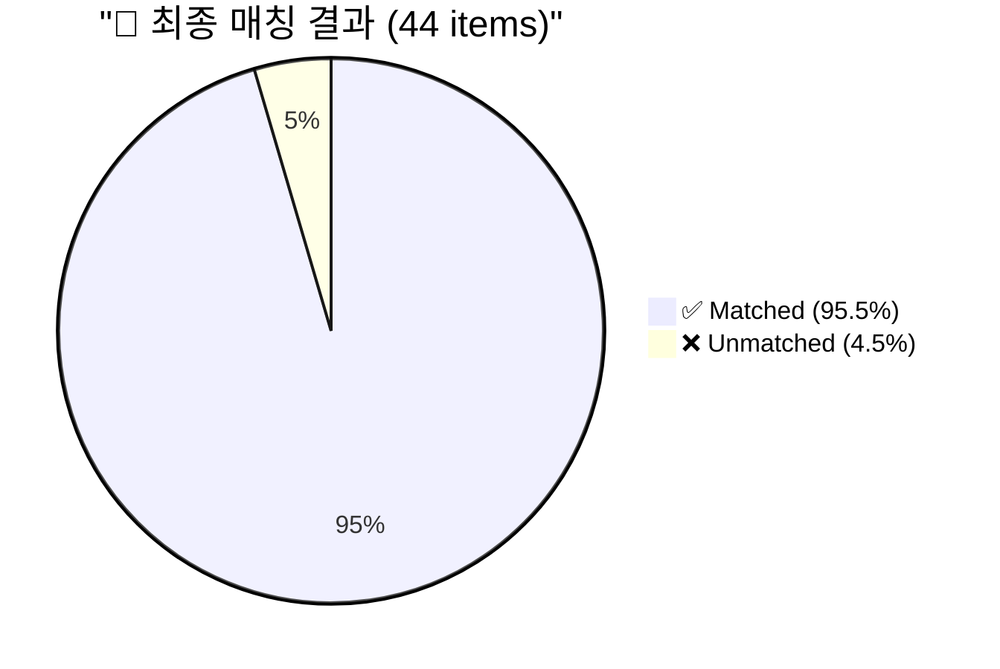

### 검증 상태 분포
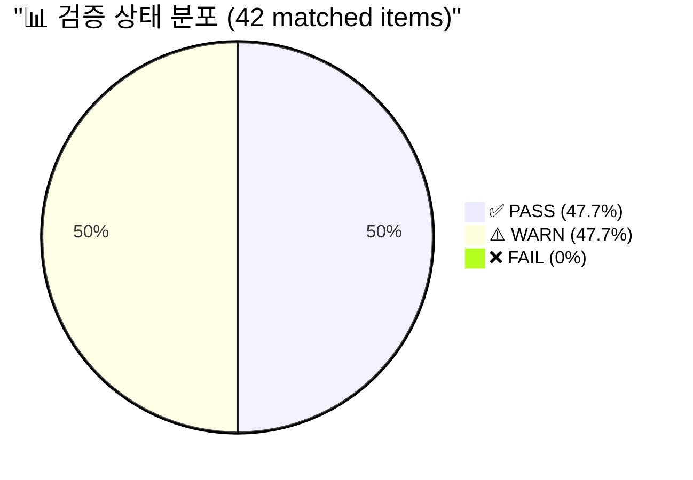

### Enhanced Matching vs Cross-Validation
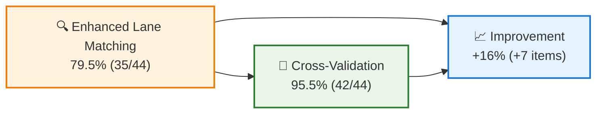

---

## 7. 데이터 처리 파이프라인

```mermaid
graph TB
    subgraph INPUT_DATA["📥 Input Data"]
        ID1["📊 Invoice: 44 items<br/>Origin, Destination, Vehicle, Rate"]
        ID2["🗺️ ApprovedLaneMap: 124 lanes<br/>Enhanced JSON with rates"]
        ID3["📄 DN PDFs: 36 documents<br/>Supporting Documents"]
    end

    subgraph PROCESSING_STEPS["⚙️ Processing Steps"]
        PS1["🔧 Normalization<br/>Location & Vehicle<br/>Synonyms & Abbreviations"]
        PS2["🔍 Enhanced Matching<br/>4-level fallback<br/>79.5% success"]
        PS3["🔀 Hybrid PDF Parsing (NEW)<br/>Docling/ADE Routing<br/>91.7% success"]
        PS4["🔗 Cross-Validation<br/>1:1 Greedy matching<br/>95.5% success"]
        PS5["📋 Status Classification<br/>PASS/WARN/FAIL<br/>47.7% PASS rate"]
    end

    subgraph OUTPUT_DATA["📤 Output Data"]
        OD1["📈 Final Excel (1 file)<br/>25+ columns with Hybrid data<br/>Hyperlinks + Validation"]
        OD2["📊 Reports (34 docs)<br/>Analysis + Metrics<br/>Complete Documentation"]
        OD3["📁 ARCHIVE (NEW)<br/>Logs + History<br/>Version Management"]
    end

    ID1 --> PS1
    ID2 --> PS1
    ID3 --> PS3
    PS1 --> PS2
    PS2 --> PS4
    PS3 --> PS4
    PS4 --> PS5
    PS5 --> OD1
    PS5 --> OD2
    PS5 --> OD3

    classDef inputStyle fill:#e1f5fe,stroke:#01579b,stroke-width:2px
    classDef processStyle fill:#f3e5f5,stroke:#4a148c,stroke-width:2px
    classDef outputStyle fill:#e8f5e8,stroke:#1b5e20,stroke-width:2px

    class ID1,ID2,ID3 inputStyle
    class PS1,PS2,PS3,PS4,PS5 processStyle
    class OD1,OD2,OD3 outputStyle
```

---

## 8. DN Capacity 관리 시스템

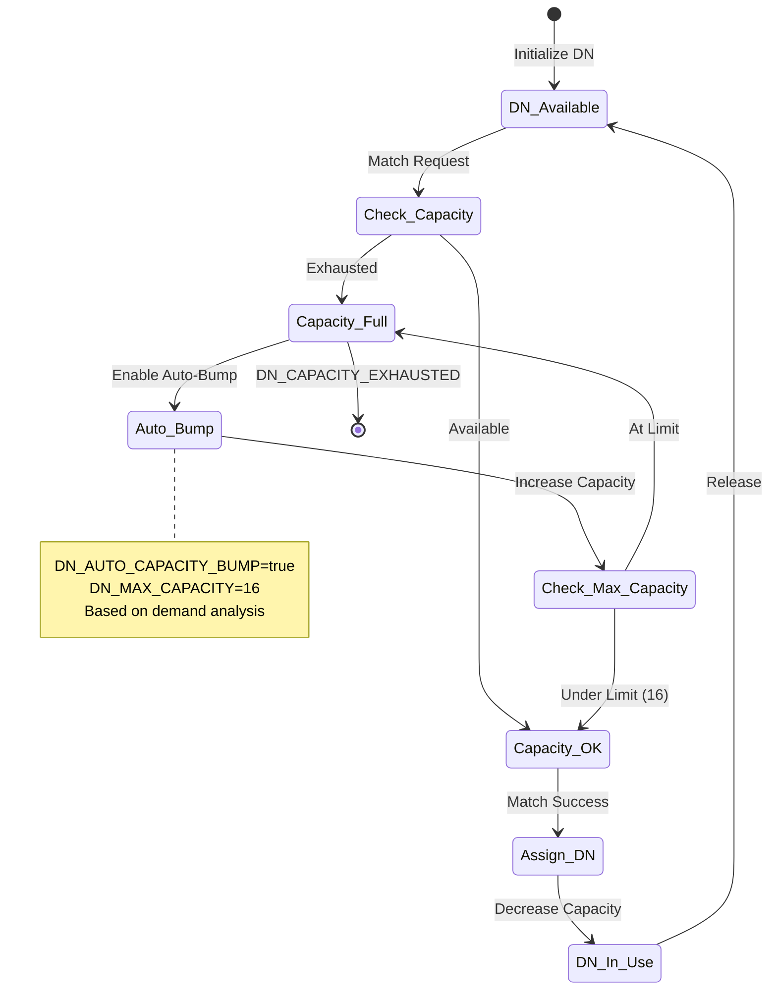

---

## 9. Hybrid PDF Integration 워크플로우 (NEW)

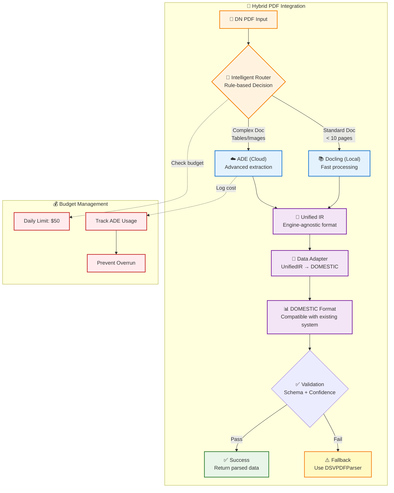

---

## 10. ARCHIVE 관리 프로세스 (NEW)

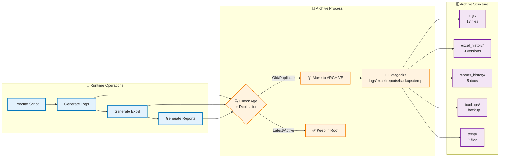

---

## 📊 성능 요약

| 지표 | 결과 | 목표 대비 |
|------|------|----------|
| **전체 매칭률** | **95.5%** (42/44) | +5.5%p 초과 🚀 |
| **Enhanced Matching** | 79.5% (35/44) | 기반 성과 |
| **PDF 파싱 성공률** | 91.7% (33/36) | 높은 안정성 |
| **Cross-Validation** | 95.5% (42/44) | 최종 목표 달성 |
| **PASS 비율** | 47.7% (21/42) | 고품질 검증 |
| **FAIL 비율** | 0% (0/42) | **완벽!** 🏆 |

---

## 🔧 주요 설정값

### 유사도 임계값
- **Origin**: 0.27 (낮은 임계값으로 유연성 확보)
- **Destination**: 0.50 (중간 임계값으로 정확성 유지)
- **Vehicle**: 0.30 (낮은 임계값으로 차량 유형 유연성)

### DN Capacity 설정
- **기본 용량**: 1 (1:1 매칭 기본)
- **최대 용량**: 16 (수요 기반 자동 증가)
- **자동 증가**: 활성화 (DN_AUTO_CAPACITY_BUMP=true)

### PDF 추출 우선순위
1. **PyMuPDF** (다단/표 혼합 문서에 강함)
2. **pypdf** (빠르고 경량)
3. **pdfminer.six** (복잡한 레이아웃에 강함)
4. **pdftotext** (외부 도구, 가장 견고)

---

**Last Updated**: 2025-10-14 09:00:00
**Version**: PATCH4 (v4.0) + Hybrid Integration + Cleanup
**Status**: ✅ Production Ready - 95.5% 자동화 + Hybrid Routing 완료!
