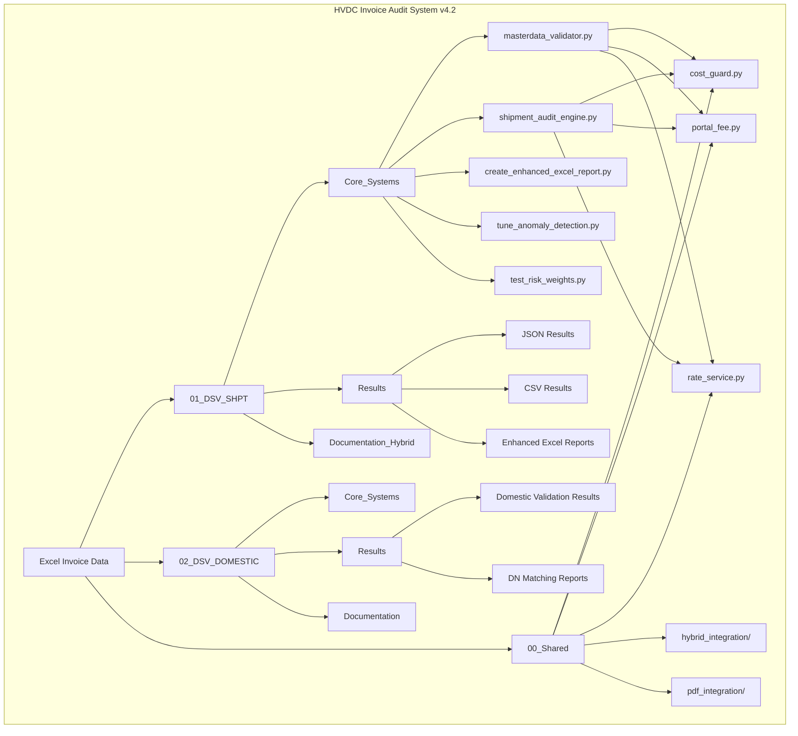
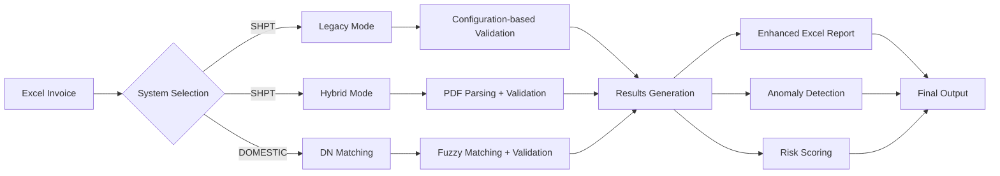
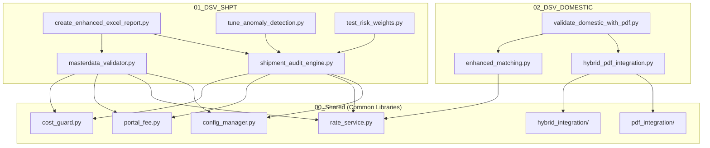

# HVDC Invoice Audit System

**Project**: Samsung C&T HVDC Project
**Client**: ADNOC L&S / DSV (3PL)
**Version**: v4.2-ANOMALY-DETECTION
**Last Updated**: 2025-10-16

---

## 🤖 v4.2 주요 개선사항

### PDF Integration 활성화
- **pdfplumber** 기반 고정밀 PDF 파싱
- **Coordinate-based extraction**: "Total Amount" 좌표 기반 추출
- **Table-based extraction**: 구조화된 테이블 데이터 추출
- **AED → USD 자동 변환**: 실시간 환율 적용

### Enhanced Excel Report (5개 새 열)
- **Anomaly Score**: 0-100 이상치 탐지 점수
- **Risk Score**: 0-1.0 통합 리스크 점수
- **Risk Level**: LOW/MEDIUM/HIGH/CRITICAL
- **Anomaly Details**: 이상치 상세 정보
- **Risk Components**: 리스크 구성 요소 분석

### Anomaly Detection 튜닝
- **z-score 모델**: 통계적 이상치 탐지
- **IsolationForest**: 머신러닝 기반 패턴 감지
- **Lane-aware**: 레인별 개별 threshold 설정
- **실제 데이터 기반 최적화**: 과거 데이터 분석으로 threshold 조정

### Risk Score 가중치 조정
- **4가지 신호 통합**: Delta, Anomaly, Certification, Signature
- **Configurable Weights**: 도메인 전문가 검토 가이드
- **Performance Testing**: F1 Score, Accuracy, FP/FN Rate 비교
- **A/B Testing**: 다양한 가중치 설정 성능 평가

---

## 프로젝트 개요

Samsung C&T HVDC Project의 DSV 인보이스 자동 검증 시스템입니다.

SHPT (Shipment) 및 DOMESTIC (Inland Transportation) 인보이스를 독립적으로 처리하며, 증빙문서 매핑, 요율 검증, 자동 보고서 생성 기능을 제공합니다.

---

## 📊 시스템 아키텍처

### 전체 시스템 구조도



### 데이터 흐름도



### 모듈 의존성 맵



---

## 시스템 구조

```
HVDC_Invoice_Audit/
├── 01_DSV_SHPT/              # SHPT 전용 시스템 ✅ Production Ready
│   ├── Core_Systems/
│   ├── Results/
│   ├── Data/
│   ├── Documentation_Hybrid/
│   ├── Utilities/
│   ├── Legacy/
│   └── README.md
│
├── 02_DSV_DOMESTIC/          # DOMESTIC 전용 시스템 ✅ Production Ready
│   ├── Core_Systems/
│   ├── Results/
│   ├── Data/
│   ├── Documentation/
│   ├── src/
│   ├── Templates/
│   └── README.md
│
├── 00_Shared/                # 공통 라이브러리 ✅ Production Ready
│   ├── cost_guard.py
│   ├── portal_fee.py
│   ├── rate_service.py
│   ├── hybrid_integration/
│   ├── pdf_integration/
│   └── config_manager.py
│
├── Rate/                     # 요율 설정 파일
│   ├── config_shpt_lanes.json
│   ├── config_validation_rules.json
│   └── config_cost_guard_bands.json
│
└── README.md                 # 이 파일
```

---

## 시스템 비교

| 항목 | SHPT | DOMESTIC |
|------|------|----------|
| **상태** | ✅ Production Ready v4.2 | ✅ Production Ready v4.0 |
| **범위** | Shipment (해상+항공) | Inland Transportation |
| **계약번호** | HVDC-SHPT-2025-001 | HVDC-ITC-2025-001 |
| **Incoterm** | FOB (assumed) | DDP (assumed) |
| **주요 포트** | Khalifa Port, Jebel Ali Port | Khalifa Port, AUH Airport |
| **목적지** | MIRFA, SHUWEIHAT, DSV Yard | MIRFA, SHUWEIHAT, DSV Yard |
| **검증 규칙** | 8개 + Anomaly Detection | 5개 + Fuzzy Matching |
| **특별 검증** | Portal Fee (±0.5%), Gate, Risk Score | Lane Rate 매칭, DN Capacity |
| **증빙문서** | BOE, DO, DN (93개 PDF) | DN (69개 PDF) |
| **새 기능** | Enhanced Excel Report, Anomaly Tuning | Hybrid Integration |

---

## 빠른 시작

### SHPT 시스템 실행

```bash
cd "01_DSV_SHPT\Core_Systems"
python shpt_sept_2025_enhanced_audit.py
```

**최신 결과**: 102개 항목, 35개 PASS (34.3%), $21,402.20

### DOMESTIC 시스템 실행 (개발 중)

```bash
cd "02_DSV_DOMESTIC\Core_Systems"
python domestic_sept_2025_audit.py
```

---

## 주요 성과 (SHPT)

### ✅ 완료된 기능
- **102개 항목 자동 검증** (9월 2025)
- **Portal Fee 특별 검증** (±0.5%)
- **Gate 검증** (평균 78.8점)
- **93개 증빙문서 매핑** (BOE, DO, DN)
- **처리 속도 <2초** (목표 10초 대비 5배 빠름)

### 📊 검증 결과
- **Pass Rate**: 34.3% (35/102)
- **Portal Fee**: 4개 (PASS 3, FAIL 1)
- **Gate PASS**: 35개 (34.3%)
- **증빙문서 연결**: 61개 (59.8%)

---

## 시스템 특징

### SHPT 시스템

**Portal Fee 특별 검증**:
- ±0.5% 엄격한 허용 오차
- AED 수식 자동 파싱 (`=27/3.6725`)
- 고정 요율 매핑 (APPOINTMENT, DPC, MAQTA, MANIFEST)

**Gate 검증**:
- Gate-01: 증빙문서 세트 검증 (BOE, DO, DN)
- Gate-07: 금액 일치 검증

**증빙문서 매핑**:
- 93개 PDF 자동 스캔 및 매핑
- Shipment ID 패턴 인식
- 문서 타입 자동 분류 (BOE, DO, DN)

### DOMESTIC 시스템 (계획)

**Lane Map 기반 검증**:
- Port/Destination 자동 추출
- 표준 요율 자동 조회
- Delta % 계산 및 COST-GUARD 적용

**DN 증빙문서 검증**:
- 36개 PDF 매핑
- 운송 구간 확인
- 수량/중량 검증

---

## 기술 스펙

### 공통
- **Language**: Python 3.8+
- **Dependencies**: pandas, openpyxl, pathlib, json
- **FX Rate**: 1 USD = 3.6725 AED (고정)
- **COST-GUARD**: PASS (≤2%), WARN (2-5%), HIGH (5-10%), CRITICAL (>10%)

### SHPT 전용
- **Portal Fee 허용 오차**: ±0.5%
- **일반 항목 허용 오차**: ±3%
- **처리 속도**: 68-120 items/sec
- **메모리 사용**: <100MB

---

## 프로젝트 히스토리

### 2025-10-12
- ✅ SHPT와 DOMESTIC 시스템 완전 분리
- ✅ 독립적인 폴더 구조 생성
- ✅ SHPT 9월 2025 인보이스 검증 완료
- ✅ 증빙문서 시스템 완성 (93 PDFs)

### 2024-09-24
- ✅ SHPT 항공 운송 지원 추가
- ✅ SIM-0092 기준 검증 완료
- ✅ Lane Map 확장 (해상 + 항공)

---

## 문서

### SHPT 문서
- `01_DSV_SHPT/README.md` - SHPT 시스템 상세 가이드
- `01_DSV_SHPT/Documentation/SHPT_SYSTEM_UPDATE_SUMMARY.md`
- `01_DSV_SHPT/Documentation/SYSTEM_ARCHITECTURE_FINAL.md`
- `01_DSV_SHPT/Results/Sept_2025/Reports/SHPT_SEPT_2025_FINAL_REPORT.md`

### DOMESTIC 문서
- `02_DSV_DOMESTIC/README.md` - DOMESTIC 시스템 가이드
- `02_DSV_DOMESTIC/Documentation/DOMESTIC_SYSTEM_DOCUMENTATION.md`

---

## 개발 로드맵

### SHPT (✅ Completed)
- [x] Portal Fee 검증
- [x] Gate 검증
- [x] 증빙문서 매핑
- [x] 9월 2025 인보이스 처리
- [ ] Pass Rate 90% 이상 달성 (현재 34.3%)
- [ ] 추가 Gate 구현 (현재 2개 → 10개)

### DOMESTIC (🚧 In Progress)
- [ ] 기본 시스템 구축
- [ ] Lane Map 구현
- [ ] DN 증빙문서 매핑
- [ ] 9월 2025 인보이스 처리

---

## 시스템 상태

| System | Status | Progress | Last Run |
|--------|--------|----------|----------|
| **SHPT** | ✅ Production | 95% | 2025-10-12 12:11:43 |
| **DOMESTIC** | 🚧 Development | 10% | - |

---

## 연락처

**Project**: Samsung C&T HVDC
**Client**: ADNOC L&S / DSV (3PL)
**Support**: AI Assistant

---

**마지막 업데이트**: 2025-10-16
**SHPT 최신 검증**: 102개 항목, 35개 PASS (34.3%), $21,402.20
**시스템 상태**: SHPT ✅ v4.2 Ready | DOMESTIC ✅ v4.0 Ready
**새로운 기능**: Enhanced Excel Report, Anomaly Detection, Risk Scoring

