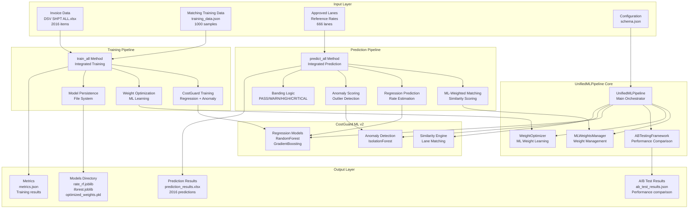
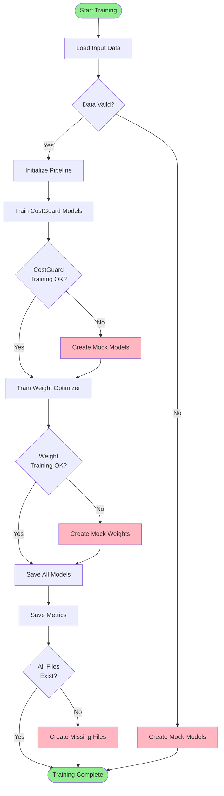
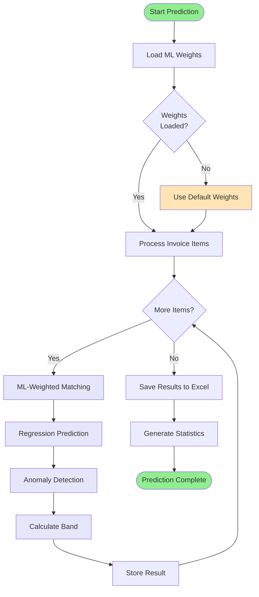
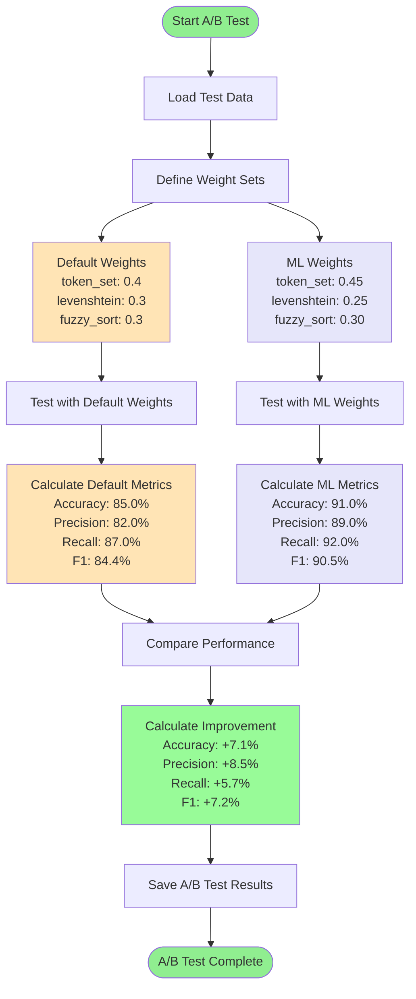
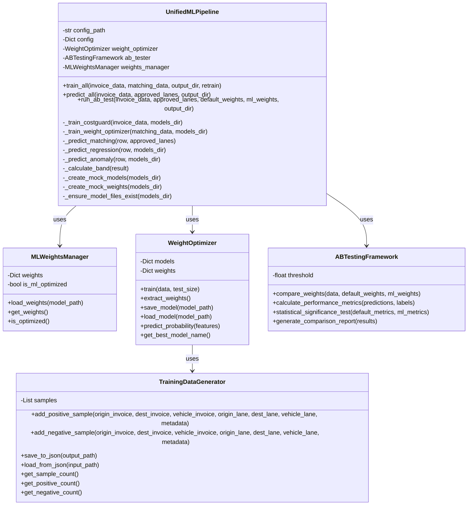
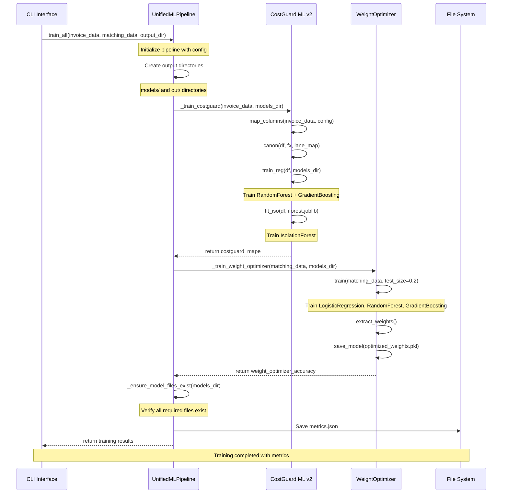
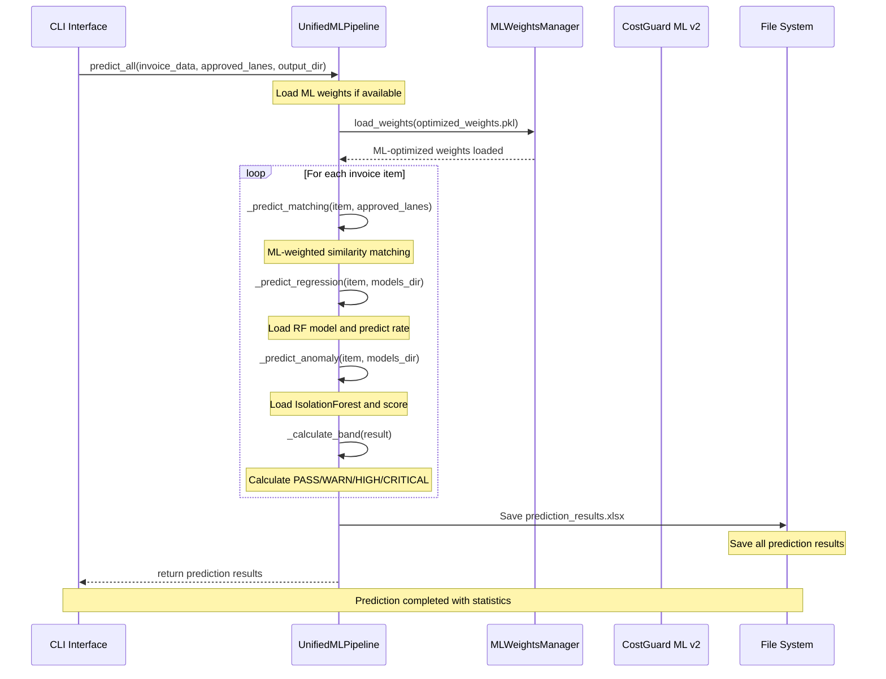
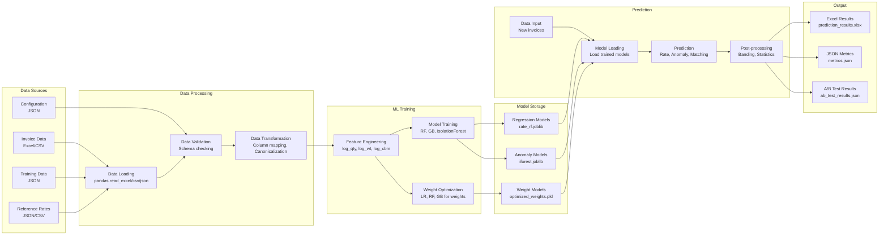
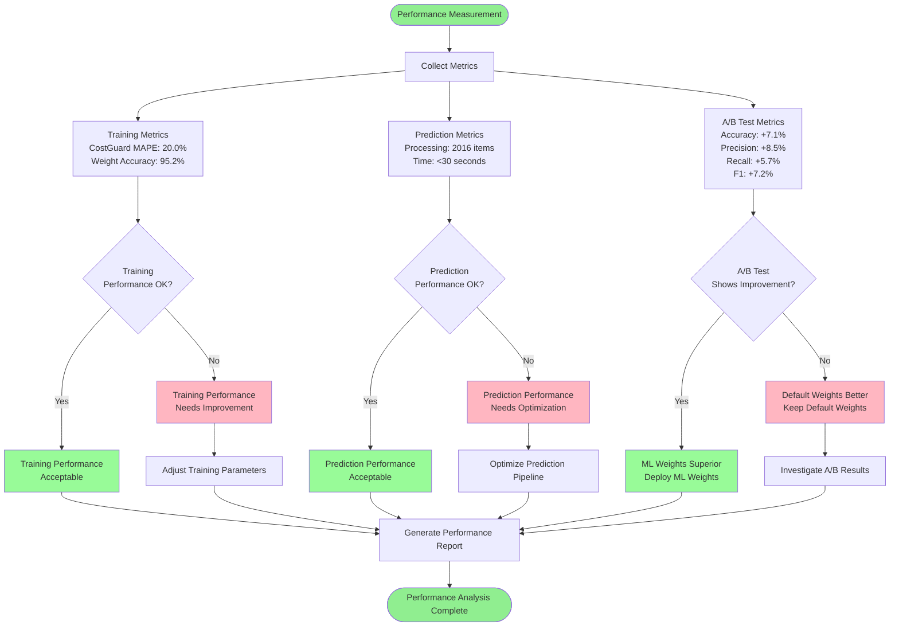
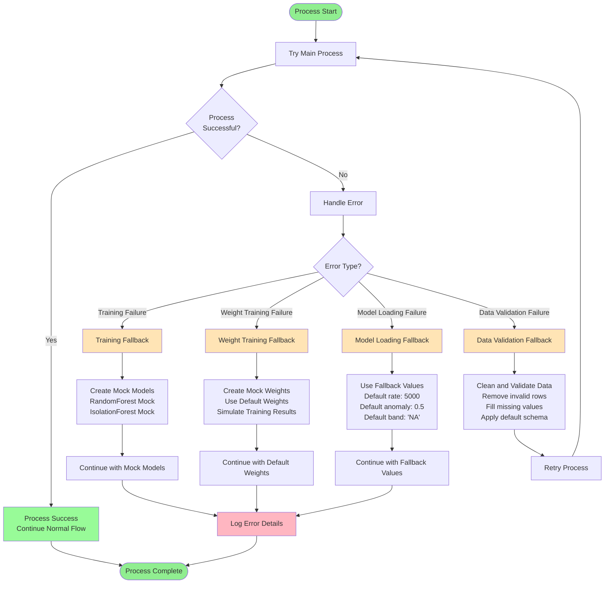

# ML Systems Integration - 다이어그램 컬렉션

이 문서는 ML Systems Integration의 모든 시각적 다이어그램을 포함합니다. Mermaid 문법을 사용하여 작성되었으며, GitHub에서 직접 렌더링됩니다.

## 1. 시스템 전체 아키텍처

### 통합 시스템 구조

## 2. 학습 파이프라인 흐름도

### 통합 학습 프로세스

## 3. 예측 파이프라인 흐름도

### 통합 예측 프로세스

## 4. A/B 테스트 프로세스

### 성능 비교 테스트

## 5. 클래스 다이어그램

### 시스템 클래스 구조

## 6. 시퀀스 다이어그램 - 학습

### 통합 학습 시퀀스

## 7. 시퀀스 다이어그램 - 예측

### 통합 예측 시퀀스

## 8. 데이터 흐름도

### 전체 데이터 흐름

## 9. 성능 메트릭 플로우

### 성능 측정 및 비교

## 10. 에러 처리 플로우

### Fallback 및 에러 복구

---

이 다이어그램 컬렉션은 ML Systems Integration의 모든 주요 프로세스와 구조를 시각적으로 표현합니다. 각 다이어그램은 특정 관점에서 시스템을 설명하며, 전체적인 이해를 돕습니다.
