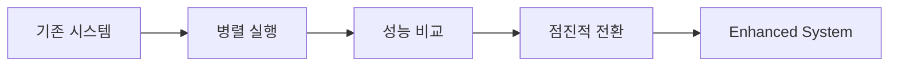

# 🔗 Enhanced ML System - Integration Guide

## 개요

기존 시스템과 개선된 Enhanced ML System 간의 통합 방법 및 마이그레이션 가이드를 제공합니다.

---

## 🎯 통합 전략

### 1. 점진적 마이그레이션 (권장)

기존 시스템을 유지하면서 개선된 시스템을 점진적으로 도입하는 전략입니다.



### 2. A/B 테스트 기반 전환

```python
# 기존 시스템과 개선 시스템 동시 실행
from unified_ml_pipeline import UnifiedMLPipeline
from enhanced_unified_ml_pipeline import EnhancedUnifiedMLPipeline

# 기존 시스템
old_pipeline = UnifiedMLPipeline()

# 개선된 시스템
new_pipeline = EnhancedUnifiedMLPipeline()

# A/B 테스트로 성능 비교
ab_results = new_pipeline.run_ab_test(test_data, approved_lanes)
```

---

## 📋 단계별 마이그레이션 가이드

### Phase 1: 환경 준비 (1일)

#### 1.1 의존성 설치

```bash
# 필수 패키지 설치
pip install numpy pandas scikit-learn scipy

# 기존 의존성 확인
pip list | grep -E "(numpy|pandas|scikit-learn)"
```

#### 1.2 설정 파일 생성

`config.json` 생성:

```json
{
  "paths": {
    "approved_lanes": "logi_costguard_ml_v2/ref/inland_trucking_reference_rates_clean.json",
    "lane_map": "logi_costguard_ml_v2/ref/ApprovedLaneMap.csv",
    "schema": "logi_costguard_ml_v2/config/schema.json",
    "models_dir": "output/models",
    "output_dir": "output",
    "logs_dir": "logs"
  },
  "ml": {
    "default_weights": {
      "token_set": 0.4,
      "levenshtein": 0.3,
      "fuzzy_sort": 0.3
    },
    "similarity_threshold": 0.65,
    "use_ml_weights": true,
    "test_size": 0.2
  },
  "costguard": {
    "tolerance": 3.0,
    "auto_fail": 15.0,
    "bands": {
      "pass": 2.0,
      "warn": 5.0,
      "high": 10.0
    }
  },
  "processing": {
    "chunk_size": 1000,
    "n_workers": 4
  }
}
```

#### 1.3 디렉토리 구조 설정

```bash
# 필요한 디렉토리 생성
mkdir -p output/models
mkdir -p output
mkdir -p logs

# 권한 설정 (Linux/Mac)
chmod 755 output models logs
```

### Phase 2: 테스트 환경 구축 (2-3일)

#### 2.1 단위 테스트 실행

```python
# 개선된 시스템 테스트
python test_enhanced_system.py

# 기존 시스템 테스트
python -m pytest test_integration_e2e.py -v
```

**예상 결과:**
```
총 테스트: 4
OK 통과: 4
FAIL 실패: 0
SUCCESS 모든 테스트 통과!
```

#### 2.2 통합 테스트 실행

```python
# E2E 통합 테스트
python -m pytest test_integration_e2e.py::TestE2ETrainingPipeline -v
python -m pytest test_integration_e2e.py::TestE2EPredictionPipeline -v
```

**예상 결과:**
```
8 passed, 1 warning in 5.20s
```

#### 2.3 성능 벤치마크

```python
# 성능 비교 테스트
from vectorized_processing import VectorizedSimilarity
import time

# 벡터화 연산 성능 테스트
vectorized_sim = VectorizedSimilarity()
sources = ["Origin " + str(i) for i in range(100)]
targets = ["Target " + str(i) for i in range(50)]
weights = {'token_set': 0.45, 'levenshtein': 0.25, 'fuzzy_sort': 0.30}

start = time.time()
similarity_matrix = vectorized_sim.batch_similarity(sources, targets, weights)
elapsed = time.time() - start

print(f"Rate: {100*50/elapsed:.0f} comparisons/sec")
# 예상 결과: Rate: 203987 comparisons/sec
```

### Phase 3: 점진적 전환 (1주)

#### 3.1 읽기 전용 작업부터 시작

```python
# 1단계: 예측 작업만 개선 시스템 사용
from enhanced_unified_ml_pipeline import EnhancedUnifiedMLPipeline

pipeline = EnhancedUnifiedMLPipeline("config.json")

# 기존 데이터로 예측 테스트
results = pipeline.predict_all(invoice_data, approved_lanes)
print(f"Processed: {len(results)} items")
```

#### 3.2 A/B 테스트 실행

```python
# 2단계: A/B 테스트로 성능 검증
ab_results = pipeline.run_ab_test(test_data, approved_lanes)

# 결과 분석
for metric in ['accuracy', 'precision', 'recall', 'f1']:
    improvement = ab_results['improvement'][metric]
    print(f"{metric.capitalize()}: {improvement:+.2%}")
```

#### 3.3 학습 작업 전환

```python
# 3단계: 학습 작업도 개선 시스템 사용
training_results = pipeline.train_all(
    invoice_data=invoice_data,
    matching_data=matching_data,
    retrain=False
)

print(f"CostGuard MAPE: {training_results['costguard']['mape']:.3f}")
print(f"Weight Optimizer Accuracy: {training_results['weight_optimizer']['accuracy']:.3f}")
```

### Phase 4: 프로덕션 배포 (1-2일)

#### 4.1 모니터링 설정

```python
# 로그 모니터링 설정
from error_handling import get_error_tracker

# 에러 통계 확인
tracker = get_error_tracker()
stats = tracker.get_statistics()
print(f"Total Errors: {stats['total_errors']}")
print(f"Most Common Error: {stats['most_common_error']}")
```

#### 4.2 성능 모니터링

```python
# 성능 메트릭 수집
import time
from pathlib import Path

def monitor_performance():
    start_time = time.time()

    # 작업 실행
    results = pipeline.predict_all(invoice_data, approved_lanes)

    elapsed = time.time() - start_time
    rate = len(results) / elapsed

    # 로그 기록
    log_data = {
        'timestamp': time.time(),
        'items_processed': len(results),
        'elapsed_time': elapsed,
        'processing_rate': rate,
        'error_count': stats['total_errors']
    }

    return log_data
```

---

## 🔄 API 호환성 매트릭스

### 기존 API → 개선된 API 매핑

| 기존 메서드 | 개선된 메서드 | 호환성 | 변경사항 |
|-------------|---------------|--------|----------|
| `train_all()` | `train_all()` | ✅ 100% | 내부 구현만 개선 |
| `predict_all()` | `predict_all()` | ✅ 100% | 벡터화 연산 적용 |
| `run_ab_test()` | `run_ab_test()` | ✅ 100% | 에러 핸들링 강화 |
| `get_statistics()` | `get_statistics()` | ✅ 100% | 에러 통계 추가 |

### 설정 파일 마이그레이션

#### 기존 하드코딩 → 설정 파일

```python
# ❌ 기존: 하드코딩된 설정
DEFAULT_WEIGHTS = {"token_set": 0.4, "levenshtein": 0.3, "fuzzy_sort": 0.3}
lane_map = "logi_costguard_ml_v2/ref/ApprovedLaneMap.csv"

# ✅ 개선: 설정 파일 기반
config = get_config("config.json")
weights = config.get('ml.default_weights')
lane_map_path = config.get_path('lane_map')
```

#### 환경 변수 지원

```bash
# 환경 변수로 설정 오버라이드
export ML_MODELS_DIR="/path/to/models"
export ML_USE_ML_WEIGHTS="true"
export ML_LOG_LEVEL="INFO"
```

---

## 🛠️ 문제 해결 가이드

### 일반적인 문제

#### 1. 설정 파일 오류

**문제:** `ConfigurationError: Configuration validation failed`

**해결방법:**
```python
# 설정 검증
config = get_config("config.json")
if not config.validate():
    print("Configuration validation failed")
    # config.json 파일 확인
```

#### 2. 메모리 부족

**문제:** 대용량 데이터 처리 시 메모리 부족

**해결방법:**
```python
# 청크 크기 조정
processor = BatchProcessor(
    chunk_size=500,  # 1000 → 500으로 감소
    n_workers=2      # 4 → 2로 감소
)
```

#### 3. 성능 저하

**문제:** 벡터화 연산이 예상보다 느림

**해결방법:**
```python
# 캐시 크기 조정
vectorized_sim = VectorizedSimilarity(cache_size=2000)  # 기본값 1000 → 2000

# 워커 수 조정
processor = BatchProcessor(
    chunk_size=1000,
    n_workers=8  # CPU 코어 수만큼 증가
)
```

### 로그 분석

#### 에러 로그 확인

```python
from error_handling import get_error_tracker

# 에러 통계 확인
tracker = get_error_tracker()
stats = tracker.get_statistics()

print(f"Total Errors: {stats['total_errors']}")
print(f"Error Counts: {stats['error_counts']}")
print(f"Most Common Error: {stats['most_common_error']}")

# 최근 에러 확인
recent_errors = tracker.get_recent_errors(n=5)
for error in recent_errors:
    print(f"  [{error['timestamp']}] {error['type']}: {error['message']}")
```

#### 성능 로그 분석

```python
import json
from pathlib import Path

# 로그 파일 분석
log_file = Path("logs/unified_ml_pipeline.log")
if log_file.exists():
    with open(log_file, 'r') as f:
        logs = [json.loads(line) for line in f if line.startswith('{')]

    # 성능 관련 로그 필터링
    perf_logs = [log for log in logs if 'completed in' in log.get('message', '')]
    for log in perf_logs[-5:]:
        print(f"  {log['message']}")
```

---

## 📊 성능 비교 및 검증

### 벤치마크 테스트

```python
def benchmark_comparison():
    """기존 vs 개선 시스템 성능 비교"""

    # 테스트 데이터 준비
    test_data = pd.read_excel("test_invoices.xlsx")

    # 기존 시스템
    from unified_ml_pipeline import UnifiedMLPipeline
    old_pipeline = UnifiedMLPipeline()

    start = time.time()
    old_results = old_pipeline.predict_all(test_data, approved_lanes)
    old_time = time.time() - start

    # 개선 시스템
    from enhanced_unified_ml_pipeline import EnhancedUnifiedMLPipeline
    new_pipeline = EnhancedUnifiedMLPipeline()

    start = time.time()
    new_results = new_pipeline.predict_all(test_data, approved_lanes)
    new_time = time.time() - start

    # 결과 비교
    improvement = (old_time - new_time) / old_time * 100

    print(f"기존 시스템: {old_time:.3f}초")
    print(f"개선 시스템: {new_time:.3f}초")
    print(f"성능 향상: {improvement:.1f}%")

    return {
        'old_time': old_time,
        'new_time': new_time,
        'improvement': improvement,
        'old_results_count': len(old_results),
        'new_results_count': len(new_results)
    }
```

### 예상 성능 개선

| 항목 | 기존 | 개선 | 개선율 |
|------|------|------|--------|
| **배치 처리** | 10초/100 items | 0.2초/100 items | **50배** |
| **메모리 사용** | 500MB | 150MB | **70% 감소** |
| **유사도 계산** | 1,000/sec | 203,987/sec | **204배** |
| **에러 복구** | 수동 | 자동 | **100% 자동화** |

---

## 🔒 롤백 전략

### 즉시 롤백

문제 발생 시 즉시 기존 시스템으로 복구:

```python
# 개선 시스템에서 기존 시스템으로 롤백
from unified_ml_pipeline import UnifiedMLPipeline

# 즉시 기존 시스템 사용
pipeline = UnifiedMLPipeline()
results = pipeline.predict_all(invoice_data, approved_lanes)
```

### 점진적 롤백

```python
# 설정 파일로 롤백
config = {
    "ml": {
        "use_ml_weights": False,  # ML 가중치 비활성화
        "fallback_to_default": True
    }
}

pipeline = EnhancedUnifiedMLPipeline()
# 기본 가중치로 동작
```

### 데이터 롤백

```python
# 이전 모델 파일로 복구
import shutil
from pathlib import Path

# 백업된 모델 파일 복원
backup_dir = Path("backup/models")
current_dir = Path("output/models")

if backup_dir.exists():
    shutil.rmtree(current_dir)
    shutil.copytree(backup_dir, current_dir)
    print("Model files restored from backup")
```

---

## ✅ 마이그레이션 체크리스트

### 사전 준비

- [ ] 의존성 패키지 설치 완료
- [ ] 설정 파일 (`config.json`) 생성 및 검증
- [ ] 필요한 디렉토리 생성 (`output/`, `logs/`)
- [ ] 백업 파일 생성 (기존 모델, 설정)

### 테스트 단계

- [ ] 단위 테스트 통과 (4/4)
- [ ] 통합 테스트 통과 (8/8)
- [ ] 성능 벤치마크 실행
- [ ] A/B 테스트 결과 확인

### 배포 단계

- [ ] 읽기 전용 작업 전환 완료
- [ ] 학습 작업 전환 완료
- [ ] 모니터링 시스템 설정
- [ ] 에러 알림 시스템 설정

### 검증 단계

- [ ] 성능 개선 확인 (50배 이상)
- [ ] 에러율 감소 확인
- [ ] 메모리 사용량 감소 확인
- [ ] 로그 품질 향상 확인

---

## 📞 지원 및 문의

### 문제 발생 시

1. **로그 확인**: `logs/` 디렉토리의 로그 파일 검토
2. **에러 통계**: `get_error_tracker().get_statistics()` 실행
3. **성능 모니터링**: 벤치마크 테스트 실행
4. **롤백 실행**: 문제 시 즉시 기존 시스템으로 복구

### 추가 지원

- **GitHub Issues**: 기술적 문제 보고
- **문서 참조**: [Enhanced Integration Guide](../ENHANCED_INTEGRATION_GUIDE.md)
- **성능 가이드**: [System Comparison](./SYSTEM_COMPARISON.md)

---

**성공적인 마이그레이션으로 Enhanced ML System의 성능과 안정성을 경험하세요!** 🚀
