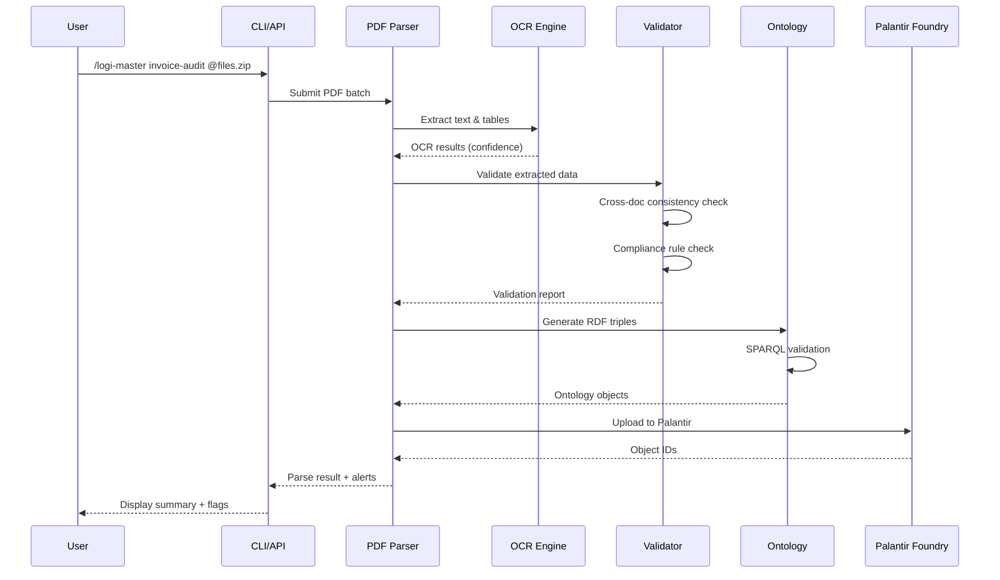

# 📄 HVDC PDF Parser - Technical Specification

**문서 버전**: 2.0
**작성일**: 2025-10-13
**담당**: Samsung C&T Logistics AI Team
**목적**: 물류 선적 서류 자동 파싱 및 온톨로지 통합

---

## 📋 목차

1. [프로그램 개요](#1-프로그램-개요)
2. [기능 요구사항](#2-기능-요구사항)
3. [기술 사양](#3-기술-사양)
4. [입출력 사양](#4-입출력-사양)
5. [온톨로지 통합](#5-온톨로지-통합)
6. [에러 처리 및 검증](#6-에러-처리-및-검증)
7. [성능 요구사항](#7-성능-요구사항)
8. [통합 워크플로우](#8-통합-워크플로우)

---

## 1. 프로그램 개요

### 1.1 배경 및 필요성

HVDC 프로젝트는 637개 아이템, 9개 주요 벤더, 10개 저장 위치에 걸친 복잡한 물류 관리 체계를 운영 중입니다. 기존 수작업 서류 처리는:
- **월 300 man-hour** 소요
- **데이터 정확도 85%** 수준
- **통관 지연 리스크** 15-25%
- **DEM/DET 비용** 월 $15,000 발생

### 1.2 프로그램 목적

PDF 형태의 물류 서류를 자동으로 파싱하여:
1. **CI/PL/BL/DO** 등 다중 문서의 아이템 레벨 데이터 추출
2. **Palantir Ontology**로 시맨틱 검증 및 통합
3. **UAE 규제 요건**(MOIAT, FANR, DCD) 자동 추론
4. **실시간 불일치 감지** 및 알림 시스템 구축

### 1.3 기대효과

| 항목 | 현재 | 목표 | 개선율 |
|------|------|------|--------|
| 처리 시간 | 4시간/BL | 15분/BL | 94% ↓ |
| 데이터 정확도 | 85% | 99% | 16% ↑ |
| 통관 지연 | 15-25% | 3-5% | 80% ↓ |
| DEM/DET 비용 | $15K/월 | $3K/월 | 80% ↓ |

---

## 2. 기능 요구사항

### 2.1 문서 유형별 파싱 기능

#### 2.1.1 Commercial Invoice (CI)
```python
# 필수 추출 필드
CI_FIELDS = {
    "header": {
        "invoice_no": str,          # SCT-INV-123
        "invoice_date": datetime,
        "seller": str,
        "buyer": str,
        "incoterms": str,          # CIF, FOB, EXW
        "payment_terms": str
    },
    "line_items": [{
        "item_no": int,
        "description": str,
        "hs_code": str,            # 8411.99.00
        "quantity": float,
        "unit": str,               # EA, KG, MT
        "unit_price": Decimal,
        "total_amount": Decimal,
        "origin": str,             # Country of Origin
        "net_weight": float,
        "gross_weight": float
    }],
    "totals": {
        "subtotal": Decimal,
        "freight": Decimal,
        "insurance": Decimal,
        "total_invoice": Decimal
    }
}
```

#### 2.1.2 Packing List (PL)
```python
PL_FIELDS = {
    "header": {
        "pl_no": str,
        "ref_invoice": str,        # Link to CI
        "shipment_date": datetime,
        "total_packages": int
    },
    "items": [{
        "item_no": int,
        "description": str,
        "quantity": float,
        "net_weight_kg": float,
        "gross_weight_kg": float,
        "dimensions_cm": {         # L x W x H
            "length": float,
            "width": float,
            "height": float
        },
        "cbm": float,
        "package_type": str,       # Crate, Pallet, Box
        "package_marks": str
    }]
}
```

#### 2.1.3 Bill of Lading (BL)
```python
BL_FIELDS = {
    "bl_no": str,                  # MBL/HBL
    "bl_type": str,                # Master/House
    "vessel_name": str,
    "voyage_no": str,
    "pol": str,                    # Port of Loading
    "pod": str,                    # Port of Discharge
    "etd": datetime,
    "eta": datetime,
    "atd": datetime,               # Actual (if available)
    "ata": datetime,
    "container_no": List[str],
    "seal_no": List[str],
    "shipper": str,
    "consignee": str,
    "notify_party": str,
    "freight_terms": str,          # Prepaid/Collect
    "no_of_containers": int,
    "total_weight": float,
    "measurement": float
}
```

#### 2.1.4 Delivery Order (DO)
```python
DO_FIELDS = {
    "do_no": str,
    "ref_bl": str,
    "release_date": datetime,
    "delivery_location": str,
    "container_list": [{
        "container_no": str,
        "seal_no": str,
        "size_type": str,          # 20GP, 40HC
        "release_status": str
    }],
    "special_instructions": str,
    "delivery_terms": str
}
```

### 2.2 OCR 엔진 통합

#### 2.2.1 OCR 우선순위
```python
OCR_ENGINES = [
    {
        "name": "AWS Textract",
        "priority": 1,
        "use_case": "테이블 구조 복잡한 문서",
        "cost_per_page": 0.0015,
        "confidence_threshold": 0.95
    },
    {
        "name": "Google Document AI",
        "priority": 2,
        "use_case": "다국어 혼재 문서",
        "cost_per_page": 0.0010,
        "confidence_threshold": 0.93
    },
    {
        "name": "Azure Form Recognizer",
        "priority": 3,
        "use_case": "표준 양식 문서",
        "cost_per_page": 0.0010,
        "confidence_threshold": 0.92
    }
]
```

#### 2.2.2 OCR 후처리
- **신뢰도 필터링**: confidence < 0.90인 필드는 manual_review 플래그
- **형식 검증**: HS Code, 날짜, 금액 포맷 자동 보정
- **테이블 재구성**: 줄바꿈/병합된 셀 자동 복원

### 2.3 데이터 검증 규칙

#### 2.3.1 Cross-Document Validation
```python
VALIDATION_RULES = {
    "qty_consistency": {
        "check": "CI.quantity == PL.quantity == WMS.received_qty",
        "tolerance": 0,
        "severity": "HIGH"
    },
    "weight_consistency": {
        "check": "abs(CI.gross_weight - PL.gross_weight) / CI.gross_weight < 0.03",
        "tolerance": 3,  # 3% 허용 오차
        "severity": "MEDIUM"
    },
    "ref_integrity": {
        "check": "PL.ref_invoice IN CI.invoice_no AND DO.ref_bl IN BL.bl_no",
        "severity": "HIGH"
    },
    "date_logic": {
        "check": "CI.date <= PL.date <= BL.etd <= BL.eta <= DO.release_date",
        "severity": "MEDIUM"
    }
}
```

#### 2.3.2 Compliance Rules (UAE-specific)
```python
COMPLIANCE_RULES = {
    "hs_code_moiat": {
        "condition": "hs_code.startswith('84') OR hs_code.startswith('85')",
        "requirement": "MOIAT Certificate of Conformity",
        "lead_time_days": 14
    },
    "hs_code_fanr": {
        "condition": "description CONTAINS ('radioactive', 'nuclear', 'isotope')",
        "requirement": "FANR Import Permit",
        "lead_time_days": 30
    },
    "hazmat_dcd": {
        "condition": "un_no IS NOT NULL OR hazmat_class IS NOT NULL",
        "requirement": "Dubai Civil Defense Approval",
        "lead_time_days": 21
    },
    "oog_handling": {
        "condition": "dimensions.any > standard_limit OR weight > 25000",
        "requirement": "Special Transport Permit + Route Survey",
        "lead_time_days": 7
    }
}
```

---

## 3. 기술 사양

### 3.1 아키텍처

```
┌─────────────────────────────────────────────────────────┐
│                     User Interface                      │
│          /logi-master invoice-audit --context @shipment │
└─────────────────┬───────────────────────────────────────┘
                  │
         ┌────────▼────────┐
         │  PDF Controller │
         │  - Queue Mgmt   │
         │  - Workflow Orch│
         └────┬──────┬─────┘
              │      │
     ┌────────▼──┐ ┌▼──────────┐
     │ OCR Engine│ │ Rule Engine│
     │ (AWS/GCP) │ │ (Drools)   │
     └─────┬─────┘ └─────┬──────┘
           │             │
      ┌────▼─────────────▼────┐
      │   Data Mapper Layer   │
      │   - Field Extraction  │
      │   - Type Conversion   │
      │   - Confidence Scoring│
      └────────┬──────────────┘
               │
    ┌──────────▼──────────────┐
    │  Ontology Integration   │
    │  - RDF Triple Generation│
    │  - SPARQL Validation    │
    │  - Inference Engine     │
    └──────────┬──────────────┘
               │
    ┌──────────▼──────────────┐
    │   Palantir Foundry      │
    │   - Object: Item        │
    │   - Object: Shipment    │
    │   - Object: Document    │
    │   - Object: CertReq     │
    └─────────────────────────┘
```

### 3.2 기술 스택

| Layer | Technology | Version | Purpose |
|-------|-----------|---------|---------|
| **OCR** | AWS Textract | Latest | 주 OCR 엔진 |
| **OCR** | Google Document AI | v1 | 백업 OCR |
| **Parser** | Python | 3.11+ | 메인 로직 |
| **PDF Library** | PyPDF2 + pdfplumber | Latest | PDF 전처리 |
| **Ontology** | RDFlib | 7.0+ | RDF 생성/질의 |
| **Validation** | Pydantic | 2.0+ | 스키마 검증 |
| **DB** | PostgreSQL | 15+ | 메타데이터 저장 |
| **Cache** | Redis | 7.0+ | OCR 결과 캐싱 |
| **Queue** | Celery + RabbitMQ | Latest | 비동기 처리 |
| **API** | FastAPI | 0.110+ | REST API |

### 3.3 클래스 설계

```python
from pydantic import BaseModel, Field, validator
from typing import Optional, List, Dict
from decimal import Decimal
from datetime import datetime
from enum import Enum

class DocumentType(str, Enum):
    COMMERCIAL_INVOICE = "CI"
    PACKING_LIST = "PL"
    BILL_OF_LADING = "BL"
    DELIVERY_ORDER = "DO"
    WMS_RECEIPT = "WMS"
    CERTIFICATE = "CERT"

class OCRConfidence(BaseModel):
    overall: float = Field(ge=0.0, le=1.0)
    by_field: Dict[str, float]
    needs_review: bool

    @validator('needs_review', always=True)
    def check_threshold(cls, v, values):
        return values.get('overall', 0) < 0.90

class LineItem(BaseModel):
    item_no: int
    hvdc_code: Optional[str] = None  # HVDC-ADOPT-HE-0001
    description: str
    hs_code: str = Field(regex=r'^\d{4}\.\d{2}\.\d{2}$')
    quantity: Decimal
    unit: str
    unit_price: Decimal
    total_amount: Decimal
    net_weight_kg: Optional[float] = None
    gross_weight_kg: Optional[float] = None
    dimensions_cm: Optional[Dict[str, float]] = None
    cbm: Optional[float] = None

    @validator('hs_code')
    def validate_hs_code(cls, v):
        # HS Code 체계 검증 로직
        if not v or len(v) < 10:
            raise ValueError("Invalid HS Code format")
        return v

class CommercialInvoice(BaseModel):
    doc_type: DocumentType = DocumentType.COMMERCIAL_INVOICE
    invoice_no: str
    invoice_date: datetime
    seller: str
    buyer: str
    incoterms: str
    line_items: List[LineItem]
    total_amount: Decimal
    currency: str = "USD"
    ocr_confidence: OCRConfidence
    source_file: str

    class Config:
        json_schema_extra = {
            "example": {
                "invoice_no": "SCT-INV-123",
                "invoice_date": "2025-06-15",
                "seller": "Hitachi Energy",
                "buyer": "Samsung C&T",
                "incoterms": "CIF Jebel Ali",
                "line_items": [...],
                "total_amount": 1250000.00,
                "currency": "USD"
            }
        }

class DocumentParseResult(BaseModel):
    doc_id: str
    doc_type: DocumentType
    parsed_data: Union[CommercialInvoice, PackingList, BillOfLading, DeliveryOrder]
    validation_status: str  # PASS, PENDING, FAILED
    validation_errors: List[str]
    ontology_mapped: bool
    rdf_triples: Optional[List[Dict]] = None
    created_at: datetime
    processing_time_ms: int
```

---

## 4. 입출력 사양

### 4.1 입력

#### 4.1.1 지원 형식
- **PDF**: 1.4~2.0 (스캔본 + 텍스트 기반 모두)
- **이미지**: PNG, JPEG, TIFF (300 DPI 이상 권장)
- **최대 파일 크기**: 50 MB
- **다중 페이지**: 지원 (최대 100페이지)

#### 4.1.2 입력 방법
```bash
# CLI 방식
/logi-master invoice-audit \
  --context @shipment_docs/HVDC-002/*.pdf \
  --validate-ontology \
  --output-format json

# API 방식
POST /api/v1/parse/pdf
Content-Type: multipart/form-data

{
  "files": [File, File, ...],
  "shipment_id": "HVDC-ADOPT-SIM-0056",
  "doc_types": ["CI", "PL", "BL"],
  "validation_level": "STRICT",
  "ontology_check": true
}
```

### 4.2 출력

#### 4.2.1 JSON 출력
```json
{
  "parse_id": "parse-20251013-001",
  "shipment_ref": "HVDC-ADOPT-SIM-0056",
  "documents": [
    {
      "doc_id": "doc-ci-001",
      "doc_type": "CI",
      "source_file": "Invoice_SCT-123.pdf",
      "parsed_data": {
        "invoice_no": "SCT-INV-123",
        "invoice_date": "2025-06-15T00:00:00Z",
        "line_items": [...]
      },
      "ocr_confidence": {
        "overall": 0.96,
        "needs_review": false
      },
      "validation_status": "PASS",
      "ontology_mapped": true
    }
  ],
  "cross_validation": {
    "qty_check": "PASS",
    "weight_check": "WARNING: 2.5% deviation in item GT-ROTOR-01",
    "ref_integrity": "PASS"
  },
  "compliance_alerts": [
    {
      "item_id": "GT-ROTOR-01",
      "hs_code": "8411.99.00",
      "requirement": "MOIAT CoC",
      "status": "MISSING",
      "action": "Initiate certification process"
    }
  ],
  "processing_stats": {
    "total_docs": 4,
    "successful": 4,
    "failed": 0,
    "total_time_ms": 12450,
    "avg_confidence": 0.94
  }
}
```

#### 4.2.2 RDF 출력 (Turtle)
```turtle
@prefix hvdc: <http://samsung.com/hvdc-project#> .
@prefix : <http://samsung.com/project-logistics#> .

hvdc:Item_GT-ROTOR-01 a :Item ;
    :hvdcCode "HVDC-ADOPT-HE-0007" ;
    :description "Gas Turbine Rotor Assembly" ;
    :hsCode "8411.99.00" ;
    :quantity 1.0 ;
    :grossWeight 150000.0 ;
    :requiresCertification hvdc:Cert_MOIAT_CoC ;
    :describedIn hvdc:Doc_CI_SCT-123 ;
    :belongsToShipment hvdc:Shipment_MBL-0056 .

hvdc:Cert_MOIAT_CoC a :CertificationRequirement ;
    :certType "MOIAT Certificate of Conformity" ;
    :status "PENDING" ;
    :inferredFrom "HS Code 8411.99.00" ;
    :requiredBy hvdc:Item_GT-ROTOR-01 .
```

---

## 5. 온톨로지 통합

### 5.1 RDF Triple 생성 규칙

```python
def generate_rdf_triples(parsed_doc: CommercialInvoice) -> List[Triple]:
    """
    파싱된 문서를 RDF 트리플로 변환
    """
    triples = []
    base_uri = "http://samsung.com/hvdc-project#"

    # Document 객체 생성
    doc_uri = f"{base_uri}Doc_{parsed_doc.doc_type}_{parsed_doc.invoice_no}"
    triples.append((
        URIRef(doc_uri),
        RDF.type,
        URIRef(f"{base_uri}Document")
    ))
    triples.append((
        URIRef(doc_uri),
        URIRef(f"{base_uri}docType"),
        Literal(parsed_doc.doc_type.value)
    ))

    # Item 객체들 생성
    for item in parsed_doc.line_items:
        item_uri = f"{base_uri}Item_{sanitize(item.description)}"

        # Item 기본 속성
        triples.extend([
            (URIRef(item_uri), RDF.type, URIRef(f"{base_uri}Item")),
            (URIRef(item_uri), URIRef(f"{base_uri}hsCode"), Literal(item.hs_code)),
            (URIRef(item_uri), URIRef(f"{base_uri}quantity"), Literal(item.quantity)),
            (URIRef(item_uri), URIRef(f"{base_uri}grossWeight"), Literal(item.gross_weight_kg))
        ])

        # Document와 Item 연결
        triples.append((
            URIRef(doc_uri),
            URIRef(f"{base_uri}describes"),
            URIRef(item_uri)
        ))

        # 규제 요건 추론
        cert_reqs = infer_certification_requirements(item.hs_code, item.description)
        for cert in cert_reqs:
            cert_uri = f"{base_uri}Cert_{cert['type']}_{item.item_no}"
            triples.extend([
                (URIRef(cert_uri), RDF.type, URIRef(f"{base_uri}CertificationRequirement")),
                (URIRef(cert_uri), URIRef(f"{base_uri}certType"), Literal(cert['type'])),
                (URIRef(item_uri), URIRef(f"{base_uri}requiresCertification"), URIRef(cert_uri))
            ])

    return triples
```

### 5.2 SPARQL 검증 쿼리

```sparql
# 불일치 검증
PREFIX : <http://samsung.com/project-logistics#>

SELECT ?item ?ci_qty ?pl_qty ?wms_qty
WHERE {
    ?item a :Item ;
          :describedIn ?ci_doc, ?pl_doc, ?wms_doc .

    ?ci_doc :docType "CI" ;
            :hasQuantity ?ci_qty .
    ?pl_doc :docType "PL" ;
            :hasQuantity ?pl_qty .
    ?wms_doc :docType "WMS" ;
             :receivedQuantity ?wms_qty .

    FILTER(?ci_qty != ?pl_qty || ?pl_qty != ?wms_qty)
}

# 누락된 인증서 검색
SELECT ?item ?hs_code ?required_cert
WHERE {
    ?item a :Item ;
          :hsCode ?hs_code ;
          :requiresCertification ?cert .

    ?cert :certType ?required_cert ;
          :status "PENDING" .

    FILTER NOT EXISTS {
        ?cert :attachedDocument ?cert_doc
    }
}
```

---

## 6. 에러 처리 및 검증

### 6.1 에러 계층

```python
class PDFParserError(Exception):
    """Base exception"""
    pass

class OCRError(PDFParserError):
    """OCR 처리 실패"""
    error_code = "OCR_001"

class ValidationError(PDFParserError):
    """데이터 검증 실패"""
    error_code = "VAL_001"

class OntologyMappingError(PDFParserError):
    """온톨로지 매핑 실패"""
    error_code = "ONT_001"

# 에러 핸들러
@app.exception_handler(PDFParserError)
async def parser_error_handler(request: Request, exc: PDFParserError):
    return JSONResponse(
        status_code=422,
        content={
            "error_code": exc.error_code,
            "message": str(exc),
            "recovery": "Check source PDF quality or contact support",
            "timestamp": datetime.utcnow().isoformat()
        }
    )
```

### 6.2 재시도 로직

```python
from tenacity import retry, stop_after_attempt, wait_exponential

@retry(
    stop=stop_after_attempt(3),
    wait=wait_exponential(multiplier=1, min=4, max=10)
)
async def ocr_with_retry(pdf_path: str, engine: OCREngine) -> OCRResult:
    """
    OCR 실패 시 최대 3회 재시도 (지수 백오프)
    """
    try:
        result = await engine.process(pdf_path)
        if result.confidence < 0.70:
            raise OCRError("Confidence too low, retrying...")
        return result
    except Exception as e:
        logger.warning(f"OCR attempt failed: {e}")
        raise
```

---

## 7. 성능 요구사항

| 지표 | 목표 | 측정 방법 |
|------|------|-----------|
| **처리 속도** | < 15분/shipment (avg 4 docs) | End-to-end timing |
| **OCR 정확도** | ≥ 95% confidence | Per-field confidence |
| **동시 처리** | 10 shipments parallel | Concurrent requests |
| **가용성** | 99.5% uptime | Monthly SLA |
| **응답 시간** | < 30초 (API 호출) | P95 latency |

### 7.1 성능 최적화

```python
# 비동기 OCR 처리
@celery_app.task
def process_pdf_async(pdf_path: str, doc_type: str):
    """Celery worker에서 비동기 처리"""
    result = await ocr_engine.process(pdf_path)
    triples = generate_rdf(result)
    upload_to_ontology(triples)
    return {"status": "success", "doc_id": result.doc_id}

# Redis 캐싱
@cache.cached(timeout=3600, key_prefix="ocr_result")
def get_ocr_result(file_hash: str):
    """동일 파일 재처리 방지"""
    return ocr_engine.process(file_path)
```

---

## 8. 통합 워크플로우

### 8.1 End-to-End 플로우



### 8.2 명령어 통합

```bash
# 1. 기본 파싱
/logi-master invoice-audit --context @shipment_002/*.pdf

# 2. 온톨로지 검증 포함
/logi-master invoice-audit --context @shipment_002/*.pdf --validate-ontology

# 3. 자동화 워크플로우 설정
/automate_workflow \
  --name "Daily PDF Ingestion" \
  --schedule "0 8 * * *" \
  --task "/logi-master invoice-audit --all-pending" \
  --alert-channel "telegram:@hvdc-alerts"

# 4. RAG 기반 질의
/ask "Show me all items in Shipment MBL-0056 missing FANR permits" \
  --context ontology:hvdc_project

# 5. 불일치 리포트
/logi-master generate-mismatch-report \
  --shipment MBL-0056 \
  --format table \
  --output reports/mismatch_$(date +%Y%m%d).xlsx
```

---

## 9. 배포 및 모니터링

### 9.1 Docker 배포

```dockerfile
FROM python:3.11-slim

# 시스템 의존성
RUN apt-get update && apt-get install -y \
    poppler-utils \
    tesseract-ocr \
    && rm -rf /var/lib/apt/lists/*

WORKDIR /app
COPY requirements.txt .
RUN pip install --no-cache-dir -r requirements.txt

COPY . .

# Health check
HEALTHCHECK --interval=30s --timeout=10s \
  CMD curl -f http://localhost:8000/health || exit 1

CMD ["uvicorn", "main:app", "--host", "0.0.0.0", "--port", "8000"]
```

### 9.2 모니터링 지표

```python
from prometheus_client import Counter, Histogram

# Metrics
pdf_processed = Counter('pdf_documents_processed_total', 'Total PDFs processed', ['doc_type'])
ocr_confidence = Histogram('ocr_confidence_score', 'OCR confidence distribution')
validation_errors = Counter('validation_errors_total', 'Validation failures', ['error_type'])
processing_time = Histogram('pdf_processing_seconds', 'Processing duration')

# Grafana Dashboard Queries
"""
- rate(pdf_processed_total[5m])
- histogram_quantile(0.95, ocr_confidence_score)
- sum(validation_errors_total) by (error_type)
"""
```

---

## 10. QA 및 Testing

### 10.1 테스트 케이스

```python
import pytest

@pytest.mark.parametrize("doc_type,file_path", [
    ("CI", "tests/samples/invoice_standard.pdf"),
    ("PL", "tests/samples/packing_list_multipage.pdf"),
    ("BL", "tests/samples/bl_scanned.pdf"),
])
def test_pdf_parsing_accuracy(doc_type, file_path):
    result = parser.parse(file_path, doc_type=doc_type)
    assert result.ocr_confidence.overall >= 0.95
    assert len(result.validation_errors) == 0

def test_cross_document_validation():
    ci = parser.parse("ci.pdf")
    pl = parser.parse("pl.pdf")

    validator = CrossDocValidator()
    report = validator.validate(ci, pl)

    assert report.qty_match == True
    assert abs(report.weight_deviation) < 0.03

def test_ontology_mapping():
    parsed = parser.parse("invoice.pdf")
    triples = ontology_mapper.map(parsed)

    # RDF 트리플 검증
    assert len(triples) > 0
    assert any(t[1] == RDF.type for t in triples)
```

---

## 🔧 추천 명령어

```bash
/logi-master invoice-audit --context @new_shipment --validate-ontology
/visualize_data --source ontology --query "compliance_status" --chart bar
/automate_workflow --name "PDF Auto-Process" --trigger on_file_upload
```

이 사양서는 HVDC 프로젝트의 PDF 파싱 시스템을 **Palantir Ontology 기반**으로 구축하여 **시맨틱 검증**, **규제 준수**, **자동화 워크플로우**를 통합한 솔루션입니다. 🚀
