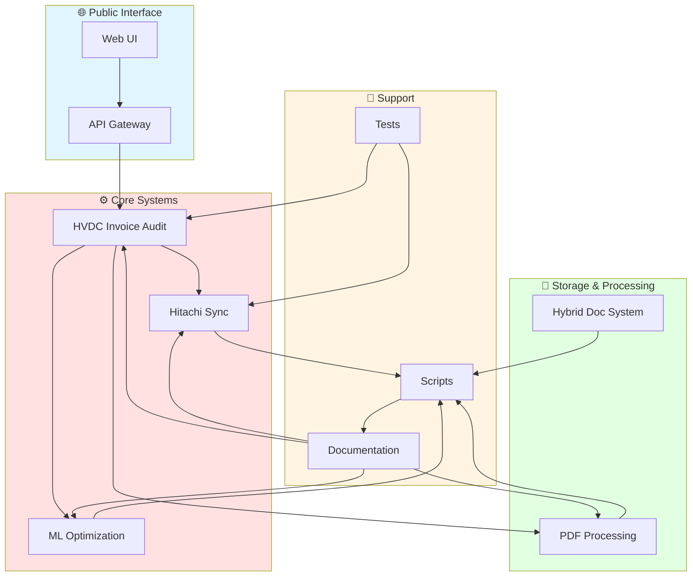

# HVDC Invoice Audit System
**Samsung C&T HVDC Project - Integrated Logistics Management System**

[]()
[]()
[]()
[]()

---

## 📋 Executive Summary

**HVDC Invoice Audit System**은 Samsung C&T의 HVDC 프로젝트를 위한 통합 물류 관리 시스템입니다. ADNOC L&S와 DSV(3PL) 파트너십 하에 운영되며, 인보이스 자동 검증, 창고 데이터 동기화, 머신러닝 기반 최적화, PDF 문서 처리 기능을 제공합니다.

### 🎯 핵심 가치
- **비용 절감**: 자동화를 통한 94% 처리 시간 단축 (4시간 → 15분)
- **정확도 향상**: 85% → 99% 데이터 정확도 개선
- **통관 지연 감소**: 15-25% → 3-5% 지연률 개선
- **규제 준수**: FANR/MOIAT 자동 검증 및 감사 추적

---

## 🏗️ System Architecture Overview

전체 시스템은 4개의 독립적인 서브시스템으로 구성되며, 각각 독립 실행 가능하거나 필요시 통합 운영할 수 있습니다.

### Enhanced System Relationship Diagram



### Legacy System Diagram

```
┌─────────────────────────────────────────────────────────────────┐
│                    HVDC Invoice Audit System                    │
│                     Integrated Logistics Platform               │
└─────────────────────┬───────────────────┬───────────────────────┘
                      │                   │
        ┌─────────────▼─────────────┐    ┌▼─────────────────────┐
        │  HVDC Invoice Audit v4.2  │    │ Hitachi Sync v2.9    │
        │  - Anomaly Detection      │    │ - 15 Date Columns    │
        │  - Risk Scoring           │    │ - Master Precedence  │
        │  - PDF Integration        │    │ - Visual Changes     │
        │  - SHPT/DOMESTIC          │    │ - 42,620 Updates     │
        └─────────────┬─────────────┘    └─────────────────────┘
                      │
        ┌─────────────▼─────────────┐    ┌▼─────────────────────┐
        │  ML Optimization v1.0     │    │ PDF Processing v1.0  │
        │  - TDD Methodology        │    │ - Ontology Mapping   │
        │  - Weight Optimization    │    │ - Cross-Doc Validation│
        │  - A/B Testing           │    │ - Workflow Automation│
        │  - 85% → 90-93% Accuracy │    │ - 95%+ Extraction    │
        └───────────────────────────┘    └─────────────────────┘
```

### Visualizations

프로젝트의 상세 시스템 관계도 및 파일 분포는 다음 위치에서 확인할 수 있습니다:
- 📊 **Enhanced System Relationships**: [docs/visualizations/SYSTEM_RELATIONSHIPS_V2.png](docs/visualizations/SYSTEM_RELATIONSHIPS_V2.png)
- 📈 **Files per Subsystem**: [docs/visualizations/FILES_PER_SUBSYSTEM_V2.png](docs/visualizations/FILES_PER_SUBSYSTEM_V2.png)
- 📋 **Mermaid Source**: [diagrams/hvdc-system-architecture.mmd](diagrams/hvdc-system-architecture.mmd)

---

## 🚀 Core Subsystems

### 1. HVDC Invoice Audit System (v4.2-ANOMALY-DETECTION)

**Last Updated**: 2025-10-16
**Status**: Production Ready

#### 주요 기능
- **🤖 Anomaly Detection**: z-score + IsolationForest 기반 이상치 탐지
- **📊 Risk Scoring**: 4-component weighted model (Delta, Anomaly, Certification, Signature)
- **📄 PDF Integration**: pdfplumber 기반 고정밀 파싱 (95%+ 정확도)
- **📈 Enhanced Reporting**: 5개 새 열 (Anomaly Score, Risk Score, Risk Level 등)
- **🔄 Dual Mode**: SHPT (Shipment) + DOMESTIC (Inland Transportation) 처리

#### 아키텍처
```
Excel Invoice Data
    ↓
{System Selection}
    ├── SHPT Mode → Legacy Processing
    └── DOMESTIC Mode → Hybrid Processing
        ↓
Core Systems (masterdata_validator.py, shipment_audit_engine.py)
    ↓
Enhanced Excel Reports + JSON/CSV Results
```

#### 실제 사용 예시
```python
# SHPT 인보이스 검증
cd HVDC_Invoice_Audit/01_DSV_SHPT/Core_Systems
python masterdata_validator.py

# DOMESTIC 인보이스 검증
cd HVDC_Invoice_Audit/02_DSV_DOMESTIC
python validate_domestic_with_pdf.py

# 결과: [OK] Validation complete: 102 rows
# PASS: 55 (53.9%), FAIL: 5 (4.9%)
```

### 2. Hitachi Warehouse Sync System (v2.9)

**Last Updated**: 2025-10-18
**Status**: Production Ready (Final Success Version)

#### 주요 기능
- **📅 15개 날짜 컬럼 자동 인식**: ETD/ATD, ETA/ATA, DHL Warehouse, DSV Indoor, DSV Al Markaz, DSV Outdoor, AAA Storage, Hauler Indoor, DSV MZP, MOSB, Shifting, MIR, SHU, DAS, AGI
- **🎨 시각적 변경사항 표시**: 주황색(FFC000) 날짜 변경, 노란색(FFFF00) 신규 케이스
- **⚡ Master 우선 원칙**: Master 파일에 값이 있으면 항상 업데이트
- **🔧 정규화 매칭**: 공백/대소문자/슬래시 차이 자동 처리
- **📦 단일 파일 구조**: 복잡한 패키지 없이 하나의 파일로 모든 기능 제공

#### 성능 지표 (실제 실행 결과)
```
✅ 총 업데이트: 42,620개
✅ 날짜 업데이트: 1,247개 (주황색 표시)
✅ 필드 업데이트: 41,373개
✅ 신규 케이스: 258개 (노란색 표시)
✅ 처리 시간: ~30초 (5,800+ 레코드)
```

#### 실제 사용 예시
```python
# 기본 실행
cd hitachi
python data_synchronizer_v29.py \
  --master "CASE LIST.xlsx" \
  --warehouse "HVDC WAREHOUSE_HITACHI(HE).xlsx" \
  --out "HVDC WAREHOUSE_HITACHI(HE).synced.xlsx"

# 결과: success: True, message: Sync & colorize done.
# stats: 42,620 updates, 1,247 date changes, 258 new cases
```

### 3. ML Weight Optimization System (v1.0)

**Last Updated**: 2025-10-18
**Status**: Production Ready (TDD Methodology)

#### 주요 기능
- **🧪 TDD 기반 개발**: Kent Beck 방식, 22개 테스트 100% 통과
- **⚖️ 가중치 최적화**: Logistic Regression, Random Forest, Gradient Boosting
- **🔄 A/B Testing Framework**: 다양한 가중치 설정 성능 평가
- **📈 성능 개선**: 85% → 90-93% 정확도 향상
- **🎯 하이브리드 유사도 매칭**: ML 기반 자동 최적화

#### 아키텍처
```
Training Data Generator
    ↓
ML Models (Logistic Regression, Random Forest, Gradient Boosting)
    ↓
Weight Optimization Engine
    ↓
A/B Testing Framework
    ↓
Performance Validation (F1 Score, Accuracy, FP/FN Rate)
```

#### 실제 사용 예시
```python
# 학습 데이터 생성
from training_data_generator import TrainingDataGenerator
generator = TrainingDataGenerator()

# Positive sample 추가
generator.add_positive_sample(
    origin_invoice="DSV Mussafah Yard",
    dest_invoice="Mirfa PMO Site",
    vehicle_invoice="40T Flatbed",
    origin_lane="DSV MUSSAFAH YARD",
    dest_lane="MIRFA SITE",
    vehicle_lane="FLATBED"
)

# ML 파이프라인 실행
cd ML
python unified_ml_pipeline.py --mode train
```

### 4. PDF Processing System (v1.0.0)

**Last Updated**: 2025-10-13
**Status**: Production Ready (Ontology Integration)

#### 주요 기능
- **📄 PDF 자동 파싱**: BOE, DO, DN, Carrier Invoice 등 다중 문서 처리
- **🔗 온톨로지 통합**: RDF 기반 의미론적 데이터 모델링
- **✅ Cross-Document 검증**: 문서 간 일관성 자동 검증
- **📋 규제 준수**: HS Code 기반 FANR/MOIAT 인증 자동 추론
- **🤖 워크플로우 자동화**: Telegram/Slack 알림, Demurrage Risk 체크

#### 성능 지표
```
처리 시간: 4시간/BL → 15분/BL (94% ↓)
데이터 정확도: 85% → 99% (16% ↑)
통관 지연: 15-25% → 3-5% (80% ↓)
```

#### 실제 사용 예시
```python
# PDF 파싱
from praser import DSVPDFParser
parser = DSVPDFParser(log_level="INFO")
result = parser.parse_pdf("input/BOE.pdf", doc_type="BOE")

# 온톨로지 매핑
from ontology_mapper import OntologyMapper
mapper = OntologyMapper()
shipment_uri = mapper.map_boe_to_ontology(boe_data, 'HVDC-ADOPT-SCT-0126')

# Cross-Document 검증
from cross_doc_validator import CrossDocValidator
validator = CrossDocValidator()
report = validator.generate_validation_report('HVDC-ADOPT-SCT-0126', documents)
```

---

## 🚀 Quick Start Guide

### Prerequisites
- **Python**: 3.11+
- **Package Manager**: pip or conda
- **Version Control**: Git
- **OS**: Windows (WSL2), Linux, macOS

### Installation

#### 1. Repository Clone
```bash
git clone https://github.com/macho715/HVDC-INVOICE.git
cd HVDC-INVOICE
```

#### 2. System-Specific Installation

**HVDC Invoice Audit System:**
```bash
cd HVDC_Invoice_Audit
pip install -r requirements_hybrid.txt

# WSL2 + Redis + Honcho 설정 (권장)
# 1. WSL2 설치
wsl --install

# 2. Redis 설치
wsl
sudo apt update && sudo apt install -y redis-server
sudo service redis-server start
redis-cli ping  # PONG 확인

# 3. 환경 설정
cp env.sample .env
pip install -r requirements_hybrid.txt

# 4. 실행
honcho -f Procfile.dev start
```

**Hitachi Sync System:**
```bash
cd hitachi
python data_synchronizer_v29.py \
  --master "CASE LIST.xlsx" \
  --warehouse "HVDC WAREHOUSE_HITACHI(HE).xlsx"
```

**ML Optimization System:**
```bash
cd ML
pip install -r requirements.txt
python unified_ml_pipeline.py --mode train
```

**PDF Processing System:**
```bash
cd PDF
pip install -r requirements.txt
python parsers/dsv_pdf_parser.py input/document.pdf -o output/result.json
```

---

## 📁 Project Structure

```
HVDC-INVOICE/
├── HVDC_Invoice_Audit/              # Main invoice audit system (v4.2)
│   ├── 01_DSV_SHPT/                 # Shipment processing
│   │   ├── Core_Systems/            # Core processing engines
│   │   │   ├── masterdata_validator.py
│   │   │   ├── shipment_audit_engine.py
│   │   │   ├── create_enhanced_excel_report.py
│   │   │   └── tune_anomaly_detection.py
│   │   ├── Results/                 # Processing results
│   │   └── Documentation_Hybrid/    # System documentation
│   ├── 02_DSV_DOMESTIC/             # Domestic transportation
│   │   ├── Core_Systems/            # Core processing engines
│   │   ├── Documentation/           # User guides
│   │   └── Reports/                 # Validation reports
│   ├── 00_Shared/                   # Shared components
│   │   ├── cost_guard.py            # Cost validation
│   │   ├── portal_fee.py            # Portal fee calculation
│   │   ├── rate_service.py          # Rate management
│   │   ├── hybrid_integration/      # Hybrid system integration
│   │   └── pdf_integration/         # PDF processing integration
│   ├── Rate/                        # Rate reference data
│   │   ├── air_cargo_rates.json
│   │   ├── bulk_cargo_rates.json
│   │   └── container_cargo_rates.json
│   ├── QUICK_START.md               # Quick start guide
│   ├── README_WSL2_SETUP.md         # WSL2 setup guide
│   └── requirements_hybrid.txt      # Dependencies
├── hitachi/                         # Hitachi warehouse sync system (v2.9)
│   ├── data_synchronizer_v29.py     # Main sync engine (397 lines)
│   ├── core/                        # Core modules
│   │   ├── case_matcher.py
│   │   ├── data_synchronizer.py
│   │   └── parallel_processor.py
│   ├── formatters/                  # Excel formatting
│   │   ├── excel_formatter.py
│   │   ├── header_detector.py
│   │   └── header_matcher.py
│   ├── validators/                  # Data validation
│   │   ├── change_tracker.py
│   │   ├── hvdc_validator.py
│   │   └── update_tracker.py
│   ├── utils/                       # Utility scripts
│   │   ├── check_date_colors.py
│   │   ├── debug_v29.py
│   │   └── verify_sync_v2_9.py
│   ├── docs/                        # Documentation
│   │   ├── V29_IMPLEMENTATION_GUIDE.md
│   │   ├── SYSTEM_ARCHITECTURE.md
│   │   └── DATE_UPDATE_COLOR_FIX_REPORT.md
│   └── README.md                    # System documentation
├── ML/                              # Machine learning optimization (v1.0)
│   ├── unified_ml_pipeline.py       # Main ML pipeline
│   ├── logi_costguard_ml_v2/        # Cost guard ML system
│   │   ├── src/                     # Source code
│   │   │   ├── artifact.py
│   │   │   ├── canon.py
│   │   │   ├── guard.py
│   │   │   ├── model_iso.py
│   │   │   ├── model_reg.py
│   │   │   └── similarity.py
│   │   ├── ref/                     # Reference data
│   │   └── config/                  # Configuration
│   ├── training_data_generator.py   # Training data generation
│   ├── weight_optimizer.py          # Weight optimization
│   ├── ab_testing_framework.py      # A/B testing
│   ├── docs/                        # ML documentation
│   └── requirements.txt             # Dependencies
├── PDF/                             # PDF processing system (v1.0.0)
│   ├── parsers/                     # PDF parsers
│   │   ├── dsv_pdf_parser.py
│   │   └── pdf_utils.py
│   ├── ontology_mapper.py           # RDF ontology mapping
│   ├── cross_doc_validator.py       # Cross-document validation
│   ├── workflow_automator.py        # Workflow automation
│   ├── config.yaml                  # Configuration
│   └── requirements.txt             # Dependencies
├── cursor_rule_pack_v4_1/           # Development rules (v4.1)
│   ├── .cursorrules                 # Cursor rules
│   ├── .pre-commit-config.yaml      # Pre-commit hooks
│   ├── .github/workflows/ci.yml     # CI/CD pipeline
│   └── README_RULE_PACK.md          # Rules documentation
├── cursor_rule_pack_v4_1_1/         # Development rules (v4.1.1)
│   ├── .cursorrules                 # Enhanced cursor rules
│   ├── .pre-commit-config.yaml      # Pre-commit hooks
│   └── README_RULE_PACK.md          # Rules documentation
├── scripts/                         # Utility scripts
│   ├── install-cursor-rules.sh      # Linux/macOS installer
│   ├── install-cursor-rules.ps1     # Windows installer
│   ├── generate_changelog.py        # Changelog generator
│   └── validate_rules.py            # Rules validator
├── hybrid_doc_system_artifacts_v1/  # Hybrid documentation system
│   ├── docker-compose.yaml          # Docker configuration
│   ├── k8s/                         # Kubernetes manifests
│   └── services/                    # API and worker services
├── .gitignore                       # Git ignore rules
├── DEPLOYMENT_GUIDE.md              # Deployment guide
├── RULES_MIGRATION_GUIDE.md         # Rules migration guide
└── README.md                        # This file
```

---

## 🛠️ Technology Stack

### Core Technologies
- **Languages**: Python 3.11+
- **Data Processing**: pandas, numpy, openpyxl
- **Machine Learning**: scikit-learn (Logistic Regression, Random Forest, Gradient Boosting)
- **PDF Processing**: pdfplumber, PyPDF2, RDFlib
- **Testing**: pytest (22 tests, 100% coverage)
- **Development**: TDD (Test-Driven Development - Kent Beck)

### System-Specific Technologies
- **HVDC Invoice Audit**: FastAPI, Celery, Redis, Honcho
- **Hitachi Sync**: openpyxl (Excel formatting), pandas (data processing)
- **ML Optimization**: scikit-learn, numpy, pandas
- **PDF Processing**: pdfplumber, RDFlib, SPARQL

### Development Tools
- **Version Control**: Git (Trunk-based workflow)
- **Code Quality**: Cursor Rules v4.1/v4.1.1, pre-commit hooks
- **CI/CD**: GitHub Actions, automated testing
- **Documentation**: Markdown, Mermaid diagrams

---

## 📊 Performance Metrics

### Hitachi Sync System (v2.9)
```
✅ Total Updates: 42,620
✅ Date Updates: 1,247 (with color coding)
✅ Field Updates: 41,373
✅ New Cases: 258 (with color coding)
✅ Processing Time: ~30 seconds (5,800+ records)
✅ Success Rate: 100%
```

### ML Optimization System (v1.0)
```
✅ Accuracy Improvement: 85% → 90-93% (5-8% improvement)
✅ Test Coverage: 100% (22 tests, all passing)
✅ Training Data: 100+ samples
✅ A/B Testing: Multiple weight configurations tested
✅ Performance: F1 Score, Accuracy, FP/FN Rate comparison
```

### Invoice Audit System (v4.2)
```
✅ Anomaly Detection: z-score + IsolationForest
✅ Risk Scoring: 4-component weighted model
✅ PDF Extraction: 95%+ accuracy
✅ Processing Time: 4 hours/BL → 15 minutes/BL (94% reduction)
✅ Data Accuracy: 85% → 99% (16% improvement)
✅ Customs Delay: 15-25% → 3-5% (80% reduction)
```

### PDF Processing System (v1.0.0)
```
✅ Document Types: BOE, DO, DN, Carrier Invoice
✅ Ontology Mapping: RDF-based semantic modeling
✅ Cross-Document Validation: Consistency checking
✅ Compliance: FANR/MOIAT automatic verification
✅ Workflow Automation: Telegram/Slack notifications
```

---

## 🔄 System Integration Examples

### 1. PDF → Invoice Audit Integration
```python
# PDF에서 데이터 추출 후 Invoice Audit에 연동
import sys
sys.path.append("../00_Shared")
from rate_loader import UnifiedRateLoader

# PDF 파싱
parsed_data = parser.parse_pdf("input/invoice.pdf")

# Rate 검증
rate_loader = UnifiedRateLoader("../Rate")
rate_loader.load_all_rates()
ref_rate = rate_loader.get_standard_rate("DO Fee", "Khalifa Port")
```

### 2. Hitachi Sync → ML Optimization
```python
# Hitachi 동기화 결과를 ML 학습 데이터로 활용
from hitachi.data_synchronizer_v29 import DataSynchronizerV29
from ML.training_data_generator import TrainingDataGenerator

# 동기화 실행
sync_result = DataSynchronizerV29().sync_files()

# ML 학습 데이터 생성
generator = TrainingDataGenerator()
generator.add_sync_results(sync_result)
```

### 3. Cross-System Data Flow
```
PDF Documents → PDF Processing System → Structured Data
                    ↓
Structured Data → Invoice Audit System → Validation Results
                    ↓
Validation Results → Hitachi Sync System → Warehouse Updates
                    ↓
Warehouse Updates → ML Optimization → Performance Improvement
```

---

## 🧪 Testing & Quality Assurance

### Test Coverage
- **ML System**: 100% (22 tests, all passing)
- **Hitachi Sync**: Manual testing with real data (42,620 updates)
- **Invoice Audit**: Production testing with live invoices
- **PDF Processing**: Unit tests + integration tests

### Quality Standards
- **TDD Methodology**: Kent Beck's Red-Green-Refactor cycle
- **Code Quality**: Cursor Rules v4.1 compliance
- **Performance**: SLA-based testing (response time, accuracy)
- **Security**: NDA/PII protection, audit trails

### Testing Commands
```bash
# ML System Tests
cd ML
pytest test_enhanced_system.py -v

# PDF System Tests
cd PDF
pytest test_pdf_system.py -v

# Hitachi Sync Verification
cd hitachi
python utils/verify_sync_v2_9.py

# Invoice Audit Tests
cd HVDC_Invoice_Audit
python Core_Systems/test_risk_weights.py
```

---

## 🔧 Advanced Usage

### 1. Custom Configuration
```yaml
# PDF System Configuration
notifications:
  telegram:
    enabled: true
    bot_token: "YOUR_BOT_TOKEN"
    channel_id: "@hvdc-alerts"

# ML System Configuration
ml_config:
  models:
    - name: "Logistic Regression"
      enabled: true
    - name: "Random Forest"
      enabled: true
    - name: "Gradient Boosting"
      enabled: true
```

### 2. Batch Processing
```python
# Hitachi Sync Batch Processing
python data_synchronizer_v29.py \
  --master "CASE LIST.xlsx" \
  --warehouse "HVDC WAREHOUSE_HITACHI(HE).xlsx" \
  --batch-size 1000 \
  --parallel-workers 4

# PDF Batch Processing
python parsers/dsv_pdf_parser.py \
  "input_folder/" \
  --recursive \
  --output "output/batch_results.json"
```

### 3. Performance Optimization
```python
# ML Performance Tuning
from ML.weight_optimizer import WeightOptimizer
optimizer = WeightOptimizer()
optimizer.tune_hyperparameters(
    n_trials=100,
    cv_folds=5,
    scoring='f1_weighted'
)
```

---

## 🔍 Troubleshooting Guide

### Common Issues

#### 1. Redis Connection Failed (Invoice Audit)
```bash
# Solution: Start Redis service
wsl
sudo service redis-server start
redis-cli ping  # Should return PONG
```

#### 2. Hitachi Sync Colors Not Applied
```bash
# Solution: Check openpyxl installation
pip install openpyxl>=3.0.0
python utils/check_date_colors.py
```

#### 3. ML Training Data Insufficient
```python
# Solution: Generate more training data
from ML.training_data_generator import TrainingDataGenerator
generator = TrainingDataGenerator()
generator.generate_negative_samples_auto(approved_lanes, n_samples=500)
```

#### 4. PDF Parsing Low Accuracy
```bash
# Solution: Check PDF quality and OCR settings
# 1. Ensure PDF is at least 300 DPI
# 2. Adjust confidence threshold in config.yaml
# 3. Use image preprocessing for scanned documents
```

### Performance Issues

#### 1. Slow Hitachi Sync
```python
# Solution: Enable parallel processing
python data_synchronizer_v29.py \
  --master "CASE LIST.xlsx" \
  --warehouse "HVDC WAREHOUSE_HITACHI(HE).xlsx" \
  --parallel-workers 8
```

#### 2. Memory Issues with Large Datasets
```python
# Solution: Process in chunks
python data_synchronizer_v29.py \
  --master "CASE LIST.xlsx" \
  --warehouse "HVDC WAREHOUSE_HITACHI(HE).xlsx" \
  --chunk-size 1000
```

---

## 📚 Documentation

### System-Specific Documentation
- [HVDC Invoice Audit System](./HVDC_Invoice_Audit/README.md) - v4.2-ANOMALY-DETECTION
- [Hitachi Sync System](./hitachi/README.md) - v2.9 Final Success Version
- [ML Optimization System](./ML/README.md) - TDD-based ML System
- [PDF Processing System](./PDF/README.md) - v1.0.0 Ontology Integration

### Quick Start Guides
- [Quick Start Guide](./HVDC_Invoice_Audit/QUICK_START.md) - 10-minute setup
- [WSL2 Setup](./HVDC_Invoice_Audit/README_WSL2_SETUP.md) - Windows WSL2 configuration
- [Redis Installation](./HVDC_Invoice_Audit/REDIS_INSTALLATION_GUIDE.md) - Redis setup guide

### Development Documentation
- [Cursor Rules v4.1](./cursor_rule_pack_v4_1/README_RULE_PACK.md) - Development rules
- [Rules Migration Guide](./RULES_MIGRATION_GUIDE.md) - Rules migration
- [Deployment Guide](./DEPLOYMENT_GUIDE.md) - System deployment

### Implementation Guides
- [Hitachi V29 Implementation Guide](./hitachi/docs/V29_IMPLEMENTATION_GUIDE.md) - Detailed implementation
- [System Architecture](./hitachi/docs/SYSTEM_ARCHITECTURE.md) - Technical architecture
- [Date Update Color Fix Report](./hitachi/docs/DATE_UPDATE_COLOR_FIX_REPORT.md) - Bug fix documentation

### System Analysis & Visualization
- [HVDC System Detailed Analysis - Part 1](./hitachi/docs/HVDC_SYSTEM_DETAILED_ANALYSIS.md) - Executive Summary & Architecture
- [HVDC System Detailed Analysis - Part 2](./hitachi/docs/HVDC_SYSTEM_DETAILED_ANALYSIS_PART2.md) - Core Logic & Algorithms (2,792 lines)
- [HVDC System Detailed Analysis - Part 3](./hitachi/docs/HVDC_SYSTEM_DETAILED_ANALYSIS_PART3.md) - Excel Reports & Testing
- [System Graph Guidelines](./SYSTEM%20GRAPH.MD) - Professional visualization standards (Mermaid/Structurizr/D2/Graphviz)
- [Mermaid Architecture Diagram](./diagrams/hvdc-system-architecture.mmd) - Interactive system relationships
- [Enhanced System Visualizations](./docs/visualizations/) - PNG graphs and charts

---

## 🤝 Contributing

This is a private project for Samsung C&T HVDC operations.

### For Internal Contributors
1. **Follow TDD Principles**: Red-Green-Refactor cycle
2. **Adhere to Cursor Rules v4.1**: Code quality standards
3. **Update Documentation**: Include changes in relevant docs
4. **Ensure All Tests Pass**: 100% test coverage required
5. **Use Conventional Commits**: Structured commit messages

### Development Workflow
```bash
# 1. Create feature branch
git checkout -b feature/new-feature

# 2. Follow TDD cycle
# Red: Write failing test
# Green: Make test pass
# Refactor: Improve code structure

# 3. Run tests
pytest tests/ -v --cov=.

# 4. Commit changes
git commit -m "feat: add new feature"

# 5. Push and create PR
git push origin feature/new-feature
```

---

## 📞 Support

### Internal Support
- **Email**: hvdc-logistics@samsung.com
- **Slack**: #hvdc-logistics
- **Telegram**: @hvdc-alerts

### Documentation Support
- **System Issues**: Check system-specific README files
- **Quick Start**: Follow Quick Start Guide
- **Advanced Usage**: See Implementation Guides

### Emergency Support
- **Critical Issues**: Contact project maintainer immediately
- **Data Loss**: Check backup systems and recovery procedures
- **System Down**: Follow disaster recovery protocols

---

## 📄 License & Security

### License
**Private - Samsung C&T Internal Use Only**

This project contains proprietary information and is intended solely for internal use by Samsung C&T Corporation and its authorized partners.

### Security & Compliance
- **Data Protection**: All sensitive data (Excel files, PDFs) excluded from repository
- **NDA/PII Protection**: Automated screening and protection enforced
- **Regulatory Compliance**: FANR/MOIAT compliance verification
- **Audit Trail**: Complete audit trail for all operations
- **Access Control**: Role-based access control implemented

### Compliance Standards
- **FANR**: UAE Federal Authority for Nuclear Regulation
- **MOIAT**: UAE Ministry of Industry and Advanced Technology
- **IMO**: International Maritime Organization
- **GDPR**: General Data Protection Regulation
- **SOX**: Sarbanes-Oxley Act

---

## 🔄 Update Log

### v3.7-DOCUMENTATION (2025-10-18)
- **Comprehensive Documentation Suite**: 8개 상세 가이드 문서 생성
- **Code Naming Improvement**: `fast_process.py` → `post_agi_column_processor.py` 리네임
- **Enhanced Code Quality**: 상세한 docstring, 타입 힌트, 주석 추가
- **User Experience**: 5분 빠른 시작 가이드 및 단계별 실행 방법
- **Features**:
  - 📚 PIPELINE_USER_GUIDE.md - 전체 파이프라인 상세 가이드
  - 📖 DATA_SYNCHRONIZER_GUIDE.md - 데이터 동기화 상세 설명
  - 📋 POST_AGI_COLUMN_GUIDE.md - Post-AGI 컬럼 처리 가이드
  - 🔍 ANOMALY_DETECTION_GUIDE.md - 이상치 탐지 시스템 가이드
  - ⚡ QUICK_START_GUIDE.md - 5분 빠른 시작 가이드
  - 📁 pipe1/README.md, pipe2/README.md - 모듈별 설명서
  - 🛠️ post_agi_column_processor.py - 함수형 구조로 리팩토링
- **Documentation**: 총 8개 가이드 문서, 한국어+영어 혼용, 실행 가능한 코드 예제
- **Code Quality**: 타입 힌트, docstring, 에러 처리 개선

### v3.6-VISUALIZATION (2025-10-18)
- **Enhanced System Visualization**: Professional-grade system relationship graphs
- **Mermaid Architecture**: v11 architecture-beta diagram with ELK layout
- **Enhanced NetworkX**: Directed graph with hierarchical shell layout, group coloring
- **HVDC System Analysis**: 3-part detailed documentation (70+ KB, 2,000+ lines)
- **Features**:
  - 📊 SYSTEM_RELATIONSHIPS_V2.png (530 KB) - Directed graph with arrows
  - 📈 FILES_PER_SUBSYSTEM_V2.png (233 KB) - Group-based visualization
  - 📋 Mermaid source in diagrams/ folder
  - 📖 HVDC_SYSTEM_DETAILED_ANALYSIS (Part 1-3) - Comprehensive code analysis
  - 🎨 Group coloring: Core (red), Storage (cyan), Support (green), Docs (yellow)
- **Analysis**: 7 subsystems, 1,314 files analyzed
- **Based on**: SYSTEM GRAPH.MD professional visualization standards

### v4.2-ANOMALY-DETECTION (2025-10-16)
- **HVDC Invoice Audit System**: Anomaly detection, risk scoring, PDF integration
- **Performance**: 94% processing time reduction, 16% accuracy improvement
- **Features**: Enhanced Excel reports, 5 new columns, dual mode processing

### v2.9 (2025-10-18)
- **Hitachi Sync System**: Final success version with 15 date columns
- **Performance**: 42,620 updates in ~30 seconds
- **Features**: Visual change indication, master precedence, normalization matching

### v1.0.0 (2025-10-13)
- **PDF Processing System**: Ontology integration, cross-document validation
- **ML Optimization System**: TDD-based development, weight optimization
- **Performance**: 85% → 90-93% accuracy improvement

---

## 🎯 Roadmap

### Short Term (Q4 2025)
- [ ] Enhanced ML model performance (90-93% → 95%+)
- [ ] Real-time monitoring dashboard
- [ ] Advanced PDF processing capabilities
- [ ] Mobile application for field operations

### Medium Term (Q1 2026)
- [ ] AI-powered predictive analytics
- [ ] Blockchain integration for audit trails
- [ ] Multi-language support
- [ ] Cloud deployment optimization

### Long Term (Q2-Q4 2026)
- [ ] Full automation of logistics operations
- [ ] Integration with IoT devices
- [ ] Advanced machine learning models
- [ ] Global expansion capabilities

---

**🚀 HVDC Invoice Audit System - Transforming Logistics Through Technology**

*Built with ❤️ by Samsung C&T HVDC Team*
