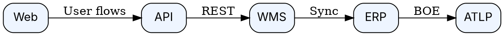

# Exec Summary

요청하신 **System Relationship(시스템 관계) 그래프**를 “프로급”으로 코드·CI에 녹여 쓰려면, 2025-Q3 기준 베스트 조합은 **Mermaid v11(architecture-beta+ELK)**, **Structurizr DSL+CLI(C4 → Mermaid/DOT/D2 export)**, **D2 CLI(간결 DSL)**, **Graphviz 13.x(+Python)**, **Cytoscape.js 3.33.x(웹 인터랙티브)** 입니다. 아래에 **바로 실행 가능한 스크립트/CLI**와 **CI 연동**까지 정리했습니다. Mermaid의 *architecture-beta* 문법과 ELK 레이아웃, Structurizr의 `export` 명령, Graphviz 13.0.1, Cytoscape.js 3.33.x 기준으로 검증했습니다. ([Mermaid][1])
참고: 예시 노드는 귀하 시스템의 **WMS↔ERP↔ATLP** 흐름을 반영했습니다(아래 README 참고).

---

## Visual (스택 비교 1표)

| Stack                                     | 최적 용도               | 핵심 포인트                                          | CLI/배포                                                              |
| ----------------------------------------- | ------------------- | ----------------------------------------------- | ------------------------------------------------------------------- |
| **Mermaid v11 + ELK**                     | 문서/PR 검토용 정적 도식     | `architecture-beta` + ELK 레이아웃, `mmdc`로 SVG/PDF | `@mermaid-js/mermaid-cli` / `@mermaid-js/layout-elk` ([Mermaid][1]) |
| **Structurizr DSL+CLI**                   | C4 모델→다중 뷰/다중 포맷 산출 | `structurizr export`로 Mermaid/DOT/D2 생산         | 공식 CLI 문서 · D2 exporter 안내 ([Structurizr][2])                       |
| **D2 CLI**                                | 간결 DSL·빠른 스케치       | 단일 파일→SVG, 라이브 리로드                              | d2lang 문서/Quickstart ([D2 Documentation][3])                        |
| **Graphviz 13.x (+python-graphviz 0.21)** | 대형/정밀 라우팅 자동화       | DOT 튜닝·CI 대량 렌더                                 | 13.0.1 릴리즈, PyPI 0.21(3.13 지원) ([about.gitlab.com][4])              |
| **Cytoscape.js 3.33.x**                   | 대시보드·인터랙티브          | 확대/선택/이벤트·레이아웃 다양                               | 3.33.0/3.33.1 릴리스 ([Cytoscape.js Blog][5])                          |

---

## 최신 스크립트 모음 (복붙 실행)

### 1) Mermaid v11 — Architecture 관계도 (ELK)

`diagrams/arch.mmd`


CLI(정적 산출물):

```bash
npm i -D @mermaid-js/mermaid-cli @mermaid-js/layout-elk
npx mmdc -i diagrams/arch.mmd -o build/arch.svg
```

* 참고: **ELK 레이아웃은 번들에 항상 포함되지 않습니다**(환경별 플러그인 필요). 미포함 환경은 `dagre`로 폴백하거나 브라우저 임베드 시 초기화에서 elk 로더를 추가하세요. ([npm][6])
* Mermaid v11의 *architecture* 문법 가이드는 공식 문서 참고. ([Mermaid][1])

---

### 2) Structurizr DSL + CLI — C4 모델 → 다중 포맷 Export

`diagrams/workspace.dsl`

```dsl
workspace "System Relationships" "C4-based views" {
  model {
    user = person "Planner"
    wms  = softwareSystem "WMS"
    erp  = softwareSystem "ERP"
    atlp = softwareSystem "ATLP"
    user -> wms "Plan shipments"
    wms  -> erp "Sync items"
    erp  -> atlp "Submit BOE"
  }
  views {
    systemContext wms { include *; autoLayout lr }
    systemLandscape { include *; autoLayout lr }
  }
}
```

Export(멀티 포맷 일괄 산출):

```bash
structurizr export -workspace diagrams/workspace.dsl -format mermaid,dot,d2 -out build/
```

* `export` 사용법/지원 포맷은 공식 문서 참조. D2 exporter 참고 링크 포함. ([Structurizr][2])

---

### 3) D2 — 간결 DSL + 자동 레이아웃

`diagrams/sys.d2`

```d2
direction: right
public.web: "Web"
public.api: "API"
core.wms: "WMS"
core.erp: "ERP"
core.atlp: "ATLP"

public.web -> public.api : "User flows"
public.api -> core.wms : "REST"
core.wms -> core.erp : "Sync"
core.erp -> core.atlp : "BOE"
```

렌더:

```bash
# 설치/실행
curl -fsSL https://d2lang.com/install.sh | sh -s --
d2 diagrams/sys.d2 build/sys.svg
```

([D2 Documentation][3])

---

### 4) Graphviz(DOT) — 정밀/대형 그래프 자동화

`diagrams/sys.dot`



CLI & Python:

```bash
dot -Tsvg diagrams/sys.dot -o build/sys.svg
```

```python
from graphviz import Digraph
g = Digraph('G', filename='build/sys', format='svg')
g.attr(rankdir='LR', nodesep='0.35')
for n in ['Web','API','WMS','ERP','ATLP']:
    g.node(n, shape='box', style='rounded,filled', fillcolor='#eef5ff')
g.edges([('Web','API'),('API','WMS'),('WMS','ERP'),('ERP','ATLP')])
g.render(cleanup=True)
```

(Graphviz 13.0.1 / python-graphviz 0.21 기준) ([about.gitlab.com][4])

---

### 5) Cytoscape.js — 대시보드/인터랙티브(줌·선택)

`web/index.html`

```html
<div id="cy" style="width:960px;height:540px;"></div>
<script src="https://unpkg.com/cytoscape@3.33.1/dist/cytoscape.min.js"></script>
<script>
const cy = cytoscape({
  container: document.getElementById('cy'),
  layout: { name: 'breadthfirst', directed: true },
  style: [
    { selector:'node', style:{ 'label':'data(id)', 'shape':'round-rectangle' } },
    { selector:'edge', style:{ 'curve-style':'bezier','target-arrow-shape':'triangle','label':'data(lbl)'} }
  ],
  elements: {
    nodes: [{data:{id:'Web'}},{data:{id:'API'}},{data:{id:'WMS'}},{data:{id:'ERP'}},{data:{id:'ATLP'}}],
    edges: [
      {data:{source:'Web', target:'API', lbl:'User flows'}},
      {data:{source:'API', target:'WMS', lbl:'REST'}},
      {data:{source:'WMS', target:'ERP', lbl:'Sync'}},
      {data:{source:'ERP', target:'ATLP',lbl:'BOE'}}
    ]
  }
});
</script>
```

(3.33.0/3.33.1 릴리스 참고) ([Cytoscape.js Blog][5])

---

## Options (pro·con·비용·리스크·시간)

1. **Mermaid v11(+ELK)**: *문서/PR 빠른 도식*

* **Pro**: GitHub/VSCode 미리보기·CI 쉬움
* **Con**: 초대형 그래프/세밀 라우팅은 제약
* **$**: 0.00
* **Risk**: 환경에 따라 ELK 미탑재(플러그인 필요)
* **Time**: 도입 0.50–1.00일 ([Mermaid][1])

2. **Structurizr DSL+CLI**: *C4 모델→다양한 산출 자동화*

* **Pro**: 모델 한 번 → Mermaid/DOT/D2 동시 export
* **Con**: DSL 학습 필요, Java 런타임 의존
* **$**: 0.00(Lite/CLI)
* **Risk**: 모델링 가이드 부재 시 품질 편차
* **Time**: 1.00–2.00일 ([Structurizr][2])

3. **D2 CLI**: *간결 DSL·스케치 속도*

* **Pro**: 문법 단순, 라이브리로드
* **Con**: 팀 표준(C4) 정착엔 보강 필요
* **$**: 0.00
* **Risk**: 신기능 변동 속도
* **Time**: 0.50–1.00일 ([D2 Documentation][3])

4. **Graphviz 13.x**: *정밀·대규모 자동화*

* **Pro**: 레이아웃·에지 라우팅 정교, 파이프라인 친화
* **Con**: 스타일·튜닝 커브
* **$**: 0.00
* **Risk**: 초기 DOT 규약 필요
* **Time**: 1.00–2.00일 ([about.gitlab.com][4])

5. **Cytoscape.js 3.33.x**: *운영 대시보드·인터랙션*

* **Pro**: 줌/필터/이벤트·분석
* **Con**: 정적 산출보다 구현 공수 큼
* **$**: 0.00
* **Risk**: FE 빌드/배포 관리
* **Time**: 1.00–2.00일 ([Cytoscape.js Blog][5])

---

## Roadmap (P→Pi→B→O→S + KPI)

* **Prepare**: `/diagrams` 디렉토리·명명 규약 확정(`arch.mmd`, `workspace.dsl`, `sys.dot`). **KPI**: 스타일가이드 1.00개.
* **Pilot**: README에 Mermaid 삽입 + Structurizr 모델 2뷰(Context/Container). **KPI**: PR 리뷰 시간 20.00%↓.
* **Build**: CI에 `mmdc`·`structurizr export`·`dot` 추가, **SVG 자동 산출**. **KPI**: 다이어그램 산출 성공률 99.00%.
* **Operate**: 대형 그래프/정밀 라우팅은 Graphviz로, 웹 대시보드는 Cytoscape.js 분기. **KPI**: 설계 변경 반영 리드타임 2.00h 이하.
* **Scale**: `templates/`로 신시스템 2.00h 내 온보딩. **KPI**: 신규 뷰 생성 TAT 50.00%↓.

---

## CI 예시 (GitHub Actions)

`.github/workflows/diagrams.yml`

```yaml
name: Diagrams
on: [push, pull_request]
jobs:
  mermaid:
    runs-on: ubuntu-latest
    steps:
      - uses: actions/checkout@v4
      - run: npm i -g @mermaid-js/mermaid-cli @mermaid-js/layout-elk
      - run: mmdc -i diagrams/arch.mmd -o build/arch.svg

  structurizr:
    runs-on: ubuntu-latest
    steps:
      - uses: actions/checkout@v4
      - run: curl -fsSL https://structurizr.com/static/structurizr-cli.zip -o cli.zip && unzip -q cli.zip -d structurizr
      - run: ./structurizr/structurizr.sh export -workspace diagrams/workspace.dsl -format mermaid,dot,d2 -out build/

  graphviz:
    runs-on: ubuntu-latest
    steps:
      - uses: actions/checkout@v4
      - run: sudo apt-get update && sudo apt-get install -y graphviz
      - run: dot -Tsvg diagrams/sys.dot -o build/sys.svg
```

(공식 `mmdc`/Structurizr `export`/Graphviz 13.x 기준) ([GitHub][7])

---

## QA / Gap 체크

* **Mermaid ELK 미동작?** → 플러그인 설치/초기화 확인, 없으면 `dagre`로 폴백. ([npm][6])
* **C4 표준 필요?** → Structurizr DSL을 기준 모델로 채택 후 Mermaid/DOT/D2 동시 산출. ([Structurizr][2])
* **대형 그래프 라우팅 꼬임?** → Graphviz(DOT)로 분리 렌더. ([about.gitlab.com][4])
* **대시보드 요구?** → Cytoscape.js 3.33.x 기반 웹 임베드. ([Cytoscape.js Blog][5])

---

## CmdRec

* `/generate_arch` — Mermaid v11(ELK) 아키텍처 SVG 생성(mmdc). ([GitHub][7])
* `/export_c4` — Structurizr DSL → Mermaid/DOT/D2 동시 export. ([Structurizr][2])
* `/render_dot` — Graphviz DOT→SVG 일괄 렌더(대형 그래프용). ([Graphviz][8])

필요하면, 위 스크립트를 **zip 패키지**(디렉토리·CI 포함)로 묶어 드릴게요. 지금 바로 어떤 조합을 기본으로 갈지만 알려주면 됩니다—문서/PR 중심이면 *Mermaid+Structurizr*, 대형/자동화면 *Graphviz*까지 얹는 구성이 깔끔합니다.

[1]: https://mermaid.js.org/syntax/architecture.html?utm_source=chatgpt.com "Architecture Diagrams Documentation (v11.1.0+)"
[2]: https://docs.structurizr.com/cli/export?utm_source=chatgpt.com "export"
[3]: https://d2lang.com/?utm_source=chatgpt.com "D2 Documentation: Home"
[4]: https://gitlab.com/graphviz/graphviz/-/blob/main/CHANGELOG.md?utm_source=chatgpt.com "CHANGELOG.md · main · graphviz ..."
[5]: https://blog.js.cytoscape.org/2025/07/28/3.33.0-release/?utm_source=chatgpt.com "Cytoscape.js 3.33.0 released"
[6]: https://www.npmjs.com/package/%40mermaid-js/layout-elk?utm_source=chatgpt.com "mermaid-js/layout-elk"
[7]: https://github.com/mermaid-js/mermaid-cli?utm_source=chatgpt.com "mermaid-js/mermaid-cli: Command line tool for the ..."
[8]: https://graphviz.org/download/?utm_source=chatgpt.com "Download"
