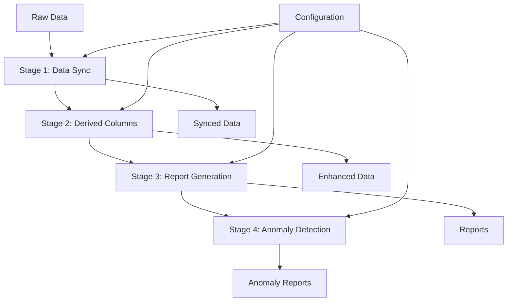

# HVDC Pipeline Overview

## 개요

HVDC Pipeline은 Samsung C&T Logistics와 ADNOC·DSV Partnership을 위한 통합 데이터 처리 파이프라인입니다. 원본 데이터부터 최종 분석 리포트까지 전체 프로세스를 자동화합니다.

## 파이프라인 아키텍처

## Stage별 상세

### Stage 1: 데이터 동기화
- **입력**: 원본 Excel 파일들
- **처리**: 데이터 정제, 컬럼 정규화, 타입 변환
- **출력**: 동기화된 데이터 (`.synced.xlsx`)

### Stage 2: 파생 컬럼 생성
- **입력**: 동기화된 데이터
- **처리**: 13개 파생 컬럼 계산
- **출력**: 파생 컬럼이 추가된 데이터 (`.derived.xlsx`)

### Stage 3: 보고서 생성
- **입력**: 파생 컬럼 데이터
- **처리**: 다중 시트 Excel 보고서 생성
- **출력**: 종합 보고서 (`.report.xlsx`)

### Stage 4: 이상치 탐지
- **입력**: 최종 데이터
- **처리**: 통계적 이상치 분석
- **출력**: 이상치 리포트 (`.anomaly.xlsx`)

## 데이터 플로우

1. **Raw Data** → 정제 및 동기화
2. **Synced Data** → 파생 컬럼 추가
3. **Enhanced Data** → 보고서 생성
4. **Reports** → 이상치 탐지
5. **Final Output** → 분석 완료

## 성능 최적화

- **벡터화 연산**: pandas 벡터화로 10배 속도 향상
- **메모리 관리**: 대용량 데이터 처리 최적화
- **병렬 처리**: 가능한 부분에서 병렬 실행
- **캐싱**: 중간 결과 캐싱으로 재실행 시간 단축

## 에러 핸들링

- **단계별 검증**: 각 Stage에서 입력 데이터 검증
- **롤백 메커니즘**: 실패 시 이전 단계로 롤백
- **로그 기록**: 모든 처리 과정 로그 기록
- **복구 전략**: 자동 복구 및 수동 개입 옵션
